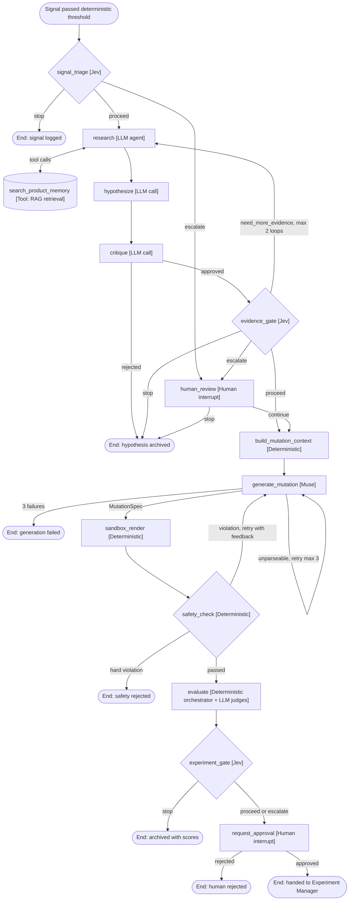

# DarwinUX — Agent Architecture

## Design Principle: Not Everything Should Be an Agent

The most common mistake in AI systems is making everything an LLM-powered agent. An "agent" implies autonomous decision-making, tool use, and iterative reasoning — capabilities that come with latency, cost, unpredictability, and evaluation difficulty.

**The right question is not "what agents do we need?" but "what responsibilities exist, and what is the simplest correct implementation for each?"**

The spectrum of implementation options, from simplest to most complex:

| Implementation | Characteristics | When to Use |
|---|---|---|
| **Deterministic Python** | Fast, testable, predictable, free | Logic with clear rules and no ambiguity |
| **Template + rules** | Configurable, auditable | Structured output from structured input |
| **Single LLM call** | Flexible text understanding/generation | One-shot tasks requiring language understanding |
| **Jev decision** | Classification, scoring, confidence-aware gating | Decision points requiring confidence-aware gating |
| **Muse generation** | Structured creative output within constraints | Producing candidate mutations from approved hypotheses |
| **LangGraph node** | Stateful, conditional routing, retries | Steps that depend on previous results |
| **LLM agent with tools** | Autonomous multi-step reasoning | Tasks requiring iterative investigation |

## Current Implementation (Step 9)

Everything else in this document is design. This is what exists today: **one bounded, structured LLM call** that turns one BehaviorSignal into at most one validated Hypothesis. No LangGraph, no agent loop, no tools, no Jev, no Muse, no mutations.

```
BehaviorSignal (canonical only)
  → deterministic retrieval query            darwin/hypotheses/queries.py
  → Product Memory retrieval, top_k = 5      darwin/memory/retrieval.py (Step 8, read-only)
  → EvidenceBundle (safe signal facts +      darwin/hypotheses/evidence.py
      excerpts ≥ relevance floor, untrusted)
      └─ no excerpts → run "insufficient_evidence", the model is NOT called
  → hypothesis.v1 request                    darwin/hypotheses/prompt.py
      trusted instructions | untrusted evidence (separate fields, hash-tagged delimiters)
  → LLMProvider.generate_structured (once)   darwin/llm/port.py — FakeLLMProvider only
  → parse → strict schema → grounding        darwin/hypotheses/schema.py
  → HypothesisRun (always) + Hypothesis (only if valid), one transaction
```

**Provider.** DarwinUX owns the port (`StructuredGenerationRequest`, `StructuredGenerationResult`, `Usage`, three error types). The only implementation is `FakeLLMProvider`, deterministic, with one mode per failure it must prove is caught (malformed output, unknown fields, fake probabilities, overlong text, prose, hallucinated evidence ids, invalid components, obeying an injection, failure, timeout, unavailable). No real provider was added: the provider choice (OPEN_QUESTIONS.md N1) should be made against this evaluation harness, and nothing in Step 9 needs a real model to prove the control layer. A real adapter will live beside `fake.py`, use the vendor's official SDK, keep instructions and evidence in separate message roles, treat missing credentials as `ProviderUnavailableError` (feature unavailable, not a startup failure), and return raw text that DarwinUX validates exactly as it validates the fake's.

**Output contract (`HypothesisDraft`).** `statement` (one line, 20–400 chars), `rationale` (40–1500), `affected_component` (an allowed component id, or null), `confidence` (`low | medium | high` — an **uncalibrated** qualitative judgment, never a probability), `evidence_chunk_ids` (1–5 unique ids), `limitations` (1–5). Unknown fields are forbidden (so there is nowhere to put code or a mutation), types are strict, whitespace is stripped before length checks, code fences and HTML tags are rejected.

**Grounding (deterministic).** Every cited id must be an excerpt id from this run's EvidenceBundle; the component must be the signal's own component (rage_click) or a component declared in the Generation 0 UI Spec (error_burst, whose signal names none). This is citation *validity*, not truthfulness: a hypothesis can cite a real excerpt and still misread it. Semantic faithfulness needs a judge (see EVALUATION_STRATEGY.md) and is not claimed.

**Failure semantics** (`hypothesis_run.status` / `error_type`): `insufficient_evidence` (`no_context`, `low_relevance` — a controlled terminal outcome, not an error: the model is never asked to invent), `provider_unavailable`, `provider_error` (`failure`, `timeout`, `unexpected:<Class>`), `invalid_output` (`not_json`, `missing`, `extra_forbidden`, `literal_error`, `string_too_long`, …), `grounding_failed` (`unknown_evidence_reference`, `invalid_component`). Every outcome is a persisted run; only `succeeded` has a Hypothesis. An unknown or superseded signal raises `SignalNotFoundError` and records nothing (there is no signal to attach it to).

**Repeat calls.** Every explicit generation is a new run. Model calls are neither deterministic nor free, so nothing pretends to deduplicate them; the fake is deterministic only so tests can be exact.

**Still future (after Step 9):** see Step 10 below for the orchestration, critique and human review that now wrap this call.

## Current Implementation (Step 10): Bounded Research Workflow

The first real orchestration: a LangGraph `StateGraph` (`research_graph.v1`, `darwin/research/graph.py`) that **orchestrates existing services and replaces none of them**. It ends at a researched hypothesis and a decision. No Jev, no Muse, no MutationSpec, no experiments, no deployment.

```
START ─> load_signal ─> retrieve ─> assess_evidence ─┬─> generate_hypothesis ─> critique_hypothesis ─┬─> finalize ─> END
             ▲              ▲                        ├─> refine_query ──┐                            └─> human_review ─> END (run waits)
             │              └────────────────────────┼──────────────────┘   (the only cycle, ≤ 1 pass)
             │                                       └─> finalize
START ─> apply_human_decision ─> finalize ─> END     (a resume: same graph, entered with a human decision)
```

| Node | Calls | Decides |
|---|---|---|
| `load_signal` | canonical BehaviorSignal; the **Step 9 deterministic query builder** | — |
| `retrieve` | **Step 8** `retrieve()`; **Step 9** `build_evidence_bundle()` | — |
| `assess_evidence` | deterministic **sufficiency heuristic** (`research/planning.py`) | generate / refine (once) / stop |
| `refine_query` | deterministic refinement: UI-Spec-targeted query + code-chosen SQL filters | → retrieve |
| `generate_hypothesis` | **Step 9** `generate_from_bundle()` (request, strict schema, grounding, HypothesisRun) | critique / stop |
| `critique_hypothesis` | `hypothesis_critique.v1` through the **same** `LLMProvider` port | accept / human review / reject / stop |
| `human_review` | — | pause (`waiting_for_human`) |
| `apply_human_decision` | — | approve → succeeded, reject → rejected |
| `finalize` | hypothesis → `accepted` / `rejected` for those outcomes | END |

**Routing.** Each node writes the next node into `route`; conditional edges accept only the targets in `TRANSITIONS` — the same table the evaluation checks trajectories against. Node code, not the model, chooses routes: model output only ever arrives as a validated verdict enum.

**Budgets** (`research/budget.py`, hard caps in code *and* as database CHECKs; a run may be given a tighter budget, never a looser one): 2 retrieval attempts, 1 refinement, 1 hypothesis generation, 1 critique, **2 LLM calls in total**, 12 graph steps (the longest legal path is 11). The cycle is bounded by `retrieval_attempts` and `refinements`; separately, the node wrapper forces `finalize` one step before the step cap; LangGraph's recursion limit is only a backstop. A test runs a deliberately looping graph and shows it still ends at `finalize` (`step_budget_exhausted`).

**Sufficiency (a deterministic heuristic, not semantic truth).** After Step 9's relevance floor: ≥ 2 excerpts, from ≥ 2 sources, including an *anchor* source — the UI Spec (what the component is) or the detector definitions (why the signal fired). Empty memory stops immediately (`no_context`, nothing to refine against). Otherwise one refinement: a signal-specific UI-Spec query, plus `source_type = ui_spec, generation = 0` when no anchor was found; its top 3 results are merged in front of the first attempt's. No model writes queries or filters yet.

**Critique.** Receives the hypothesis (marked untrusted — it is model output), the signal facts and *only the cited excerpts*; returns `verdict` (`accept | human_review | reject`), a one-line `summary`, and ≤ 5 each of `issues`, `unsupported_claims`, `missing_evidence`. Strict schema; a `reasoning` field is rejected like any unknown field; the request never asks for reasoning. An `accept` on a **low-confidence** hypothesis still goes to a human (a deterministic rule).

**Human review.** No LangGraph checkpointer: `interrupt()` needs one, the Postgres checkpointer is a separate package, and it would couple the schema to LangGraph internals. Instead the run is persisted as `waiting_for_human` and the invocation ends. `make research-resume RUN_ID=… DECISION=approve|reject` (an allowlist, never free text) atomically moves the run `waiting_for_human → running` (so a duplicate or concurrent resume is refused), rebuilds a small state from `research_run`, and re-enters the graph at `apply_human_decision`. A resume cannot call a model or retrieve: its dependencies are stubs that raise.

**Retry semantics.** Graph loop = one evidence refinement inside a run. Provider retry = none in Step 10 (a failed call ends the run with `*_provider_error`). New run = every explicit `research-run`. Each LLM call is visible: generation in its HypothesisRun, critique in its `research_step`.

**Audit.** `research_run` (status, stop reason, counters, tokens, elapsed, ids, critique findings, budget used) + `research_step` (one row per executed node: outcome and compact metadata). No prompts, chunk text, model output or reasoning.

**Future span mapping (OpenTelemetry not added yet).** One span per graph invocation named `research_run` (attributes: `research_run_id`, `signal_id`, `graph_version`, status); a child span per `research_step` (`node`, `sequence`, `outcome`); `retrieve` spans nest Step 8 retrieval; `generate_hypothesis` and `critique_hypothesis` nest a `gen_ai` span with provider, model, request version and token counts. A resume is a new trace linked to the first by `research_run_id` (span link), not one trace spanning a human wait.

**Still future:** LLM-written queries (the full Research agent), a real LLM provider, Muse mutation generation, MutationSpec, sandbox, experiments. (The first Jev gate is Step 11, below.)

## Current Implementation (Step 11): Decision Gate

A bounded gate **after** a finished research run. It is a separate service (`darwin/decisions/`), not a graph node: `research_graph.v1` is unchanged, and no decider has any path to graph transitions, budgets, tools or human gates.

```
ResearchRun (succeeded | rejected) + Hypothesis + Critique + canonical Signal
  → eligibility checks ─ fail → DecisionInputError (no decider call, nothing recorded)
  → DecisionRequest (decision_request.v1: bounded facts only)
  → Decider.decide  ── exactly one call ──  rules.v1 | fake_decider.v1 | llm_decision.v1 | jev:<model>
  → strict DecisionOutput validation → fail-closed policy
  → DecisionRun (final decision: proceed | human_review | reject)
```

**`proceed` means only** that the research artifact is eligible to enter a *future* mutation-generation stage. Nothing in Step 11 creates, approves or deploys a mutation or starts an experiment.

**Decision port** (`decisions/port.py`, owned by DarwinUX): a decider gets a validated `DecisionRequest` and returns its output *unvalidated* plus the exact implementation version; failures are `DeciderUnavailableError`, `DeciderFailureError`, `DeciderTimeoutError`. The request holds signal type + safe facts, research outcome and accounting, hypothesis statement / component / confidence / cited sources / limitations, critique findings, and fixed constraints — never session or event ids, payloads, Product Memory text, prompts, the rationale or reasoning. Its text fields are model output and are untrusted for any decider that reads them.

**Output** (`DecisionOutput`, strict): `decision` ∈ {proceed, human_review, reject}; `confidence` ∈ {low, medium, high} (qualitative, uncalibrated); 1–4 `reason_codes` from an allowlist of 10 (`critique_accepted`, `sufficient_evidence`, `human_approved`, `human_rejected`, `critique_rejected`, `unsupported_claim`, `missing_evidence`, `critique_issues`, `low_confidence`, `human_judgment_required`); optional `provider_confidence` (a provider's own 0–1 statistic, recorded, never treated as a probability). Two more codes (`decider_failure`, `policy_override`) can only be added by DarwinUX.

**Fail-closed policy (outside every model).** Any exception, timeout, unavailability, non-JSON, unknown field, unknown decision or reason code → **human_review**, status `failed_closed`. A valid `proceed` is kept only if hard preconditions hold (research succeeded, hypothesis accepted, critique accepted or a human approved, no unsupported claims, no low-confidence hypothesis without a human, decider not low-confidence); otherwise it becomes human_review, status `overridden`. A decider may always be *more* cautious. The database repeats this: `failed_closed` rows must be human_review, and `proceed` can only be recorded as `decided`.

**Deciders.**
- `rules.v1` — the deterministic baseline (first match wins): research rejected → reject; unsupported claims → reject; human approved → proceed; low-confidence hypothesis → review; missing evidence → review; critique issues → review; else proceed.
- `fake_decider.v1` — a **test double**, not Jev: one mode per misbehaviour (reckless proceed, low-confidence proceed, malformed, extra field, invented decision, invented reason code, failure, timeout, unavailable). It proves containment, nothing about Jev.
- `llm_decision.v1` — a comparator on the existing LLM port (`decision.v1` request, untrusted-evidence delimiters, same strict validation). Only the FakeLLMProvider exists, so it measures plumbing.
- `JevAdapter` — see below.

**Jev integration status (honest).** TypeSafe AI publishes HTTP API docs (docs.typesafe.ai/api, /models, /confidence, read 2026-09-27): `POST https://api.typesafe.ai/v1/systemone` with a Bearer API key; `{state, model, questions}`; typed questions (`noul`, `choice`, `score`); choice answers carry `choice`, `probabilities` and a 0–1 `confidence` that the docs describe as a statistic derived from the distribution — explicitly not a probability, with no calibration claim; model ids like `jev-1.13.0` and aliases `jev-latest`. The adapter uses exactly that: two `choice` questions (the gate decision over our three decisions; the primary reason over our reason codes), the DecisionRequest as structured `state`, one attempt (no SDK auto-retry), 401/403 → unavailable, other non-200 → failure — all failing closed. Configured by `DARWIN_JEV_API_KEY` / `DARWIN_JEV_MODEL` (DarwinUX setting names). **It has never been called against the live service** (no key here); tests use a fake transport shaped like the documented examples. Still unknown: determinism, latency, rate limits, pricing, data retention/training use, licensing (OPEN_QUESTIONS B1).

**The Jev value criterion.** Jev earns a production role only if, on a representative, *independently labelled* set of research artifacts (not the rules-derived golden set), it improves meaningful metrics over `rules.v1` — e.g. reject/human_review recall without losing proceed precision — **with a fail-open count no higher than the baseline's**, reported per decider, never averaged. No threshold is set until real data exists; `make decision-eval --include-jev` produces the side-by-side once a key is available.

## Current Implementation (Step 12): Candidate Mutations

A proceed decision (Step 11) can produce one **candidate** UI Spec through a DarwinUX-owned `MutationGenerator` port (`backend/src/darwin/mutations/`). The generator receives a bounded `MutationRequest` (mutation_request.v1): the decision summary, the hypothesis statement / component / confidence / limitations and critique findings (untrusted model output), the source spec's id / generation / hash, and — for each mutable node in the affected section — its id, type, current values and allowed values. Never the full spec, Product Memory text, telemetry, ids of sessions or events, prompts or paths. It returns an unvalidated MutationSpec; DarwinUX validates, applies in memory and stores the candidate (see MUTATION_SAFETY.md, "What exists today (Step 12)").

- `fixture_mutation.v1` — deterministic: rage click on a delayed button → `feedback: immediate`; error burst → `validation: inline` + `error_display: per_field`; plus one mode per unsafe output (unknown component, protected property, invalid token, duplicate target, too many ops, action/type change, executable field, markup, raw JSON Pointer, malformed, wrong source, no-op, echoing an injection) and failures. **Not Muse.**
- `llm_mutation.v1` — a comparator on the existing LLM port (`mutation.v1` request, untrusted-evidence delimiters, same validation). FakeLLMProvider only.
- `MuseAdapter` — an explicit seam. TypeSafe's official docs describe only Jev (a decision model); no Muse interface is documented, so nothing is invented and `GENERATOR=muse` fails clearly.

Every failure — invalid output, validation failure, generator error or unavailability, stale provenance — is an audited `mutation_run` without a candidate. **Muse value criterion:** Muse earns a production mutation role only if, on a representative set, it produces more *useful* candidates than these baselines (judged later by sandbox evaluation, humans and experiments) while keeping zero protected-field violations, zero unsafe candidates, an acceptable invalid-output rate and acceptable cost/latency. No thresholds until real data exists.

**Still future:** sandbox rendering, accessibility / visual / performance evaluation, human approval of candidates, experiments, promotion to a generation.

## Current Implementation (Step 13): Candidate Sandbox Evaluation

Step 12 proved a candidate can be **safe and still harmful** (the fake LLM set a CTA back to `delayed`). Step 13 evaluates usefulness before anything could reach a future experiment — deterministically, with no LLM judge (`backend/src/darwin/sandbox/`, `frontend/src/evaluation/`).

```
CandidateUISpec → provenance re-check (reject on failure, no harness call)
  → frontend harness: real Zod schema + registry + SpecPage in jsdom (facts only)
  → schema | render | functional | accessibility | regression | ux_intent | performance
  → candidate_eval.v1 policy → pass | human_review | reject → immutable CandidateEvaluationRun
```

| Category | Kind | Checks (fail → reject; warn → human_review) |
|---|---|---|
| schema | deterministic | the app's Zod schema accepts the candidate |
| render | deterministic | it renders through the registry / `SpecPage` |
| functional | deterministic | every CTA still reveals the form and emits its own `button_click`; the form errors on empty submit, completes, keeps its telemetry ids; no typed value in telemetry |
| accessibility | deterministic | no NEW serious/critical axe violation (fail) or minor one (warn); every input labelled; no focusable button lost; heading structure unchanged (warn). Pre-existing issues are not held against the candidate |
| regression | deterministic | ids, types, actions and structure unchanged; only mutable leaves differ; the candidate equals parent + its MutationSpec; something changed |
| ux_intent | deterministic | **alignment with the observed problem, not UX quality**: rage_click on X → `X.feedback` delayed → immediate, confirmed by the measured reveal delay (1500 → 0 ms); error_burst → `validation` on_submit → inline (confirmed: an error shows on blur) and/or `error_display` summary → per_field (confirmed). Moving any property *to* a known friction value → fail. Unrelated / mixed / unconfirmed / unsupported → warn |
| performance | measured | component count unchanged (fail); JSON delta ≤ 2 KiB and DOM-node delta ≤ 10% (warn). Local jsdom render time is recorded, never gated |

`pass` requires every gate to pass **and** aligned UX intent; it means only "eligible for future human approval / experiment setup". Any evaluator problem (harness unavailable, crashed, malformed output, an evaluator bug) is `human_review`, never `pass`; provenance failures are `reject`. Design taste, copy quality and visual quality are **not** evaluated: they need humans (or a calibrated judge, later).

A finding from the harness: `validation: inline` alone has **no visible effect** in today's renderer (with `error_display: summary`, a blur records the error but shows nothing), so an inline-only candidate is `human_review` (`ux_intent_unconfirmed`) rather than a pass — behaviour, not token names, decides.

**Still future:** human approval of candidates, experiment creation, traffic allocation, statistical analysis, promotion and rollback; browser-based checks (contrast, layout, visual regression, real performance).

## Current Implementation (Step 14): Controlled Experiments — no agent involved

Step 14 adds **no agent, no model call and no Jev/Muse control**. Experiments are deliberately outside the AI subsystems (`backend/src/darwin/experiments/`): eligibility, the start gate, traffic assignment (stable hashing), exposure recording and the statistics are deterministic code; creating, starting, pausing, stopping, completing and analyzing are explicit human CLI commands (`make experiment-*`; `start` requires retyping the experiment key). There is no HTTP route or tool that lets an agent create or start an experiment, choose an allocation, or read a result as a decision.

| Question | Who answers | How |
|---|---|---|
| May this candidate enter an experiment? | Deterministic | the persisted Step 13 `pass`, re-derived (never a claim in the request) |
| Should it start now? | **Human** | explicit CLI start after the start gate |
| Which variant does a session see? | Deterministic | `sha256(key:session) % 10 000` vs allowlisted basis points, served by the backend |
| What happened? | Deterministic | per-variant session rates, Wilson / Newcombe 95% intervals, guardrail flags |
| Is the candidate better? Promote it? | **Human** (later step) | nothing in Step 14 declares a winner or promotes |

Future LLM/Jev involvement (e.g. an advisory read of an experiment report) must stay advisory and fail closed; it may never change allocation or status.

## Current Implementation (Step 15): Promotion and Rollback — humans only

Step 15 again adds **no agent and no model call**. The authority boundary:

| Question | Who answers | How |
|---|---|---|
| Is this analysed candidate eligible for a decision? | Deterministic | `promotion_policy.v1`, re-derived from the database; no overrides |
| Approve or reject? | **Human** | `make promotion-approve` / `promotion-reject` (self-asserted reviewer, reason) |
| Activate it now? | **Human** | `make generation-promote CONFIRM=<page>:<generation>`; the gate is re-derived at that moment |
| Roll back? | **Human** | `make generation-rollback CONFIRM=<page>:<generation>` |
| Which generation does /demo serve? | Deterministic | the `active_generation` pointer |

An ExperimentAnalysis may make a candidate *eligible for review*; it never grants authority. LangGraph, LLMs, Jev, Muse, `RulesDecider`, the sandbox evaluator and the experiment analysis have no path to approval, promotion or rollback.

## Responsibility Analysis

### 1. Signal Detection (Observer)

**Proposed name:** Observer Agent

**What it actually does:**
- Receives processed telemetry data
- Identifies behavioral patterns (rage clicks, abandonment, repeated errors)
- Classifies signal severity
- Decides whether to trigger investigation

**Should it be an agent?** **No.**

**Recommended implementation:** Deterministic Python + Jev classification.

**Reasoning:**
- Pattern detection (e.g., "3+ clicks on same element within 2 seconds") is purely rule-based. An LLM cannot reliably count events or compute time deltas.
- Signal triage (is this signal worth investigating?) is a confidence-aware decision — Jev's intended role — but does not require multi-step reasoning. Whether Jev's confidence is calibrated must be measured, not assumed.
- This runs on every batch of processed events. Latency and cost must be minimal.

**Implementation sketch:**
```
Telemetry events
  → Deterministic pattern matching (Python, telemetry worker)
  → BehaviorSignal created (status: detected)
  → Deterministic threshold: severity/evidence_count high enough? (else stays logged)
  → Investigation worker starts AgentRun
  → Graph node signal_triage: JevProvider.decide(signal_triage) → proceed | stop | escalate
```

**What you learn:** Signal detection rules, threshold tuning, designing a decision port before the real provider exists.

---

### 2. Evidence Research (Research Agent)

> **Partly implemented (Step 10):** the retrieval loop exists as graph nodes with a *deterministic* query builder, sufficiency heuristic and one refinement. LLM-written queries and tools are not built.

**Proposed name:** Research Agent

**What it actually does:**
- Receives a behavioral signal
- Formulates retrieval queries
- Searches Product Memory
- Assesses whether retrieved evidence is sufficient
- Summarizes relevant findings

**Should it be an agent?** **Yes — but a constrained one.**

**Recommended implementation:** LangGraph node with RAG tools.

**Reasoning:**
- Query formulation benefits from language understanding ("rage_click on checkout" → "checkout button design guidelines, error states, past experiments with checkout").
- Evidence assessment ("is this enough to form a hypothesis?") requires judgment that rules cannot easily encode.
- However, the agent should not have access to arbitrary tools. Its tools are read-only: `search_product_memory` and `get_document_details`. (Summarizing evidence is the agent's own final LLM output, not a tool.) No tool can write, deploy, or call Muse.

**Why LangGraph:** The research agent may need to iterate — if the first retrieval query returns insufficient results, it should reformulate and try again. LangGraph's conditional edges support this loop with explicit bounds (max 3 retrieval attempts).

**Implementation sketch:**
```
LangGraph node: research_agent
  Tools: [search_product_memory, get_document_details]   # read-only, deterministic
  Input: BehaviorSignal
  Output: EvidencePackage { chunks: [...], summary: str, sufficient: bool }
  Max iterations: 3
  On insufficient evidence after max iterations: escalate to human
```

**What you learn:** RAG query formulation, tool calling, LangGraph iteration loops, retrieval evaluation.

---

### 3. Hypothesis Formation (Hypothesis Agent)

> **Implemented (Step 9)** as a single structured call — see "Current Implementation (Step 9)" above. The sketch below used `confidence: float`; the implementation uses a qualitative `low | medium | high` enum instead, because a model-invented probability looks calibrated and is not.

**Proposed name:** Hypothesis Agent

**What it actually does:**
- Receives a behavioral signal + evidence package
- Proposes an explanation for the observed friction
- Cites specific evidence supporting the hypothesis
- Assesses confidence

**Should it be an agent?** **No — a single structured LLM call is sufficient.**

**Recommended implementation:** Single LLM call with structured output.

**Reasoning:**
- Hypothesis formation is a single reasoning step: "Given this signal and this evidence, what explains the friction?" This does not require tools, iteration, or multi-step planning.
- Structured output (Pydantic model) ensures the hypothesis has the required fields: description, evidence citations, confidence, proposed area of improvement.
- Making this an agent adds latency and cost without adding capability.

**Implementation sketch:**
```python
# Conceptual — not production code
class HypothesisOutput(BaseModel):
    description: str
    evidence_citations: list[str]
    confidence: float
    target_component: str
    proposed_improvement_area: str

hypothesis = await llm.generate_structured(
    prompt=hypothesis_prompt(signal, evidence),
    schema=HypothesisOutput
)
```

**What you learn:** Structured generation, Pydantic output schemas, prompt design for reasoning tasks.

---

### 4. Hypothesis Critique (Critic)

> **Implemented (Step 10)** as one structured call on the same provider port (`hypothesis_critique.v1`), with a different request, not a different provider (OPEN_QUESTIONS.md N2). See "Current Implementation (Step 10)".

**Proposed name:** Critic Agent

**What it actually does:**
- Reviews a hypothesis for logical consistency
- Checks whether evidence actually supports the claims
- Identifies alternative explanations
- Flags potential issues

**Should it be an agent?** **No — a single LLM call with a different prompt persona.**

**Recommended implementation:** Single LLM call (different model or prompt from hypothesis generation).

**Reasoning:**
- Critique is a single evaluation step, not a multi-step investigation.
- Using a different model (or the same model with a critique-focused prompt) provides genuine value — it catches reasoning errors, unsupported claims, and overlooked alternatives.
- The value is in the separation of concerns (generator vs. critic), not in agent machinery.

**Design note:** Consider using a different LLM provider for the critic than for hypothesis generation. This provides genuine diversity of reasoning, not just prompt-level role-playing.

**Implementation sketch:**
```
LangGraph node: critique_hypothesis
  Input: Hypothesis + EvidencePackage
  Output: CritiqueResult { approved: bool, concerns: list[str], alternative_explanations: list[str] }
  Implementation: Single LLM call, structured output
```

**What you learn:** LLM-as-judge patterns, generator-critic architectures, cross-model evaluation.

---

### 5. Mutation Generation (Muse)

> **Step 12:** the port, a fixture, an LLM-port baseline and an explicit, unimplemented Muse seam exist (no documented Muse interface). See "Current Implementation (Step 12)".

**Proposed name:** ~~Mutation Agent~~ → **Muse** (generative mutation layer)

**What it actually does:**
- Receives an approved, evidence-backed hypothesis
- Receives product context, design system constraints, and component constraints
- Receives the allowed mutation boundary (what properties can change, valid ranges)
- Generates a structured candidate mutation specification

**Should it be an agent?** **No — Muse is a dedicated generative model behind a provider boundary.**

**Recommended implementation:** Muse provider call + deterministic validation.

**Reasoning:**

Muse is treated as a distinct subsystem — the **generative mutation layer** — alongside Jev (decision layer), RAG (evidence layer), LangGraph agents (reasoning/orchestration layer), and the Evaluation Engine (quality/safety layer).

The critical distinction from the original "Mutation Agent" concept:

| Aspect | Generic LLM "Mutation Agent" | Muse as Generative Layer |
|---|---|---|
| **Model** | Whichever general-purpose LLM is configured | Muse (provider and model details: see OPEN_QUESTIONS.md) |
| **Input** | Freeform prompt with hypothesis | Structured input: hypothesis + context + constraints |
| **Output** | Raw text requiring parsing | Structured candidate mutation |
| **Boundary** | Part of the agent orchestration | Its own provider with its own abstraction |
| **Evaluation** | Evaluated as "did the agent do a good job?" | Evaluated as "is this candidate mutation valid, safe, and good?" |

**Why a provider boundary, not an agent:** Muse's provider, API surface, input format, and capabilities are not documented in this repository. Nothing here should be read as a claim about how Muse works internally. Wrapping it in a provider boundary means:
- The rest of the system can develop and test against a mock Muse provider.
- When real integration details become available, only the provider implementation changes.
- Muse can be independently evaluated, versioned, and monitored.

**Muse's output is always a CANDIDATE.** It never directly deploys. The pipeline after Muse:

```
Muse generates candidate
  → Constrained mutation representation (structured spec)
  → Sandbox rendering (visual verification)
  → Deterministic validation (schema, allowlist, value ranges)
  → AI evaluation (accessibility, design consistency, regression)
  → Jev decision gate (proceed to experiment?)
  → Human approval
  → Experiment
```

**Implementation sketch:**
```
Deterministic step: build_mutation_context   # "mutation planning" is NOT an LLM step
  - Load active UI Spec version for the target screen
  - Look up allowed props / token ranges in the component registry
  - Attach retrieved evidence + hypothesis
  → MutationContext + MutationConstraints

LangGraph node: generate_mutation_via_muse
  Input: ApprovedHypothesis + MutationContext + MutationConstraints
  Call: muse_provider.generate_mutation(hypothesis, context, constraints)
  Output: CandidateMutation
  Post-processing: Parse into MutationSpec (schema) — anything unparseable counts as a failed attempt
  Loop: If validation fails, retry with constraint feedback (max 3 attempts)
  On repeated failure: reject with reasoning, log for Muse evaluation
```

**What you learn:** Provider abstraction for external models with unknown interfaces, constrained generation, structured input/output contracts, candidate-vs-deployment distinction, evaluation of generative model quality.

---

### 6. Safety Validation (Safety Agent)

**Proposed name:** Safety Agent

**What it actually does:** (in the graph this is the `safety_check` node, after `sandbox_render`)
- Checks mutations against safety constraints
- Verifies no forbidden properties are modified
- Validates accessibility requirements
- Checks for regressions against known issues

**Should it be an agent?** **No — deterministic validation with optional LLM accessibility check.**

**Recommended implementation:** Deterministic Python rules + optional LLM accessibility assessment.

**Reasoning:**
- "Does this mutation modify authentication?" is a deterministic check against the mutation specification schema.
- "Does this mutation modify only allowed properties?" is a schema validation.
- "Is this color change accessible?" may benefit from an LLM check against WCAG guidelines, but only after deterministic contrast ratio checks pass.
- Safety validation must be fast, reliable, and auditable. LLM calls introduce uncertainty. Use them only for checks that rules cannot perform.

**Implementation sketch:**
```
Safety pipeline (sequential, all must pass):
  1. Schema validation (deterministic): mutation conforms to MutationSpec
  2. Allowlist check (deterministic): only permitted properties modified
  3. Value range check (deterministic): values within valid ranges
  4. Accessibility check (deterministic + optional LLM): contrast ratios, font sizes
  5. Regression check (deterministic): no known problematic patterns
```

**What you learn:** Validation pipeline design, defense-in-depth, separating mechanical checks from judgment.

---

### 7. Evaluation Orchestration (Evaluation Agent)

**Proposed name:** Evaluation Agent

**What it actually does:**
- Orchestrates evaluation of mutations across multiple dimensions
- Runs deterministic evaluators and LLM-as-judge evaluators
- Aggregates scores
- Determines overall pass/fail

**Should it be an agent?** **No — a deterministic orchestrator.**

**Recommended implementation:** Python orchestration code that runs evaluators in parallel and aggregates results.

**Reasoning:**
- Which evaluators to run is determined by the mutation type (a color change needs accessibility evaluation; a copy change needs readability evaluation). This is rule-based.
- Running evaluators is embarrassingly parallel and doesn't require reasoning.
- Aggregating scores into a pass/fail decision follows configured thresholds.
- Some individual evaluators use LLM calls (LLM-as-judge), but the orchestration layer is deterministic.

**Implementation sketch:**
```
Evaluation orchestrator:
  1. Determine required evaluators based on mutation type (deterministic)
  2. Run evaluators in parallel:
     - Schema compliance (deterministic)
     - Accessibility (deterministic + LLM)
     - Design consistency (LLM-as-judge)
     - Regression (deterministic)
  3. Aggregate scores (deterministic)
  4. Apply pass/fail thresholds (deterministic)
  5. Return EvaluationResult
```

**What you learn:** Parallel execution, evaluation framework design, score aggregation, threshold configuration.

---

### 8. System Monitoring (Monitoring Agent)

**Proposed name:** Monitoring Agent

**What it actually does:**
- Tracks system health metrics
- Monitors experiment progress
- Detects anomalies in AI behavior (model drift, cost spikes)
- Alerts on failures

**Should it be an agent?** **No — standard monitoring infrastructure.**

**Recommended implementation:** OpenTelemetry instrumentation + CloudWatch alarms + periodic health check jobs. Experiment guardrail monitoring (auto-rollback) is deterministic code in the Experiment Manager. See OBSERVABILITY.md.

**Reasoning:**
- Monitoring is a solved problem with mature tooling. Using an LLM to "monitor" adds latency, cost, and unreliability to a system that must be the most reliable part of the platform.
- Anomaly detection can be done with statistical methods (standard deviation alerts, cost threshold checks).
- The only place an LLM might add value is in generating human-readable incident summaries — but this is a nice-to-have, not a core requirement.

**What you learn:** OpenTelemetry, CloudWatch configuration, alerting strategy, health check design.

---

## Summary: Responsibility Classification

Every responsibility is classified as exactly one primary kind: **deterministic Python**, **LLM call**, **LangGraph node** (a unit of orchestration that wraps one of the others), **tool**, **Jev decision**, **Muse generation**, or **human decision**.

| Responsibility | Classification | Runs where | Why |
|---|---|---|---|
| Event validation & persistence | Deterministic Python | Telemetry worker | Schema + idempotent insert |
| Signal detection (Observer) | Deterministic Python | Telemetry worker | Counting over time windows |
| Signal triage | Jev decision (graph node `signal_triage`) | Investigation worker | Confidence-aware go/no-go |
| Evidence research | LangGraph node containing the **only LLM agent** | Investigation worker | Needs iterative query reformulation |
| Product Memory search | Tool (`search_product_memory`) — deterministic retrieval | Called by Research agent | Retrieval is search, not reasoning |
| Hypothesis formation | LLM call (structured output), graph node `hypothesize` | Investigation worker | One-shot reasoning |
| Hypothesis critique | LLM call (structured output), graph node `critique` | Investigation worker | One-shot evaluation, generator/critic split |
| Evidence sufficiency | Jev decision, graph node `evidence_gate` | Investigation worker | Confidence-aware gating |
| Mutation planning (context + constraints) | Deterministic Python, graph node `build_mutation_context` | Investigation worker | Registry lookup; must not be improvised by a model |
| Mutation generation | Muse generation, graph node `generate_mutation` | Investigation worker | Constrained generative capability |
| Sandbox rendering | Deterministic Python (headless render), graph node `sandbox_render` | Investigation worker | Reproducible artefacts (screenshots, DOM, a11y scan) |
| Safety validation | Deterministic Python, graph node `safety_check` | Investigation worker | Safety must never be probabilistic |
| Evaluation orchestration | Deterministic Python (some evaluators use LLM-as-judge) | Investigation worker | Rule-based evaluator selection + aggregation |
| Experiment readiness | Jev decision, graph node `experiment_gate` | Investigation worker | Highest-stakes AI gate |
| Approval to experiment | **Human decision** (graph interrupt) | Evolution Lab | Accountability |
| Escalation review | **Human decision** (graph interrupt) | Evolution Lab | Jev uncertain or unavailable |
| Experiment assignment & statistics | Deterministic Python | Experiment Manager | Math, not judgment |
| Guardrail monitoring & auto-rollback | Deterministic Python | Experiment Manager | Moving toward safety needs no approval |
| Promotion to new Generation | **Human decision** (Jev advisory) | Evolution Lab | Accountability |
| Experiment report → Product Memory | Deterministic record + optional LLM summary | Ingestion worker | Summary is nice-to-have; facts are stored deterministically |
| System monitoring | Deterministic (OTel + CloudWatch) | Infrastructure | Solved problem |

**Result:** Of eight proposed "agents," only one (Research) is genuinely an autonomous agent with tools. Mutation generation is handled by Muse — a dedicated generative model behind a provider boundary, not an agent. The rest are deterministic code, single LLM calls, or Jev decisions.

**This is the correct outcome.** The five AI subsystems each have a clear role:

| Subsystem | Role |
|---|---|
| **RAG / Product Memory** | Evidence — what do we know? |
| **LangGraph workflow** | Reasoning / orchestration — investigate and hypothesize |
| **Jev** | Decision — should we proceed? |
| **Muse** | Generation — produce a candidate mutation |
| **Evaluation Engine** | Quality — is the candidate good enough? |

## LangGraph Orchestration

Even though most components are not agents, LangGraph still provides value as the orchestration layer for the investigation flow. The legend on each node shows what kind of work it does.



**Human decision boundaries** are LangGraph *interrupts*: the graph checkpoints its state to PostgreSQL and stops. The Evolution Lab shows the pending decision; the human's answer resumes the graph. No thread or process waits for a human.

**The graph ends at approval.** Running an experiment takes days. That is not a workflow step to hold open; it is a deterministic lifecycle owned by the Experiment Manager (DATA_PIPELINES.md, "Experiment Data Flow"). Post-experiment analysis and the promotion decision happen outside the graph.

**Every loop is bounded** (research ≤ 2 extra loops, Muse ≤ 3 attempts total including safety retries). Unbounded loops are the most common way agent systems burn money.

**Why LangGraph for orchestration:** The investigation flow has conditional branches, loops (research → hypothesize → need more evidence → research again), and human-in-the-loop requirements. LangGraph's state graph model handles these naturally. Without it, you'd write a complex state machine in plain Python — which is possible but less maintainable as the flow evolves.

**LangGraph state:** The graph maintains state across nodes:
```python
# Conceptual
class InvestigationState(TypedDict):
    signal: BehaviorSignal
    evidence: Optional[EvidencePackage]
    hypothesis: Optional[Hypothesis]
    critique: Optional[CritiqueResult]
    mutation_context: Optional[MutationContext]     # Deterministic
    candidate_mutation: Optional[CandidateMutation]  # From Muse
    sandbox_result: Optional[SandboxResult]
    evaluation: Optional[EvaluationResult]
    decisions: list[Decision]
    research_loops: int
    muse_attempts: int
```

Note that `candidate_mutation` is explicitly named to reinforce that Muse produces candidates, not deployable changes. The state tracks the full progression: evidence → hypothesis → critique → Muse candidate → sandbox → evaluation.

---

## What You Should Understand Before Implementation

1. **An agent is a specific architectural pattern (autonomous decision-making with tools), not a synonym for "AI-powered component."** Most AI-powered components in DarwinUX are single LLM calls, dedicated models (Muse, Jev), or deterministic code.
2. **The cost of making something an agent is concrete: latency (seconds vs. milliseconds), cost (LLM tokens), unpredictability (non-deterministic behavior), and evaluation difficulty.** Each time you consider an agent, weigh these costs against the capability gained.
3. **LangGraph's value is in orchestration, not in making everything an agent.** A LangGraph node can contain a deterministic function, a single LLM call, a Muse call, or a Jev decision — it's the conditional routing and state management that justify LangGraph. Human decisions are graph *interrupts* (checkpoint and stop), and experiments live outside the graph — a workflow engine should not wait for weeks.
4. **The generator-critic pattern (hypothesis + critique) is more reliable than a single "do everything" agent.** Separating generation from evaluation forces the system to justify its reasoning.
5. **Muse, Jev, and general-purpose LLMs serve different roles.** Muse generates candidate mutations. Jev makes confidence-aware decisions. General-purpose LLMs handle reasoning tasks (hypothesis, critique, research). Don't conflate these — they have different input/output contracts, different evaluation criteria, and different provider boundaries.
6. **Jev's role is confidence-aware gating, not text generation.** Its value over plain thresholds or an LLM's "opinion" is a hypothesis to test: DarwinUX records rule, LLM-baseline, and Jev decisions side by side so the comparison can actually be measured. Every gate fails closed.
7. **Safety validation must be deterministic first, AI-augmented second.** Never rely solely on an LLM to enforce safety constraints. Muse's output always passes through deterministic validation before AI evaluation.
