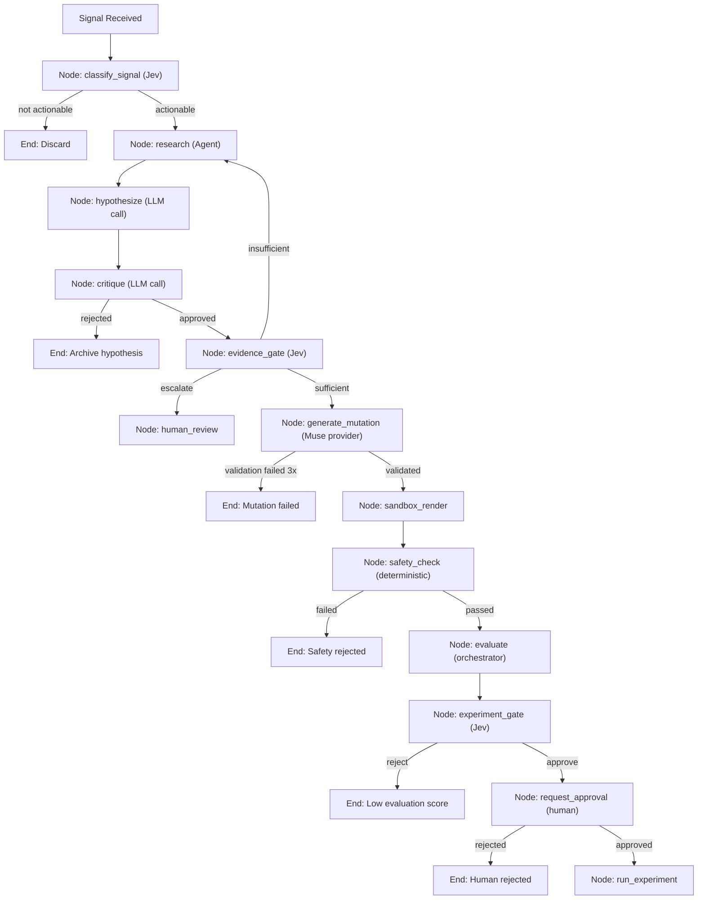

# DarwinUX — Agent Architecture

## Design Principle: Not Everything Should Be an Agent

The most common mistake in AI systems is making everything an LLM-powered agent. An "agent" implies autonomous decision-making, tool use, and iterative reasoning — capabilities that come with latency, cost, unpredictability, and evaluation difficulty.

**The right question is not "what agents do we need?" but "what responsibilities exist, and what is the simplest correct implementation for each?"**

The spectrum of implementation options, from simplest to most complex:

| Implementation | Characteristics | When to Use |
|---|---|---|
| **Deterministic Python** | Fast, testable, predictable, free | Logic with clear rules and no ambiguity |
| **Template + rules** | Configurable, auditable | Structured output from structured input |
| **Single LLM call** | Flexible text understanding/generation | One-shot tasks requiring language understanding |
| **Jev decision** | Classification, scoring, confidence-aware gating | Decision points requiring calibrated confidence |
| **Muse generation** | Structured creative output within constraints | Producing candidate mutations from approved hypotheses |
| **LangGraph node** | Stateful, conditional routing, retries | Steps that depend on previous results |
| **LLM agent with tools** | Autonomous multi-step reasoning | Tasks requiring iterative investigation |

## Responsibility Analysis

### 1. Signal Detection (Observer)

**Proposed name:** Observer Agent

**What it actually does:**
- Receives processed telemetry data
- Identifies behavioral patterns (rage clicks, abandonment, repeated errors)
- Classifies signal severity
- Decides whether to trigger investigation

**Should it be an agent?** **No.**

**Recommended implementation:** Deterministic Python + Jev classification.

**Reasoning:**
- Pattern detection (e.g., "3+ clicks on same element within 2 seconds") is purely rule-based. An LLM cannot reliably count events or compute time deltas.
- Signal classification (is this signal worth investigating?) benefits from Jev's calibrated scoring, but does not require multi-step reasoning.
- This runs on every batch of processed events. Latency and cost must be minimal.

**Implementation sketch:**
```
Telemetry events
  → Deterministic pattern matching (Python)
  → BehaviorSignal created
  → Jev classify(signal) → { actionable: true/false, severity: 0.0–1.0 }
  → If actionable and above threshold → trigger agent run
```

**What you learn:** Signal detection rules, threshold tuning, Jev classification API.

---

### 2. Evidence Research (Research Agent)

**Proposed name:** Research Agent

**What it actually does:**
- Receives a behavioral signal
- Formulates retrieval queries
- Searches Product Memory
- Assesses whether retrieved evidence is sufficient
- Summarizes relevant findings

**Should it be an agent?** **Yes — but a constrained one.**

**Recommended implementation:** LangGraph node with RAG tools.

**Reasoning:**
- Query formulation benefits from language understanding ("rage_click on checkout" → "checkout button design guidelines, error states, past experiments with checkout").
- Evidence assessment ("is this enough to form a hypothesis?") requires judgment that rules cannot easily encode.
- However, the agent should not have access to arbitrary tools. Its tools are: `search_product_memory`, `get_document_details`, `summarize_evidence`.

**Why LangGraph:** The research agent may need to iterate — if the first retrieval query returns insufficient results, it should reformulate and try again. LangGraph's conditional edges support this loop with explicit bounds (max 3 retrieval attempts).

**Implementation sketch:**
```
LangGraph node: research_agent
  Tools: [search_product_memory, get_document_details]
  Input: BehaviorSignal
  Output: EvidencePackage { chunks: [...], summary: str, sufficient: bool }
  Max iterations: 3
  On insufficient evidence after max iterations: escalate to human
```

**What you learn:** RAG query formulation, tool calling, LangGraph iteration loops, retrieval evaluation.

---

### 3. Hypothesis Formation (Hypothesis Agent)

**Proposed name:** Hypothesis Agent

**What it actually does:**
- Receives a behavioral signal + evidence package
- Proposes an explanation for the observed friction
- Cites specific evidence supporting the hypothesis
- Assesses confidence

**Should it be an agent?** **No — a single structured LLM call is sufficient.**

**Recommended implementation:** Single LLM call with structured output.

**Reasoning:**
- Hypothesis formation is a single reasoning step: "Given this signal and this evidence, what explains the friction?" This does not require tools, iteration, or multi-step planning.
- Structured output (Pydantic model) ensures the hypothesis has the required fields: description, evidence citations, confidence, proposed area of improvement.
- Making this an agent adds latency and cost without adding capability.

**Implementation sketch:**
```python
# Conceptual — not production code
class HypothesisOutput(BaseModel):
    description: str
    evidence_citations: list[str]
    confidence: float
    target_component: str
    proposed_improvement_area: str

hypothesis = await llm.generate_structured(
    prompt=hypothesis_prompt(signal, evidence),
    schema=HypothesisOutput
)
```

**What you learn:** Structured generation, Pydantic output schemas, prompt design for reasoning tasks.

---

### 4. Hypothesis Critique (Critic)

**Proposed name:** Critic Agent

**What it actually does:**
- Reviews a hypothesis for logical consistency
- Checks whether evidence actually supports the claims
- Identifies alternative explanations
- Flags potential issues

**Should it be an agent?** **No — a single LLM call with a different prompt persona.**

**Recommended implementation:** Single LLM call (different model or prompt from hypothesis generation).

**Reasoning:**
- Critique is a single evaluation step, not a multi-step investigation.
- Using a different model (or the same model with a critique-focused prompt) provides genuine value — it catches reasoning errors, unsupported claims, and overlooked alternatives.
- The value is in the separation of concerns (generator vs. critic), not in agent machinery.

**Design note:** Consider using a different LLM provider for the critic than for hypothesis generation. This provides genuine diversity of reasoning, not just prompt-level role-playing.

**Implementation sketch:**
```
LangGraph node: critique_hypothesis
  Input: Hypothesis + EvidencePackage
  Output: CritiqueResult { approved: bool, concerns: list[str], alternative_explanations: list[str] }
  Implementation: Single LLM call, structured output
```

**What you learn:** LLM-as-judge patterns, generator-critic architectures, cross-model evaluation.

---

### 5. Mutation Generation (Muse)

**Proposed name:** ~~Mutation Agent~~ → **Muse** (generative mutation layer)

**What it actually does:**
- Receives an approved, evidence-backed hypothesis
- Receives product context, design system constraints, and component constraints
- Receives the allowed mutation boundary (what properties can change, valid ranges)
- Generates a structured candidate mutation specification

**Should it be an agent?** **No — Muse is a dedicated generative model behind a provider boundary.**

**Recommended implementation:** Muse provider call + deterministic validation.

**Reasoning:**

Muse is not a general-purpose LLM being prompted to "write some UI changes." It is a specialized generative model (from TypeSafe AI) that should be treated as a distinct subsystem — the **generative mutation layer** — alongside Jev (decision layer), RAG (evidence layer), LangGraph agents (reasoning/orchestration layer), and the Evaluation Engine (quality/safety layer).

The critical distinction from the original "Mutation Agent" concept:

| Aspect | Generic LLM "Mutation Agent" | Muse as Generative Layer |
|---|---|---|
| **Model** | Whichever general-purpose LLM is configured | Muse — a purpose-built model |
| **Input** | Freeform prompt with hypothesis | Structured input: hypothesis + context + constraints |
| **Output** | Raw text requiring parsing | Structured candidate mutation |
| **Boundary** | Part of the agent orchestration | Its own provider with its own abstraction |
| **Evaluation** | Evaluated as "did the agent do a good job?" | Evaluated as "is this candidate mutation valid, safe, and good?" |

**Why a provider boundary, not an agent:** Muse's API surface, input format, and capabilities are not yet fully defined. Wrapping it in a provider boundary means:
- The rest of the system can develop and test against a mock Muse provider.
- When real integration details become available, only the provider implementation changes.
- Muse can be independently evaluated, versioned, and monitored.

**Muse's output is always a CANDIDATE.** It never directly deploys. The pipeline after Muse:

```
Muse generates candidate
  → Constrained mutation representation (structured spec)
  → Sandbox rendering (visual verification)
  → Deterministic validation (schema, allowlist, value ranges)
  → AI evaluation (accessibility, design consistency, regression)
  → Jev decision gate (proceed to experiment?)
  → Human approval
  → Experiment
```

**Implementation sketch:**
```
LangGraph node: generate_mutation_via_muse
  Input: ApprovedHypothesis + MutationContext + MutationConstraints
  Call: muse_provider.generate_mutation(hypothesis, context, constraints)
  Output: CandidateMutation
  Post-processing: Deterministic validation against component registry
  Loop: If validation fails, retry with constraint feedback (max 3 attempts)
  On repeated failure: reject with reasoning, log for Muse evaluation
```

**What you learn:** Provider abstraction for proprietary models, constrained generation, structured input/output contracts, candidate-vs-deployment distinction, evaluation of generative model quality.

---

### 6. Safety Validation (Safety Agent)

**Proposed name:** Safety Agent

**What it actually does:**
- Checks mutations against safety constraints
- Verifies no forbidden properties are modified
- Validates accessibility requirements
- Checks for regressions against known issues

**Should it be an agent?** **No — deterministic validation with optional LLM accessibility check.**

**Recommended implementation:** Deterministic Python rules + optional LLM accessibility assessment.

**Reasoning:**
- "Does this mutation modify authentication?" is a deterministic check against the mutation specification schema.
- "Does this mutation modify only allowed properties?" is a schema validation.
- "Is this color change accessible?" may benefit from an LLM check against WCAG guidelines, but only after deterministic contrast ratio checks pass.
- Safety validation must be fast, reliable, and auditable. LLM calls introduce uncertainty. Use them only for checks that rules cannot perform.

**Implementation sketch:**
```
Safety pipeline (sequential, all must pass):
  1. Schema validation (deterministic): mutation conforms to MutationSpec
  2. Allowlist check (deterministic): only permitted properties modified
  3. Value range check (deterministic): values within valid ranges
  4. Accessibility check (deterministic + optional LLM): contrast ratios, font sizes
  5. Regression check (deterministic): no known problematic patterns
```

**What you learn:** Validation pipeline design, defense-in-depth, separating mechanical checks from judgment.

---

### 7. Evaluation Orchestration (Evaluation Agent)

**Proposed name:** Evaluation Agent

**What it actually does:**
- Orchestrates evaluation of mutations across multiple dimensions
- Runs deterministic evaluators and LLM-as-judge evaluators
- Aggregates scores
- Determines overall pass/fail

**Should it be an agent?** **No — a deterministic orchestrator.**

**Recommended implementation:** Python orchestration code that runs evaluators in parallel and aggregates results.

**Reasoning:**
- Which evaluators to run is determined by the mutation type (a color change needs accessibility evaluation; a copy change needs readability evaluation). This is rule-based.
- Running evaluators is embarrassingly parallel and doesn't require reasoning.
- Aggregating scores into a pass/fail decision follows configured thresholds.
- Some individual evaluators use LLM calls (LLM-as-judge), but the orchestration layer is deterministic.

**Implementation sketch:**
```
Evaluation orchestrator:
  1. Determine required evaluators based on mutation type (deterministic)
  2. Run evaluators in parallel:
     - Schema compliance (deterministic)
     - Accessibility (deterministic + LLM)
     - Design consistency (LLM-as-judge)
     - Regression (deterministic)
  3. Aggregate scores (deterministic)
  4. Apply pass/fail thresholds (deterministic)
  5. Return EvaluationResult
```

**What you learn:** Parallel execution, evaluation framework design, score aggregation, threshold configuration.

---

### 8. System Monitoring (Monitoring Agent)

**Proposed name:** Monitoring Agent

**What it actually does:**
- Tracks system health metrics
- Monitors experiment progress
- Detects anomalies in AI behavior (model drift, cost spikes)
- Alerts on failures

**Should it be an agent?** **No — standard monitoring infrastructure.**

**Recommended implementation:** OpenTelemetry instrumentation + CloudWatch alarms + periodic health check jobs.

**Reasoning:**
- Monitoring is a solved problem with mature tooling. Using an LLM to "monitor" adds latency, cost, and unreliability to a system that must be the most reliable part of the platform.
- Anomaly detection can be done with statistical methods (standard deviation alerts, cost threshold checks).
- The only place an LLM might add value is in generating human-readable incident summaries — but this is a nice-to-have, not a core requirement.

**What you learn:** OpenTelemetry, CloudWatch configuration, alerting strategy, health check design.

---

## Summary: Agent vs. Not-Agent

| Responsibility | Agent? | Implementation | Justification |
|---|---|---|---|
| Signal Detection | ❌ | Python rules + Jev classify | Pattern matching is deterministic; classification is Jev's strength |
| Evidence Research | ✅ | LangGraph + RAG tools | Requires iterative retrieval and query reformulation |
| Hypothesis Formation | ❌ | Single LLM call, structured output | One-shot reasoning task, no tools needed |
| Hypothesis Critique | ❌ | Single LLM call, different perspective | One-shot evaluation, no iteration needed |
| Mutation Generation | 🔷 | **Muse** (provider) + validation | Dedicated generative model, not a generic agent; provider boundary |
| Safety Validation | ❌ | Deterministic pipeline | Safety must be reliable, fast, and auditable |
| Evaluation Orchestration | ❌ | Python orchestrator | Deterministic coordination of parallel evaluators |
| System Monitoring | ❌ | Standard monitoring tools | Solved problem, no AI required |

**Result:** Of eight proposed "agents," only one (Research) is genuinely an autonomous agent with tools. Mutation generation is handled by Muse — a dedicated generative model behind a provider boundary, not an agent. The rest are deterministic code, single LLM calls, or Jev decisions.

**This is the correct outcome.** The five AI subsystems each have a clear role:

| Subsystem | Role |
|---|---|
| **RAG / Product Memory** | Evidence — what do we know? |
| **LangGraph Agents** | Reasoning — investigate and hypothesize |
| **Jev** | Decision — should we proceed? |
| **Muse** | Generation — produce a candidate mutation |
| **Evaluation Engine** | Quality — is the candidate good enough? |

## LangGraph Orchestration

Even though most components are not agents, LangGraph still provides value as the orchestration layer for the overall investigation flow:



**Why LangGraph for orchestration:** The investigation flow has conditional branches, loops (research → hypothesize → need more evidence → research again), and human-in-the-loop requirements. LangGraph's state graph model handles these naturally. Without it, you'd write a complex state machine in plain Python — which is possible but less maintainable as the flow evolves.

**LangGraph state:** The graph maintains state across nodes:
```python
# Conceptual
class InvestigationState(TypedDict):
    signal: BehaviorSignal
    evidence: Optional[EvidencePackage]
    hypothesis: Optional[Hypothesis]
    critique: Optional[CritiqueResult]
    candidate_mutation: Optional[CandidateMutation]  # From Muse
    sandbox_result: Optional[SandboxResult]
    evaluation: Optional[EvaluationResult]
    decisions: list[Decision]
    iteration_count: int
```

Note that `candidate_mutation` is explicitly named to reinforce that Muse produces candidates, not deployable changes. The state tracks the full progression: evidence → hypothesis → critique → Muse candidate → sandbox → evaluation.

---

## What You Should Understand Before Implementation

1. **An agent is a specific architectural pattern (autonomous decision-making with tools), not a synonym for "AI-powered component."** Most AI-powered components in DarwinUX are single LLM calls, dedicated models (Muse, Jev), or deterministic code.
2. **The cost of making something an agent is concrete: latency (seconds vs. milliseconds), cost (LLM tokens), unpredictability (non-deterministic behavior), and evaluation difficulty.** Each time you consider an agent, weigh these costs against the capability gained.
3. **LangGraph's value is in orchestration, not in making everything an agent.** A LangGraph node can contain a deterministic function, a single LLM call, a Muse call, or a Jev decision — it's the conditional routing and state management that justify LangGraph.
4. **The generator-critic pattern (hypothesis + critique) is more reliable than a single "do everything" agent.** Separating generation from evaluation forces the system to justify its reasoning.
5. **Muse, Jev, and general-purpose LLMs serve different roles.** Muse generates candidate mutations. Jev makes calibrated decisions. General-purpose LLMs handle reasoning tasks (hypothesis, critique, research). Don't conflate these — they have different input/output contracts, different evaluation criteria, and different provider boundaries.
6. **Jev as a decision gate replaces what would otherwise be arbitrary thresholds or uncalibrated LLM "opinions."** The value of a decision-oriented model is confidence-aware gating, not text generation.
7. **Safety validation must be deterministic first, AI-augmented second.** Never rely solely on an LLM to enforce safety constraints. Muse's output always passes through deterministic validation before AI evaluation.
