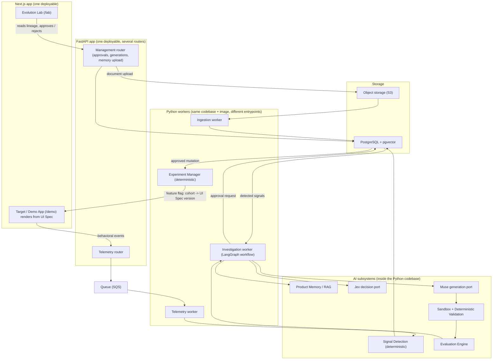
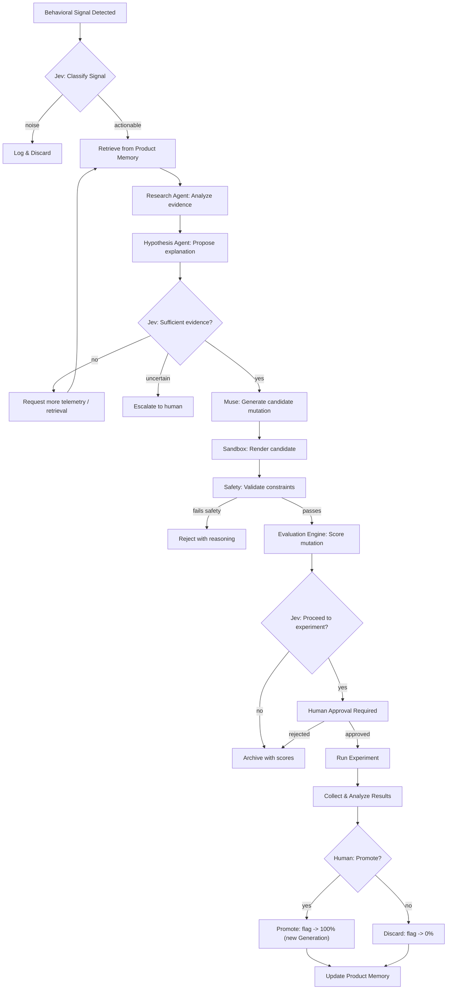

# DarwinUX — System Architecture

## Architectural Philosophy

DarwinUX follows three principles:

1. **Separate concerns by rate of change.** Things that change together live together. The telemetry pipeline changes independently from the agent system, which changes independently from the frontend.
2. **Prefer boring technology unless AI requires otherwise.** PostgreSQL over a custom graph database. SQS over Kafka. Python functions over LLM calls. Use AI where it provides capabilities that deterministic code cannot.
3. **Design for evaluation from day one.** Every AI component must be measurable. If you can't evaluate it, you can't trust it. If you can't trust it, you can't deploy it.

## High-Level System Architecture



The diagram shows **logical components**, not services. There are three deployables (the Next.js app, the FastAPI app, and the Python workers — which share one codebase and one Docker image). See "Modular Monolith" below.
### Why This Shape

**Three entry points exist:** behavioral telemetry from the target application, management actions from the Evolution Lab, and document ingestion for Product Memory. These have fundamentally different characteristics (high-volume events vs. low-frequency human actions vs. batch document processing) and should not share the same request path.

**The queue (SQS) sits between telemetry ingestion and processing** because user events arrive at unpredictable rates and processing them (signal detection, aggregation) is more expensive than receiving them. Decoupling prevents back-pressure from degrading the user-facing application.

**PostgreSQL serves as the primary data store** including vector search via pgvector. Starting with a single database engine reduces operational complexity. A dedicated vector database (Pinecone, Weaviate) can be introduced later if pgvector becomes a bottleneck — but for the scale of an experimental platform, it will not.

**Muse is the generative mutation layer, not the agents.** The LangGraph workflow investigates and hypothesizes, and Jev decides. Muse receives an approved hypothesis with product context and design constraints, then generates a structured candidate mutation. This separation is deliberate: reasoning and generation are different capabilities with different evaluation criteria, different failure modes, and potentially different underlying models.

**The LangGraph workflow is not the center of the system.** It is one component that is invoked when behavioral signals trigger analysis. Most of the system's value comes from the pipelines, evaluation, and experiment management — not from the agents themselves.

### Five Core AI Subsystems

The platform has five distinct AI subsystems, each with a clear responsibility:

| Subsystem | Role | Analogy |
|---|---|---|
| **RAG / Product Memory** | Evidence layer — what do we know? | The library |
| **LangGraph workflow** | Reasoning / orchestration layer — investigate and hypothesize (contains exactly one true agent: Research) | The investigators |
| **Jev** | Decision layer — should we proceed? | The judge |
| **Muse** | Generative mutation layer — produce a candidate change | The craftsperson |
| **Evaluation Engine** | Quality / safety layer — is the candidate good enough? | The inspector |

These subsystems have clear boundaries and interact through well-defined interfaces. An investigation (AgentRun) retrieves evidence from RAG, reasons about it, gets gated by Jev, hands an approved hypothesis to Muse, and the candidate Muse produces flows through the Evaluation Engine before any human sees it.

### Modular Monolith

DarwinUX starts as a **modular monolith**: one Python package (`darwin`) with strict internal module boundaries, deployed as one Docker image with several entrypoints.

| Deployable | Entrypoint | Why it is separate |
|---|---|---|
| `web` (Next.js) | `next start` | Different language/runtime |
| `api` (FastAPI) | `uvicorn darwin.api.main:app` | Must stay fast; serves humans and the telemetry SDK |
| `worker` (same image as `api`) | `python -m darwin.workers <name>` | Long-running / queue-driven work must not share a process with request handling |

Workers are *processes*, not *services*: they import the same domain models and repositories. A module gets extracted into its own service only when it needs a different runtime, scaling profile, or security boundary — not before.

### Deterministic vs. AI

AI is used only where the task genuinely requires language understanding, judgment under uncertainty, or generation. Everything else is deterministic Python.

| Stage | Implementation | Why |
|---|---|---|
| Event validation, enrichment, persistence | Deterministic | Schema problem |
| Signal detection (rage click, abandonment…) | Deterministic | Counting / time-window problem; must be unit-testable |
| Signal triage ("worth investigating?") | Deterministic threshold, then **Jev** | Cheap filter first; Jev only for ambiguous cases |
| Query formation, evidence assessment | **LLM agent** (Research) | Needs language understanding and iteration |
| Retrieval, filtering, context construction | Deterministic (+ embedding model) | Retrieval is search, not reasoning |
| Hypothesis / critique | **LLM call** (structured output) | One-shot reasoning |
| Evidence sufficiency, experiment readiness | **Jev** | Confidence-aware gating |
| Mutation generation | **Muse** | Generative capability, constrained |
| Mutation validation, safety | Deterministic | Safety must never be probabilistic |
| Design-consistency judgement | LLM-as-judge (advisory) | Rules cannot express it |
| Experiment assignment, statistics | Deterministic | Math, not judgment |
| Approval to experiment / promote | **Human** | Accountability |
| Rollback on guardrail breach | Deterministic (automatic) | Moving *toward* safety needs no approval |

## End-to-End Evolution Loop

```mermaid
graph LR
    subgraph Observe["1. Observe"]
        UE["User Events"]
        TEL["Telemetry Pipeline"]
        SIG["Signal Detection"]
    end

    subgraph Reason["2. Reason"]
        RET["RAG Retrieval"]
        HYP["Hypothesis Formation"]
        DEC["Jev Decision Gate"]
    end

    subgraph Mutate["3. Mutate"]
        MUSE["Muse: Generate Candidate"]
        SANDBOX["Sandbox Rendering"]
        VAL["Deterministic Validation"]
    end

    subgraph Evaluate["4. Evaluate & Decide"]
        AI_EVAL["AI Evaluation"]
        GATE["Jev Experiment Gate"]
        HUMAN["Human Approval"]
    end

    subgraph Experiment["5. Experiment"]
        DEPLOY["Controlled Deployment"]
        MEASURE["Metric Collection"]
        ANALYZE["Result Analysis"]
    end

    subgraph Learn["6. Learn"]
        PROMOTE["Promote / Discard"]
        GEN["New Generation (or none)"]
        MEMORY["Update Product Memory"]
    end

    UE --> TEL --> SIG
    SIG --> RET --> HYP --> DEC
    DEC -->|proceed| MUSE --> SANDBOX --> VAL
    DEC -->|need more evidence| RET
    DEC -->|escalate| HUMAN
    VAL --> AI_EVAL --> GATE --> HUMAN
    HUMAN -->|approved| DEPLOY --> MEASURE --> ANALYZE
    ANALYZE -->|human decides| PROMOTE --> GEN --> MEMORY
    MEMORY -.->|next cycle| UE
```



### Decision Points

The loop has three critical decision points, each with different decision-makers:

| Gate | Who Decides | What Happens on "No" |
|---|---|---|
| **Should we investigate this signal?** | Deterministic thresholds + Jev classification | Signal is logged but no agent run is triggered |
| **Is this mutation worth experimenting?** | Jev scoring + AI evaluation + human review | Mutation is archived with reasoning |
| **Should this experiment be promoted?** | Deterministic statistical analysis + human approval (Jev advisory only) | Experiment results feed back into Product Memory as negative evidence |

A fourth, automatic decision exists: **rollback on guardrail breach** (error rate, accessibility regression, key metric collapse). It is deterministic and needs no approval because it moves the system back to a known-good Generation.

## AI / Agent Decision Flow



### Why Jev Appears Multiple Times

Jev is not a single call. It serves as a decision gate at multiple points because each point has different inputs and different consequences:

- **Signal classification** has low cost of error (worst case: we investigate a non-issue). Speed matters.
- **Evidence sufficiency** has moderate cost (wasting agent compute on insufficient data). Calibration matters.
- **Experiment approval** has high cost (shipping a bad mutation to users). Confidence and safety matter.

Each gate can have different thresholds, different confidence requirements, and different fallback behaviors. Whether Jev's confidence values are *calibrated* is not assumed — it must be measured (see EVALUATION_STRATEGY.md, "Evaluating Jev decisions").

**Fail closed.** If Jev is unavailable, times out, or returns something that fails schema validation, the gate outcome is `escalate` (to a human) or `stop` — never `proceed`.

## Layer Architecture

The backend is organized into modules with clear dependency rules:

```
┌───────────────────────────────────────────────┐
│  Entrypoints                                  │  FastAPI routers, worker commands.
│  (api/, workers/)                             │  Parse input, call services. No logic.
├───────────────────────────────────────────────┤
│  Application services / workflows             │  Use-case orchestration, state machines,
│  (services/)                                  │  approval rules, experiment lifecycle.
├──────────────┬───────────────┬────────────────┤
│  AI          │  Evaluation   │  Pipelines     │  LangGraph graph, prompts, RAG retrieval │
│  (ai/)       │  (evaluation/)│  (pipelines/)  │  evaluators & judges │ telemetry/ingestion
├──────────────┴───────────────┴────────────────┤
│  Ports & adapters                             │  LLM, embedding, Jev, Muse providers;
│  (providers/, data/)                          │  repositories, queue, object storage.
├───────────────────────────────────────────────┤
│  Domain models                                │  Pure Pydantic models + enums + state
│  (domain/)                                    │  transition rules. Imports nothing else.
└───────────────────────────────────────────────┘
```

**Dependency rule:** A module may import from modules below it, never above. `ai/`, `evaluation/` and `pipelines/` are siblings: they all use providers (an LLM judge needs the LLM provider; ingestion needs the embedding provider), and none of them import each other directly — services wire them together. `domain/` imports nothing from the rest of the codebase.

Infrastructure (Docker, Terraform, CI/CD) is **not** a code layer; it lives outside `backend/src`.

### Why These Specific Layers

- **Entrypoints are separate from services** because FastAPI routing concerns (authentication, request parsing, response formatting) should not contaminate business logic. Services should be testable without HTTP.
- **Providers are isolated behind ports** because AI providers (LLMs, embeddings, Jev, Muse) have their own lifecycle, configuration, and failure modes. Swapping an LLM provider should not require changing business logic.
- **Evaluation is its own module** because evaluation is a first-class capability, not an afterthought. It has its own records, its own metrics, and its own execution model. It evaluates the AI module but is not part of it.
- **Pipelines are separate from entrypoints** because pipelines are long-running, asynchronous, and batch-oriented. They share domain models with the API but have completely different execution characteristics.
- **Domain models sit at the bottom** so the state machines (e.g., "a Mutation in `generated` cannot enter an experiment") are enforced everywhere, by pure, fast unit tests.

## Provider Abstraction

DarwinUX should not be coupled to a single AI provider. Provider boundaries exist for:

### LLM Provider
```python
# Conceptual interface — not production code
class LLMProvider(Protocol):
    async def generate(self, prompt: str, **kwargs) -> LLMResponse: ...
    async def generate_structured(self, prompt: str, schema: type[BaseModel], **kwargs) -> BaseModel: ...
```

**Why:** Model capabilities, pricing, and availability change rapidly. The system should be able to swap LLM vendors without rewriting business logic.

### Embedding Provider
```python
class EmbeddingProvider(Protocol):
    async def embed(self, texts: list[str]) -> list[list[float]]: ...
```

**Why:** Embedding models affect retrieval quality and vector dimensions. Provider changes require re-embedding but should not require code changes.

### Jev Provider

```python
# Conceptual DarwinUX-owned port — NOT Jev's API. Jev's real interface is unknown.
class JevProvider(Protocol):
    async def decide(self, request: DecisionRequest) -> DecisionResult: ...

# DecisionRequest: decision_type (signal_triage | evidence_gate | experiment_gate),
#                  structured evidence, policy/threshold version
# DecisionResult:  outcome (proceed | stop | need_more_evidence | escalate),
#                  confidence, rationale, provider + provider_version
```

**Why:** Jev is developed by TypeSafe AI, but its API surface, input format, output format, and confidence semantics are not documented in this repository (see OPEN_QUESTIONS.md). The port is shaped around **what DarwinUX needs from a decision component**, not around a guessed Jev API. When Jev's real interface is known, a `JevAdapter` translates between the two.

**Adapters, in order of availability:**

1. `RulesDecider` — deterministic thresholds. Always available; also the fallback.
2. `LLMBaselineDecider` — a general-purpose LLM with structured output. Gives a **baseline** to compare Jev against.
3. `JevAdapter` — the real Jev integration, once the open questions are resolved.

Every `Decision` record stores which adapter produced it, so Jev's decisions are never confused with the baseline's.

### Muse Provider
```python
class MuseProvider(Protocol):
    async def generate_mutation(
        self,
        hypothesis: ApprovedHypothesis,
        context: MutationContext,
        constraints: MutationConstraints,
    ) -> CandidateMutation: ...
```

This is a **DarwinUX-owned port**, not Muse's API. `MutationContext` carries the retrieved evidence, the current UI representation (the active UI Spec version for the target screen), design-system tokens, and component-registry entries. `MutationConstraints` defines the permitted mutation surface — which properties can change, valid value ranges, and forbidden modifications (see MUTATION_SAFETY.md). `CandidateMutation` is a `MutationSpec`: a structured patch against a UI Spec, never source code.

**Why:** Muse's provider, API surface, input format, output format, and capabilities are not documented in this repository (see OPEN_QUESTIONS.md). The provider boundary serves three purposes:

1. **Development velocity:** The rest of the system can be built and tested against a mock Muse provider that returns valid structured mutations.
2. **Integration isolation:** When real Muse integration details become available, only the provider implementation changes — not the domain logic, agent orchestration, or evaluation engine.
3. **Evaluation:** A mock provider produces predictable outputs, enabling deterministic testing of the downstream pipeline (validation → evaluation → experiment).

**Adapters, in order of availability:** `FixtureMuse` (returns recorded valid/invalid specs for tests) → `LLMBaselineGenerator` (general LLM with structured output — the baseline Muse is compared against) → `MuseAdapter` (real integration). The `Mutation` record stores which adapter produced it.

**Critical constraint:** The `CandidateMutation` output from the Muse provider is never treated as deployable. It is always a candidate that must pass through deterministic validation, AI evaluation, Jev gating, and human approval before it can reach an experiment.

## Proposed Repository Layout

```
darwin-ux/
├── README.md
├── docs/                          # Architecture & design documentation
│   ├── PRODUCT.md
│   ├── ARCHITECTURE.md
│   ├── DOMAIN_MODEL.md
│   ├── ...
│   └── decisions/                 # Architecture Decision Records (added from Step 1 on)
│
├── backend/                       # Python platform (FastAPI)
│   ├── pyproject.toml
│   ├── src/
│   │   └── darwin/
│   │       ├── api/               # FastAPI routers, middleware, deps
│   │       ├── workers/           # Worker entrypoints (telemetry, ingestion, investigation, experiments)
│   │       ├── services/          # Application services, workflows, state transitions
│   │       ├── domain/            # Pure Pydantic models, enums, transition rules
│   │       ├── ai/                # LangGraph graph, prompts, RAG retrieval
│   │       ├── evaluation/        # Evaluation engine, metrics, judges
│   │       ├── pipelines/         # Telemetry & ingestion processing logic
│   │       ├── mutation/          # UI Spec, component registry, MutationSpec validation
│   │       ├── providers/         # LLM, embedding, Jev, Muse ports + adapters
│   │       ├── data/              # Repositories, database, queue, object storage
│   │       └── config/            # Settings, provider config
│   ├── tests/
│   │   ├── unit/
│   │   ├── integration/
│   │   └── evals/                 # AI evaluation suites
│   │       └── golden/            # Versioned golden datasets
│   ├── Dockerfile
│   └── alembic/                   # Database migrations (future)
│
├── frontend/                      # Next.js: Evolution Lab (/lab) + demo target app (/demo)
│   ├── package.json
│   ├── src/
│   │   ├── app/
│   │   ├── components/
│   │   └── lib/
│   └── Dockerfile
│
├── infrastructure/                # Terraform + deployment
│   ├── terraform/
│   │   ├── environments/
│   │   │   └── dev/               # One AWS environment first; add prod later
│   │   └── modules/
│   └── docker-compose.yml         # Local development (Postgres+pgvector, SQS emulator, OTel collector)
│
└── .github/
    └── workflows/                 # CI/CD
        ├── backend.yml
        ├── frontend.yml
        └── evals.yml              # AI regression evals (path-filtered)
```

### Why This Layout

**Monorepo with two primary applications (`backend/`, `frontend/`)** rather than a flat `apps/services/packages/` structure. The rationale:

- There are exactly two deployable applications right now. Creating `apps/` and `services/` directories implies multiple services that don't exist yet.
- The `packages/` pattern (shared libraries) is premature. If backend and frontend need shared types, that's a single concern — not a reason for a packages directory.
- `pipelines/` lives inside `backend/` because pipelines share all the same domain models, data layer, and AI layer. They are workers within the same Python application, not separate services.
- `evals/` lives inside `backend/tests/` because evaluation suites are test suites with special characteristics. They use the same test runner and CI integration. Golden datasets live in `backend/tests/evals/golden/` and are versioned in git.
- The demo target app lives inside `frontend/` (as `/demo`) because it shares the component library with the Evolution Lab's before/after previews. It could be split out later.

**When to split:** If a pipeline becomes a genuinely separate service (different deployment, different scaling, different language), extract it then. Not before.

---

## What You Should Understand Before Implementation

1. **Layer boundaries are dependency rules, not folder conventions.** The value is not in having directories called `api/` and `domain/` — it's in enforcing that API code never contains business logic and domain code never imports FastAPI.
2. **Provider abstraction is about isolating volatility.** AI models change faster than application logic. The abstraction boundary exists at the point of highest change rate.
3. **The queue between telemetry ingestion and processing exists for resilience, not performance.** Even if direct processing were fast enough, the queue prevents user-facing latency from being affected by processing failures.
4. **pgvector is a deliberate simplicity choice.** It may not be the best vector database, but it eliminates an entire operational dependency. The architecture allows replacing it later if needed.
5. **The repository layout should match the actual system, not the aspirational system.** Two apps, not eight services. Add structure when complexity demands it.
6. **Jev appears at multiple decision gates because each gate has different risk tolerances.** Signal classification can tolerate false positives. Experiment approval cannot. Same port, different thresholds — and every gate fails closed.
7. **Muse generates candidates, never deployments.** The provider boundary ensures that Muse's output is always treated as a proposal that must survive validation, evaluation, and human approval. The separation between reasoning (agents), generation (Muse), decision (Jev), and evaluation (Evaluation Engine) is a deliberate architectural firewall.
