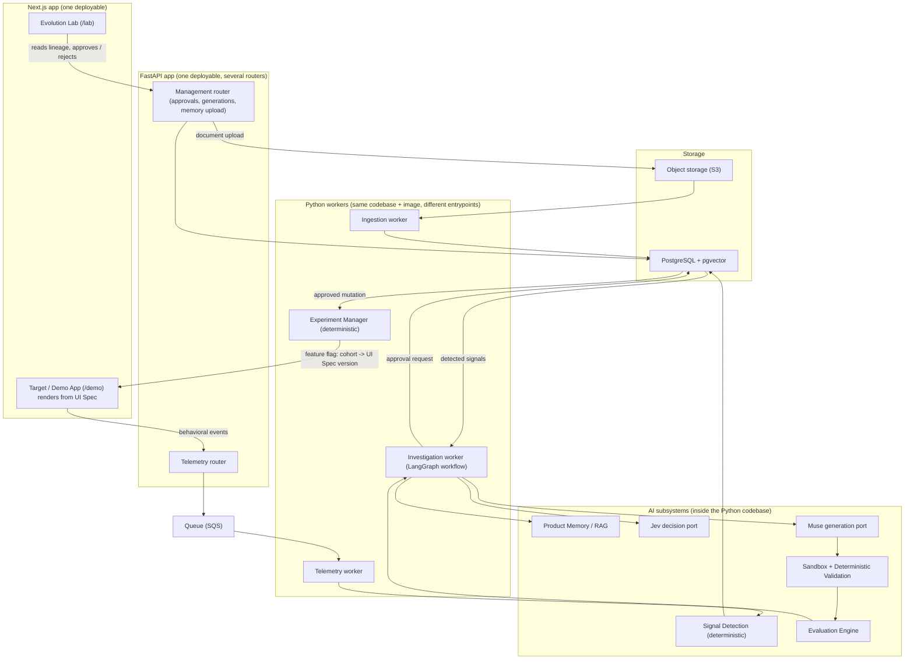
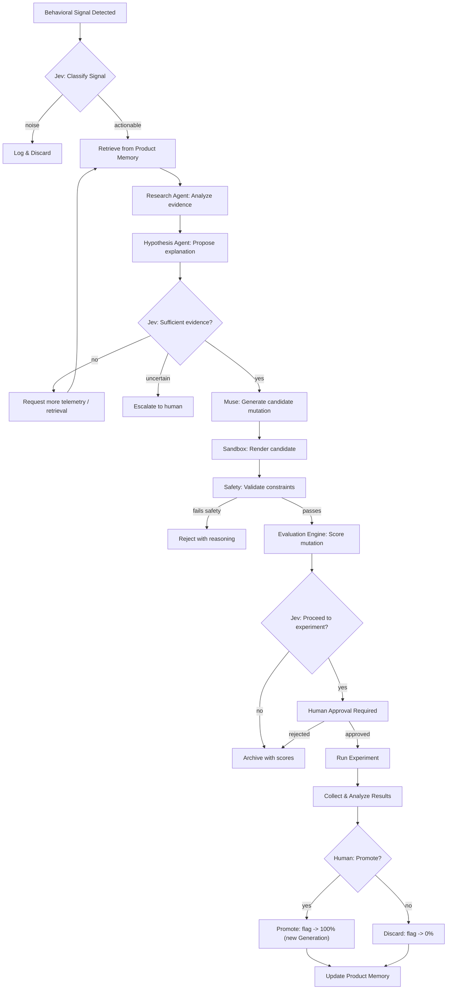

# DarwinUX — System Architecture

## Architectural Philosophy

DarwinUX follows three principles:

1. **Separate concerns by rate of change.** Things that change together live together. The telemetry pipeline changes independently from the agent system, which changes independently from the frontend.
2. **Prefer boring technology unless AI requires otherwise.** PostgreSQL over a custom graph database. SQS over Kafka. Python functions over LLM calls. Use AI where it provides capabilities that deterministic code cannot.
3. **Design for evaluation from day one.** Every AI component must be measurable. If you can't evaluate it, you can't trust it. If you can't trust it, you can't deploy it.

## High-Level System Architecture



**Built so far (Step 7):** only `/demo` — the Generation 0 target app — plus a landing page at `/`. `/lab` does not exist yet. The demo renders from a validated UI Spec (`frontend/src/ui-spec/generation-0.json`) through an allowlisted component registry, and its browser telemetry SDK posts to the API, which queues events for the worker.

The diagram shows **logical components**, not services. There are three deployables (the Next.js app, the FastAPI app, and the Python workers — which share one codebase and one Docker image). See "Modular Monolith" below.
### Why This Shape

**Three entry points exist:** behavioral telemetry from the target application, management actions from the Evolution Lab, and document ingestion for Product Memory. These have fundamentally different characteristics (high-volume events vs. low-frequency human actions vs. batch document processing) and should not share the same request path.

**The queue (SQS) sits between telemetry ingestion and processing** because user events arrive at unpredictable rates and processing them (signal detection, aggregation) is more expensive than receiving them. Decoupling prevents back-pressure from degrading the user-facing application.

**PostgreSQL serves as the primary data store** including vector search via pgvector. Starting with a single database engine reduces operational complexity. A dedicated vector database (Pinecone, Weaviate) can be introduced later if pgvector becomes a bottleneck — but for the scale of an experimental platform, it will not.

**Muse is the generative mutation layer, not the agents.** The LangGraph workflow investigates and hypothesizes, and Jev decides. Muse receives an approved hypothesis with product context and design constraints, then generates a structured candidate mutation. This separation is deliberate: reasoning and generation are different capabilities with different evaluation criteria, different failure modes, and potentially different underlying models.

**The LangGraph workflow is not the center of the system.** It is one component that is invoked when behavioral signals trigger analysis. Most of the system's value comes from the pipelines, evaluation, and experiment management — not from the agents themselves.

### Five Core AI Subsystems

The platform has five distinct AI subsystems, each with a clear responsibility:

| Subsystem | Role | Analogy |
|---|---|---|
| **RAG / Product Memory** | Evidence layer — what do we know? | The library |
| **LangGraph workflow** | Reasoning / orchestration layer — investigate and hypothesize (contains exactly one true agent: Research) | The investigators |
| **Jev** | Decision layer — should we proceed? | The judge |
| **Muse** | Generative mutation layer — produce a candidate change | The craftsperson |
| **Evaluation Engine** | Quality / safety layer — is the candidate good enough? | The inspector |

These subsystems have clear boundaries and interact through well-defined interfaces. An investigation (AgentRun) retrieves evidence from RAG, reasons about it, gets gated by Jev, hands an approved hypothesis to Muse, and the candidate Muse produces flows through the Evaluation Engine before any human sees it.

### Modular Monolith

DarwinUX starts as a **modular monolith**: one Python package (`darwin`) with strict internal module boundaries, deployed as one Docker image with several entrypoints.

| Deployable | Entrypoint | Why it is separate |
|---|---|---|
| `web` (Next.js) | `next start` | Different language/runtime |
| `api` (FastAPI) | `uvicorn darwin.api.main:app` | Must stay fast; serves humans and the telemetry SDK |
| `worker` (same image as `api`) | `python -m darwin.worker` (today: the telemetry worker) | Long-running / queue-driven work must not share a process with request handling |

Workers are *processes*, not *services*: they import the same domain models and repositories. A module gets extracted into its own service only when it needs a different runtime, scaling profile, or security boundary — not before.

### Deterministic vs. AI

AI is used only where the task genuinely requires language understanding, judgment under uncertainty, or generation. Everything else is deterministic Python.

| Stage | Implementation | Why |
|---|---|---|
| Event validation, enrichment, persistence | Deterministic | Schema problem |
| Signal detection (rage click, abandonment…) | Deterministic | Counting / time-window problem; must be unit-testable |
| Signal triage ("worth investigating?") | Deterministic threshold, then **Jev** | Cheap filter first; Jev only for ambiguous cases |
| Query formation, evidence assessment | **LLM agent** (Research) | Needs language understanding and iteration |
| Retrieval, filtering, context construction | Deterministic (+ embedding model) | Retrieval is search, not reasoning |
| Hypothesis / critique | **LLM call** (structured output) | One-shot reasoning |
| Evidence sufficiency, experiment readiness | **Jev** | Confidence-aware gating |
| Mutation generation | **Muse** | Generative capability, constrained |
| Mutation validation, safety | Deterministic | Safety must never be probabilistic |
| Design-consistency judgement | LLM-as-judge (advisory) | Rules cannot express it |
| Experiment assignment, statistics | Deterministic | Math, not judgment |
| Approval to experiment / promote | **Human** | Accountability |
| Rollback on guardrail breach | Deterministic (automatic) | Moving *toward* safety needs no approval |

## End-to-End Evolution Loop

```mermaid
graph LR
    subgraph Observe["1. Observe"]
        UE["User Events"]
        TEL["Telemetry Pipeline"]
        SIG["Signal Detection"]
    end

    subgraph Reason["2. Reason"]
        RET["RAG Retrieval"]
        HYP["Hypothesis Formation"]
        DEC["Jev Decision Gate"]
    end

    subgraph Mutate["3. Mutate"]
        MUSE["Muse: Generate Candidate"]
        SANDBOX["Sandbox Rendering"]
        VAL["Deterministic Validation"]
    end

    subgraph Evaluate["4. Evaluate & Decide"]
        AI_EVAL["AI Evaluation"]
        GATE["Jev Experiment Gate"]
        HUMAN["Human Approval"]
    end

    subgraph Experiment["5. Experiment"]
        DEPLOY["Controlled Deployment"]
        MEASURE["Metric Collection"]
        ANALYZE["Result Analysis"]
    end

    subgraph Learn["6. Learn"]
        PROMOTE["Promote / Discard"]
        GEN["New Generation (or none)"]
        MEMORY["Update Product Memory"]
    end

    UE --> TEL --> SIG
    SIG --> RET --> HYP --> DEC
    DEC -->|proceed| MUSE --> SANDBOX --> VAL
    DEC -->|need more evidence| RET
    DEC -->|escalate| HUMAN
    VAL --> AI_EVAL --> GATE --> HUMAN
    HUMAN -->|approved| DEPLOY --> MEASURE --> ANALYZE
    ANALYZE -->|human decides| PROMOTE --> GEN --> MEMORY
    MEMORY -.->|next cycle| UE
```



### Decision Points

The loop has three critical decision points, each with different decision-makers:

| Gate | Who Decides | What Happens on "No" |
|---|---|---|
| **Should we investigate this signal?** | Deterministic thresholds + Jev classification | Signal is logged but no agent run is triggered |
| **Is this mutation worth experimenting?** | Jev scoring + AI evaluation + human review | Mutation is archived with reasoning |
| **Should this experiment be promoted?** | Deterministic statistical analysis + human approval (Jev advisory only) | Experiment results feed back into Product Memory as negative evidence |

A fourth, automatic decision exists: **rollback on guardrail breach** (error rate, accessibility regression, key metric collapse). It is deterministic and needs no approval because it moves the system back to a known-good Generation.

## AI / Agent Decision Flow

> **Built so far (Step 14):** … → sandbox evaluation → **controlled experiment**: a Step 13 `pass` (re-checked from the database) can become a human-created draft experiment against Generation 0, started only by an explicit CLI command after a deterministic start gate; stable-hash assignment served by the backend, exposure only after a successful render, idempotent exposures through the telemetry pipeline, and immutable frequentist analyses that are evidence for a human (see "Experiment Architecture (Step 14)" below). Promotion, generations, automatic rollback and deployment are still design. Step 13: **sandbox evaluation**: every candidate can be evaluated by rendering it through the real Zod schema, registry and `SpecPage` in a jsdom harness (telemetry captured, never sent) and scored in seven separate categories by a deterministic `candidate_eval.v1` policy — pass | human_review | reject, stored as an immutable `candidate_evaluation_run`; a safe-but-harmful candidate is rejected. Step 12: a proceed decision (re-checked for stale provenance) produces a MutationRequest; a MutationGenerator (fixture, LLM-port baseline; Muse is an unimplemented seam) proposes a data-only MutationSpec; DarwinUX validates it against an explicit mutation surface, applies it in memory, proves only allowed leaves changed, and stores an immutable candidate UI Spec (`ui_spec_version`, `mutation_run`) that the frontend's real Zod schema accepts. Promotion to a new Generation, automatic rollback, the Evolution Lab UI, browser-based checks and deployment below are still design.



### Why Jev Appears Multiple Times

Jev is not a single call. It serves as a decision gate at multiple points because each point has different inputs and different consequences:

- **Signal classification** has low cost of error (worst case: we investigate a non-issue). Speed matters.
- **Evidence sufficiency** has moderate cost (wasting agent compute on insufficient data). Calibration matters.
- **Experiment approval** has high cost (shipping a bad mutation to users). Confidence and safety matter.

Each gate can have different thresholds, different confidence requirements, and different fallback behaviors. Whether Jev's confidence values are *calibrated* is not assumed — it must be measured (see EVALUATION_STRATEGY.md, "Evaluating Jev decisions").

**Fail closed.** If Jev is unavailable, times out, or returns something that fails schema validation, the gate outcome is `escalate` (to a human) or `stop` — never `proceed`.

## Experiment Architecture (Step 14)

Step 13 answers "is this candidate safe enough to consider?" (deterministic). Step 14 answers "what happens when a bounded group of sessions experiences it?" (statistical). The two are never mixed: the sandbox verdict is an eligibility precondition, not evidence of improvement.

```
CandidateEvaluationRun (pass, re-derived from the DB)
  -> make experiment-create        draft Experiment (config validated against allowlists)
  -> make experiment-start CONFIRM=<key>   start gate (all checks) -> running
  -> POST /api/v1/experiments/assignment   stable hash -> variant + spec (backend only)
  -> browser: Zod -> registry -> SpecPage   rendered? -> experiment_exposure event
                                            failed?   -> Generation 0 + experiment_fallback
  -> telemetry pipeline (API -> queue -> worker): user_event + idempotent experiment_exposure
  -> make experiment-analyze        counts -> experiment_analysis.v1 -> immutable ExperimentAnalysis
  -> HUMAN REVIEW                   (no automatic winner, promotion, rollback or deployment)
```

| Concern | Built (Step 14) |
|---|---|
| Eligibility | the CandidateEvaluationRun exists, completed, `pass`, `candidate_eval.v1`, reasons exactly `all_gates_passed`, every category `pass`; no newer non-pass evaluation of the candidate; Step 13's provenance re-check still holds (hashes re-computed, succeeded MutationRun, decision still proceed); the parent is Generation 0; both specs contain the metric components. A request that merely claims this is not trusted. |
| Start gate | the above again, plus: draft (or paused), stored hashes equal the evaluated specs, configuration inside the allowlists, no other active experiment on the page. Every failed check is returned as a reason code; nothing starts. |
| Human boundary | create / start / pause / stop / complete / analyze exist only as CLI commands; `start` requires retyping the experiment key. The only HTTP route is the read-only assignment endpoint. No model allocates traffic or reads results. |
| Assignment | `bucket = int(sha256(f"{key}:{session_id}")[:8], big-endian) % 10 000`; candidate iff `bucket < candidate_allocation_bp`. Deterministic, cross-process stable (never Python `hash()`), salted per experiment, monotonic in allocation. |
| Allocation | integer basis points; candidate ∈ {100, 500, 1000, 2500, 5000} (1/5/10/25/50%), control = 10 000 − candidate. Anything else (0, 100%, 51–99%, negative, float, bool, string) is refused in code and by a database CHECK. |
| Variant serving | the backend serves `{experiment_key, variant, spec_hash, spec}` after re-hashing the stored spec; any mismatch or error answers `fallback`/`none`. Both variants take the same fetch → validate → render path. |
| Exposure | ASSIGNED ≠ EXPOSED. The browser sends `experiment_exposure` from an effect that runs only after the assigned spec committed to the DOM. The worker records it only if the experiment is **running** when the event is processed, the exposure's time lies inside a collection window, the variant equals a fresh assignment and the spec hash matches; UNIQUE(experiment, session) makes repeats no-ops. A delayed or redelivered exposure processed while paused, stopped or completed never becomes an exposure (the raw event is still stored). |
| Collection windows | EXPOSED ≠ ATTRIBUTED. Every status change is written by a database trigger to the immutable `experiment_lifecycle_event` history (validated against the experiment row and the previous event; no UPDATE, no DELETE). Each move into `running` opens a window `[opened, closed)`; pause, stop or complete closes it. Only exposures and outcomes whose time falls inside a window count; a signal counts only if its whole evidence interval lies inside one window (a signal straddling a boundary is excluded and reported). The windows used are listed in every analysis report. |
| Lifecycle semantics | running: assignment active, variants served, exposures recorded, outcomes attributed. paused / stopped / completed: assignment inactive, Generation 0 served (`none`), no new exposures, no new attribution. Historical evidence is never changed. |
| Metrics | four session-level binary metrics on existing telemetry: `rage_click_session_rate`, `error_burst_session_rate` (signals), `form_error_session_rate`, `signup_submit_session_rate` (events). Exactly one primary, 1–3 guardrails, never the primary. |
| Statistics | per variant: exposed sessions, successes, rate, 95% Wilson interval; candidate − control difference with Newcombe's hybrid score interval; relative difference only when the control rate > 0. |
| Assessment | `insufficient_data` (below the per-variant floor, ≥ 100) · `evidence_ready` · `needs_review` (fallbacks, rejected/mismatched exposures, guardrail watch, analysis error) · `stop_recommended` (a guardrail's whole interval harmful). A flag for a human — nothing is paused or rolled back automatically in Step 14. |
| Records | `experiment` (born as draft; configuration immutable by trigger; lifecycle transitions allowlisted, each strictly later than the last), `experiment_lifecycle_event` (append-only, trigger-written), `experiment_exposure` (immutable), `experiment_analysis` (immutable, aggregates only, report hash, collection windows). |

**Failure behaviour (fail closed).** Missing / non-pass / superseded evaluation, hash mismatch, unknown allocation or metric → no experiment is created or started. Assignment error, candidate unavailable or not the evaluated spec → Generation 0, no exposure. Candidate fails the schema or throws while rendering → Generation 0 + `experiment_fallback`, no exposure. Analysis error, or a lifecycle history that fails validation → an immutable `analysis_error` record, `needs_review`. Too few exposed sessions → `insufficient_data`. Exposure or outcome outside every collection window → not counted (out-of-window exposures are reported and need review).

**Deliberate deviation from the earlier design.** The design above (and DATA_PIPELINES.md) planned automatic rollback on a guardrail breach. Step 14 only *flags* `stop_recommended`; a human stops with one command (`make experiment-stop`). Automatic rollback waits until repeated-look false alarms are handled (OPEN_QUESTIONS.md N19).

**Limitations.** Window boundaries are server time; exposure and outcome times are the client's clock (one browser, so consistent with each other). A client clock skewed by more than the distance to a boundary can misplace an event across it; the extra requirement that an event arrive no earlier than its window opened (server clock) blocks the "arrived before the window existed" case, not every skew. Sessions still showing a page loaded before a pause behave in the candidate UI during the pause; that evidence is discarded, not attributed. Traffic is simulated (labelled `traffic_source=simulated` everywhere). The sample floor is an operational minimum, not a power calculation. Repeated analyses of a running experiment inflate false positives. There is no completion event, so "task success" is not measurable yet. The candidate's footer reads "Generation 1" while control reads "Generation 0" — a small visible difference between arms.

---

## Layer Architecture

The backend is organized into modules with clear dependency rules:

```
┌───────────────────────────────────────────────┐
│  Entrypoints                                  │  FastAPI routers, worker commands.
│  (api/, workers/)                             │  Parse input, call services. No logic.
├───────────────────────────────────────────────┤
│  Application services / workflows             │  Use-case orchestration, state machines,
│  (services/)                                  │  approval rules, experiment lifecycle.
├──────────────┬───────────────┬────────────────┤
│  AI          │  Evaluation   │  Pipelines     │  LangGraph graph, prompts, RAG retrieval │
│  (ai/)       │  (evaluation/)│  (pipelines/)  │  evaluators & judges │ telemetry/ingestion
├──────────────┴───────────────┴────────────────┤
│  Ports & adapters                             │  LLM, embedding, Jev, Muse providers;
│  (providers/, data/)                          │  repositories, queue, object storage.
├───────────────────────────────────────────────┤
│  Domain models                                │  Pure Pydantic models + enums + state
│  (domain/)                                    │  transition rules. Imports nothing else.
└───────────────────────────────────────────────┘
```

**Dependency rule:** A module may import from modules below it, never above. `ai/`, `evaluation/` and `pipelines/` are siblings: they all use providers (an LLM judge needs the LLM provider; ingestion needs the embedding provider), and none of them import each other directly — services wire them together. `domain/` imports nothing from the rest of the codebase.

Infrastructure (Docker, Terraform, CI/CD) is **not** a code layer; it lives outside `backend/src`.

### Why These Specific Layers

- **Entrypoints are separate from services** because FastAPI routing concerns (authentication, request parsing, response formatting) should not contaminate business logic. Services should be testable without HTTP.
- **Providers are isolated behind ports** because AI providers (LLMs, embeddings, Jev, Muse) have their own lifecycle, configuration, and failure modes. Swapping an LLM provider should not require changing business logic.
- **Evaluation is its own module** because evaluation is a first-class capability, not an afterthought. It has its own records, its own metrics, and its own execution model. It evaluates the AI module but is not part of it.
- **Pipelines are separate from entrypoints** because pipelines are long-running, asynchronous, and batch-oriented. They share domain models with the API but have completely different execution characteristics.
- **Domain models sit at the bottom** so the state machines (e.g., "a Mutation in `generated` cannot enter an experiment") are enforced everywhere, by pure, fast unit tests.

## Provider Abstraction

DarwinUX should not be coupled to a single AI provider. Provider boundaries exist for:

### LLM Provider
```python
# Conceptual interface — not production code
class LLMProvider(Protocol):
    async def generate(self, prompt: str, **kwargs) -> LLMResponse: ...
    async def generate_structured(self, prompt: str, schema: type[BaseModel], **kwargs) -> BaseModel: ...
```

**Why:** Model capabilities, pricing, and availability change rapidly. The system should be able to swap LLM vendors without rewriting business logic.

### Embedding Provider
```python
class EmbeddingProvider(Protocol):
    async def embed(self, texts: list[str]) -> list[list[float]]: ...
```

**Why:** Embedding models affect retrieval quality and vector dimensions. Provider changes require re-embedding but should not require code changes.

### Jev Provider

```python
# Conceptual DarwinUX-owned port — NOT Jev's API. Jev's real interface is unknown.
class JevProvider(Protocol):
    async def decide(self, request: DecisionRequest) -> DecisionResult: ...

# DecisionRequest: decision_type (signal_triage | evidence_gate | experiment_gate),
#                  structured evidence, policy/threshold version
# DecisionResult:  outcome (proceed | stop | need_more_evidence | escalate),
#                  confidence, rationale, provider + provider_version
```

**Why:** Jev is developed by TypeSafe AI, but its API surface, input format, output format, and confidence semantics are not documented in this repository (see OPEN_QUESTIONS.md). The port is shaped around **what DarwinUX needs from a decision component**, not around a guessed Jev API. When Jev's real interface is known, a `JevAdapter` translates between the two.

**Adapters, in order of availability:**

1. `RulesDecider` — deterministic thresholds. Always available; also the fallback.
2. `LLMBaselineDecider` — a general-purpose LLM with structured output. Gives a **baseline** to compare Jev against.
3. `JevAdapter` — the real Jev integration, once the open questions are resolved.

Every `Decision` record stores which adapter produced it, so Jev's decisions are never confused with the baseline's.

### Muse Provider
```python
class MuseProvider(Protocol):
    async def generate_mutation(
        self,
        hypothesis: ApprovedHypothesis,
        context: MutationContext,
        constraints: MutationConstraints,
    ) -> CandidateMutation: ...
```

This is a **DarwinUX-owned port**, not Muse's API. `MutationContext` carries the retrieved evidence, the current UI representation (the active UI Spec version for the target screen), design-system tokens, and component-registry entries. `MutationConstraints` defines the permitted mutation surface — which properties can change, valid value ranges, and forbidden modifications (see MUTATION_SAFETY.md). `CandidateMutation` is a `MutationSpec`: a structured patch against a UI Spec, never source code.

**Why:** Muse's provider, API surface, input format, output format, and capabilities are not documented in this repository (see OPEN_QUESTIONS.md). The provider boundary serves three purposes:

1. **Development velocity:** The rest of the system can be built and tested against a mock Muse provider that returns valid structured mutations.
2. **Integration isolation:** When real Muse integration details become available, only the provider implementation changes — not the domain logic, agent orchestration, or evaluation engine.
3. **Evaluation:** A mock provider produces predictable outputs, enabling deterministic testing of the downstream pipeline (validation → evaluation → experiment).

**Adapters, in order of availability:** `FixtureMuse` (returns recorded valid/invalid specs for tests) → `LLMBaselineGenerator` (general LLM with structured output — the baseline Muse is compared against) → `MuseAdapter` (real integration). The `Mutation` record stores which adapter produced it.

**Critical constraint:** The `CandidateMutation` output from the Muse provider is never treated as deployable. It is always a candidate that must pass through deterministic validation, AI evaluation, Jev gating, and human approval before it can reach an experiment.

## Proposed Repository Layout

```
darwin-ux/
├── README.md
├── .env.example                   # Committed env template; real values go in git-ignored .env
├── .nvmrc  .editorconfig  .gitignore
├── docs/                          # Architecture & design documentation
│   ├── PRODUCT.md
│   ├── ARCHITECTURE.md
│   ├── DOMAIN_MODEL.md
│   ├── ...
│   └── decisions/                 # Architecture Decision Records (added from Step 1 on)
│
├── backend/                       # Python platform (FastAPI)
│   ├── pyproject.toml             # uv-managed; tool config for Ruff, mypy, pytest
│   ├── .python-version            # 3.13
│   ├── src/
│   │   └── darwin/
│   │       ├── api/               # FastAPI routers, middleware, deps
│   │       ├── worker.py          # Telemetry worker entrypoint (more workers later: ingestion, investigation, experiments)
│   │       ├── queue/             # MessageQueue port + local PostgreSQL implementation (SQS adapter later)
│   │       ├── services/          # Application services, workflows, state transitions
│   │       ├── domain/            # Pure Pydantic models, enums, transition rules
│   │       ├── memory/            # Product Memory: corpus, chunking, embeddings, retrieval, evaluation (Step 8)
│   │       ├── llm/               # LLM provider port + FakeLLMProvider (Step 9)
│   │       ├── hypotheses/        # signal → evidence → one structured call → validated Hypothesis (Step 9)
│   │       ├── research/          # LangGraph research workflow: graph, budgets, critique, resume (Step 10)
│   │       ├── decisions/         # decision gate: port, rules, test double, LLM baseline, Jev adapter (Step 11)
│   │       ├── mutations/         # candidate mutations: surface, MutationSpec, apply, generators, UI Spec versions (Step 12)
│   │       ├── sandbox/           # candidate evaluation: provenance, harness runner, candidate_eval.v1 policy (Step 13)
│   │       ├── experiments/       # controlled experiments: assignment, eligibility, exposure, stats, analysis (Step 14)
│   │       ├── evaluation/        # Evaluation engine, metrics, judges
│   │       ├── pipelines/         # Telemetry & ingestion processing logic
│   │       ├── mutation/          # UI Spec, component registry, MutationSpec validation
│   │       ├── providers/         # LLM, embedding, Jev, Muse ports + adapters
│   │       ├── db/                # SQLAlchemy engine, sessions, ORM models (queue/storage adapters come later)
│   │       └── config/            # Settings, provider config
│   ├── tests/
│   │   ├── unit/
│   │   ├── integration/
│   │   └── evals/                 # AI evaluation suites
│   │       └── golden/            # Versioned golden datasets
│   ├── Dockerfile
│   └── alembic/                   # Database migrations (future)
│
├── frontend/                      # Next.js: demo target app (/demo, Step 7); Evolution Lab (/lab) later
│   ├── src/ui-spec/               # UI Spec schema (Zod) + committed, immutable generation-N.json
│   ├── src/components/            # Component registry: the only spec -> React path
│   └── src/lib/telemetry/         # Browser telemetry SDK
│   ├── package.json
│   ├── src/
│   │   ├── app/
│   │   ├── components/
│   │   └── lib/
│   └── Dockerfile
│
├── infrastructure/                # Terraform + deployment
│   └── terraform/
│       ├── environments/
│       │   └── dev/               # One AWS environment first; add prod later
│       └── modules/
│
└── .github/
    └── workflows/                 # CI/CD
        ├── backend.yml
        ├── frontend.yml
        └── evals.yml              # AI regression evals (path-filtered)
```

### Why This Layout

**Monorepo with two primary applications (`backend/`, `frontend/`)** rather than a flat `apps/services/packages/` structure. The rationale:

- There are exactly two deployable applications right now. Creating `apps/` and `services/` directories implies multiple services that don't exist yet.
- The `packages/` pattern (shared libraries) is premature. If backend and frontend need shared types, that's a single concern — not a reason for a packages directory.
- `pipelines/` lives inside `backend/` because pipelines share all the same domain models, data layer, and AI layer. They are workers within the same Python application, not separate services.
- `evals/` lives inside `backend/tests/` because evaluation suites are test suites with special characteristics. They use the same test runner and CI integration. Golden datasets live in `backend/tests/evals/golden/` and are versioned in git.
- The demo target app lives inside `frontend/` (as `/demo`) because it shares the component library with the Evolution Lab's before/after previews. It could be split out later.

**When to split:** If a pipeline becomes a genuinely separate service (different deployment, different scaling, different language), extract it then. Not before.

---

## What You Should Understand Before Implementation

1. **Layer boundaries are dependency rules, not folder conventions.** The value is not in having directories called `api/` and `domain/` — it's in enforcing that API code never contains business logic and domain code never imports FastAPI.
2. **Provider abstraction is about isolating volatility.** AI models change faster than application logic. The abstraction boundary exists at the point of highest change rate.
3. **The queue between telemetry ingestion and processing exists for resilience, not performance.** Even if direct processing were fast enough, the queue prevents user-facing latency from being affected by processing failures.
4. **pgvector is a deliberate simplicity choice.** It may not be the best vector database, but it eliminates an entire operational dependency. The architecture allows replacing it later if needed.
5. **The repository layout should match the actual system, not the aspirational system.** Two apps, not eight services. Add structure when complexity demands it.
6. **Jev appears at multiple decision gates because each gate has different risk tolerances.** Signal classification can tolerate false positives. Experiment approval cannot. Same port, different thresholds — and every gate fails closed.
7. **Muse generates candidates, never deployments.** The provider boundary ensures that Muse's output is always treated as a proposal that must survive validation, evaluation, and human approval. The separation between reasoning (agents), generation (Muse), decision (Jev), and evaluation (Evaluation Engine) is a deliberate architectural firewall.
