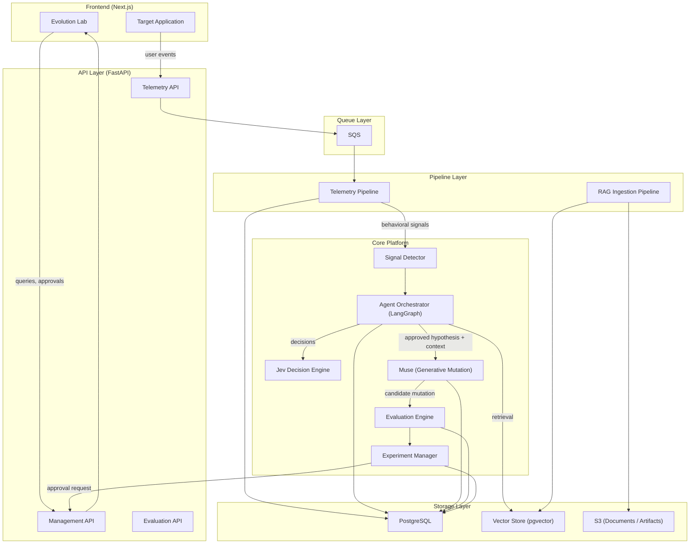
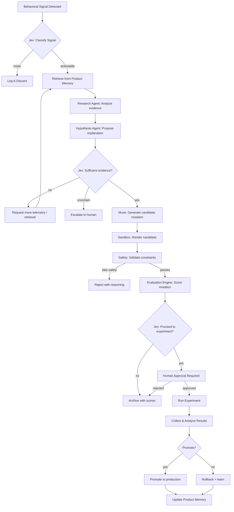

# DarwinUX — System Architecture

## Architectural Philosophy

DarwinUX follows three principles:

1. **Separate concerns by rate of change.** Things that change together live together. The telemetry pipeline changes independently from the agent system, which changes independently from the frontend.
2. **Prefer boring technology unless AI requires otherwise.** PostgreSQL over a custom graph database. SQS over Kafka. Python functions over LLM calls. Use AI where it provides capabilities that deterministic code cannot.
3. **Design for evaluation from day one.** Every AI component must be measurable. If you can't evaluate it, you can't trust it. If you can't trust it, you can't deploy it.

## High-Level System Architecture



### Why This Shape

**Three entry points exist:** telemetry from the target application, management actions from the Evolution Lab, and document ingestion for Product Memory. These have fundamentally different characteristics (high-volume events vs. low-frequency human actions vs. batch document processing) and should not share the same request path.

**The queue (SQS) sits between telemetry ingestion and processing** because user events arrive at unpredictable rates and processing them (signal detection, aggregation) is more expensive than receiving them. Decoupling prevents back-pressure from degrading the user-facing application.

**PostgreSQL serves as the primary data store** including vector search via pgvector. Starting with a single database engine reduces operational complexity. A dedicated vector database (Pinecone, Weaviate) can be introduced later if pgvector becomes a bottleneck — but for the scale of an experimental platform, it will not.

**Muse is the generative mutation engine, not the agents.** The LangGraph agents investigate, hypothesize, and decide. Muse receives an approved hypothesis with product context and design constraints, then generates a structured candidate mutation. This separation is deliberate: reasoning and generation are different capabilities with different evaluation criteria, different failure modes, and potentially different underlying models.

**The Agent Orchestrator is not the center of the system.** It is one component that is invoked when behavioral signals trigger analysis. Most of the system's value comes from the pipelines, evaluation, and experiment management — not from the agents themselves.

### Five Core AI Subsystems

The platform has five distinct AI subsystems, each with a clear responsibility:

| Subsystem | Role | Analogy |
|---|---|---|
| **RAG / Product Memory** | Evidence layer — what do we know? | The library |
| **LangGraph Agents** | Reasoning / orchestration layer — investigate and hypothesize | The investigators |
| **Jev** | Decision layer — should we proceed? | The judge |
| **Muse** | Generative mutation layer — produce a candidate change | The craftsperson |
| **Evaluation Engine** | Quality / safety layer — is the candidate good enough? | The inspector |

These subsystems have clear boundaries and interact through well-defined interfaces. An agent run retrieves evidence from RAG, reasons about it, gets gated by Jev, hands an approved hypothesis to Muse, and the candidate Muse produces flows through the Evaluation Engine before any human sees it.

## End-to-End Evolution Loop

```mermaid
graph LR
    subgraph Observe["1. Observe"]
        UE["User Events"]
        TEL["Telemetry Pipeline"]
        SIG["Signal Detection"]
    end

    subgraph Reason["2. Reason"]
        RET["RAG Retrieval"]
        HYP["Hypothesis Formation"]
        DEC["Jev Decision Gate"]
    end

    subgraph Mutate["3. Mutate"]
        MUSE["Muse: Generate Candidate"]
        SANDBOX["Sandbox Rendering"]
        VAL["Deterministic Validation"]
    end

    subgraph Evaluate["4. Evaluate"]
        AI_EVAL["AI Evaluation"]
        HUMAN["Human Review"]
    end

    subgraph Experiment["5. Experiment"]
        DEPLOY["Controlled Deployment"]
        MEASURE["Metric Collection"]
        ANALYZE["Result Analysis"]
    end

    subgraph Learn["6. Learn"]
        PROMOTE["Promote / Rollback"]
        MEMORY["Update Product Memory"]
        GEN["New Generation"]
    end

    UE --> TEL --> SIG
    SIG --> RET --> HYP --> DEC
    DEC -->|proceed| MUSE --> SANDBOX --> VAL
    DEC -->|need more evidence| RET
    DEC -->|escalate| HUMAN
    VAL --> AI_EVAL --> HUMAN
    HUMAN -->|approved| DEPLOY --> MEASURE --> ANALYZE
    ANALYZE --> PROMOTE --> MEMORY --> GEN
    GEN -.->|next cycle| UE
```



### Decision Points

The loop has three critical decision points, each with different decision-makers:

| Gate | Who Decides | What Happens on "No" |
|---|---|---|
| **Should we investigate this signal?** | Deterministic thresholds + Jev classification | Signal is logged but no agent run is triggered |
| **Is this mutation worth experimenting?** | Jev scoring + AI evaluation + human review | Mutation is archived with reasoning |
| **Should this experiment be promoted?** | Statistical analysis + Jev confidence + human approval | Experiment results feed back into Product Memory as negative evidence |

## AI / Agent Decision Flow



### Why Jev Appears Multiple Times

Jev is not a single call. It serves as a decision gate at multiple points because each point has different inputs and different consequences:

- **Signal classification** has low cost of error (worst case: we investigate a non-issue). Speed matters.
- **Evidence sufficiency** has moderate cost (wasting agent compute on insufficient data). Calibration matters.
- **Experiment approval** has high cost (shipping a bad mutation to users). Confidence and safety matter.

Each gate can have different thresholds, different confidence requirements, and different fallback behaviors.

## Layer Architecture

The backend is organized into layers with clear dependency rules:

```
┌─────────────────────────────────────┐
│           API Layer                 │  ← HTTP entry points, request/response
│   (FastAPI routers, middleware)     │     validation, auth
├─────────────────────────────────────┤
│         Domain Layer                │  ← Business logic, orchestration,
│   (Services, domain models)        │     state machines
├─────────────────────────────────────┤
│          AI Layer                   │  ← LLM providers, agent definitions,
│   (LangGraph, Jev, Muse, RAG)      │     retrieval, structured generation
├─────────────────────────────────────┤
│       Evaluation Layer              │  ← Metrics, judges, golden datasets,
│   (Deterministic + model-based)    │     evaluation orchestration
├─────────────────────────────────────┤
│        Pipeline Layer               │  ← Async workers, queue consumers,
│   (Telemetry, ingestion)           │     batch processing
├─────────────────────────────────────┤
│         Data Layer                  │  ← Repositories, query builders,
│   (PostgreSQL, pgvector, S3)       │     storage abstraction
├─────────────────────────────────────┤
│      Infrastructure Layer           │  ← AWS config, Terraform,
│   (Docker, CI/CD, monitoring)      │     deployment
└─────────────────────────────────────┘
```

**Dependency rule:** Each layer may depend on layers below it, never above. The API layer calls domain services, never the reverse. The AI layer uses the data layer for persistence, but the data layer knows nothing about AI.

### Why These Specific Layers

- **API is separate from Domain** because FastAPI routing concerns (authentication, request parsing, response formatting) should not contaminate business logic. Domain services should be testable without HTTP.
- **AI is separate from Domain** because AI components (LLM providers, agent graphs, retrieval) have their own lifecycle, configuration, and failure modes. Swapping an LLM provider should not require changing business logic.
- **Evaluation is its own layer** because evaluation is a first-class capability, not an afterthought. It has its own storage, its own metrics, and its own execution model. It evaluates the AI layer but is not part of it.
- **Pipeline is separate from API** because pipelines are long-running, asynchronous, and batch-oriented. They share domain models with the API but have completely different execution characteristics.

## Provider Abstraction

DarwinUX should not be coupled to a single AI provider. Provider boundaries exist for:

### LLM Provider
```python
# Conceptual interface — not production code
class LLMProvider(Protocol):
    async def generate(self, prompt: str, **kwargs) -> LLMResponse: ...
    async def generate_structured(self, prompt: str, schema: type[BaseModel], **kwargs) -> BaseModel: ...
```

**Why:** Model capabilities, pricing, and availability change rapidly. The system should be able to swap from GPT-4o to Claude to Gemini without rewriting business logic.

### Embedding Provider
```python
class EmbeddingProvider(Protocol):
    async def embed(self, texts: list[str]) -> list[list[float]]: ...
```

**Why:** Embedding models affect retrieval quality and vector dimensions. Provider changes require re-embedding but should not require code changes.

### Jev Provider
```python
class JevProvider(Protocol):
    async def classify(self, input: JevInput) -> JevClassification: ...
    async def score(self, input: JevInput) -> JevScore: ...
    async def decide(self, input: JevInput) -> JevDecision: ...
```

**Why:** Jev's API surface is not yet fully defined. A provider boundary isolates the rest of the system from integration details and allows development to proceed with a mock implementation.

### Muse Provider
```python
class MuseProvider(Protocol):
    async def generate_mutation(
        self,
        hypothesis: ApprovedHypothesis,
        context: MutationContext,
        constraints: MutationConstraints,
    ) -> CandidateMutation: ...
```

`MutationContext` encapsulates the product context, design system tokens, and component constraints that Muse needs. `MutationConstraints` defines the allowed mutation boundary — which properties can change, valid value ranges, and forbidden modifications.

**Why:** Muse is a proprietary model whose API surface, input format, and capabilities are not yet fully defined. The provider boundary serves three purposes:

1. **Development velocity:** The rest of the system can be built and tested against a mock Muse provider that returns valid structured mutations.
2. **Integration isolation:** When real Muse integration details become available, only the provider implementation changes — not the domain logic, agent orchestration, or evaluation engine.
3. **Evaluation:** A mock provider produces predictable outputs, enabling deterministic testing of the downstream pipeline (validation → evaluation → experiment).

**Critical constraint:** The `CandidateMutation` output from the Muse provider is never treated as deployable. It is always a candidate that must pass through deterministic validation, AI evaluation, Jev gating, and human approval before it can reach an experiment.

## Proposed Repository Layout

```
darwin-ux/
├── README.md
├── docs/                          # Architecture & design documentation
│   ├── PRODUCT.md
│   ├── ARCHITECTURE.md
│   ├── DOMAIN_MODEL.md
│   ├── ...
│   └── decisions/                 # Architecture Decision Records
│       └── 001-pgvector-over-dedicated-vectordb.md
│
├── backend/                       # Python platform (FastAPI)
│   ├── pyproject.toml
│   ├── src/
│   │   └── darwin/
│   │       ├── api/               # FastAPI routers, middleware, deps
│   │       ├── domain/            # Business logic, services, models
│   │       ├── ai/                # LLM providers, agents, RAG, Jev, Muse
│   │       ├── evaluation/        # Evaluation engine, metrics, judges
│   │       ├── pipelines/         # Telemetry & ingestion workers
│   │       ├── data/              # Repositories, database, storage
│   │       └── config/            # Settings, provider config
│   ├── tests/
│   │   ├── unit/
│   │   ├── integration/
│   │   └── evals/                 # AI evaluation test suites
│   ├── Dockerfile
│   └── alembic/                   # Database migrations (future)
│
├── frontend/                      # Next.js Evolution Lab
│   ├── package.json
│   ├── src/
│   │   ├── app/
│   │   ├── components/
│   │   └── lib/
│   └── Dockerfile
│
├── infrastructure/                # Terraform + deployment
│   ├── terraform/
│   │   ├── environments/
│   │   │   ├── staging/
│   │   │   └── production/
│   │   └── modules/
│   └── docker-compose.yml         # Local development
│
└── .github/
    └── workflows/                 # CI/CD
        ├── backend.yml
        └── frontend.yml
```

### Why This Layout

**Monorepo with two primary applications (`backend/`, `frontend/`)** rather than a flat `apps/services/packages/` structure. The rationale:

- There are exactly two deployable applications right now. Creating `apps/` and `services/` directories implies multiple services that don't exist yet.
- The `packages/` pattern (shared libraries) is premature. If backend and frontend need shared types, that's a single concern — not a reason for a packages directory.
- `pipelines/` lives inside `backend/` because pipelines share all the same domain models, data layer, and AI layer. They are workers within the same Python application, not separate services.
- `evals/` lives inside `backend/tests/` because evaluation suites are test suites with special characteristics. They use the same test runner and CI integration.

**When to split:** If a pipeline becomes a genuinely separate service (different deployment, different scaling, different language), extract it then. Not before.

---

## What You Should Understand Before Implementation

1. **Layer boundaries are dependency rules, not folder conventions.** The value is not in having directories called `api/` and `domain/` — it's in enforcing that API code never contains business logic and domain code never imports FastAPI.
2. **Provider abstraction is about isolating volatility.** AI models change faster than application logic. The abstraction boundary exists at the point of highest change rate.
3. **The queue between telemetry ingestion and processing exists for resilience, not performance.** Even if direct processing were fast enough, the queue prevents user-facing latency from being affected by processing failures.
4. **pgvector is a deliberate simplicity choice.** It may not be the best vector database, but it eliminates an entire operational dependency. The architecture allows replacing it later if needed.
5. **The repository layout should match the actual system, not the aspirational system.** Two apps, not eight services. Add structure when complexity demands it.
6. **Jev appears at multiple decision gates because each gate has different risk tolerances.** Signal classification can tolerate false positives. Experiment approval cannot. Same model, different thresholds.
7. **Muse generates candidates, never deployments.** The provider boundary ensures that Muse's output is always treated as a proposal that must survive validation, evaluation, and human approval. The separation between reasoning (agents), generation (Muse), decision (Jev), and evaluation (Evaluation Engine) is a deliberate architectural firewall.
