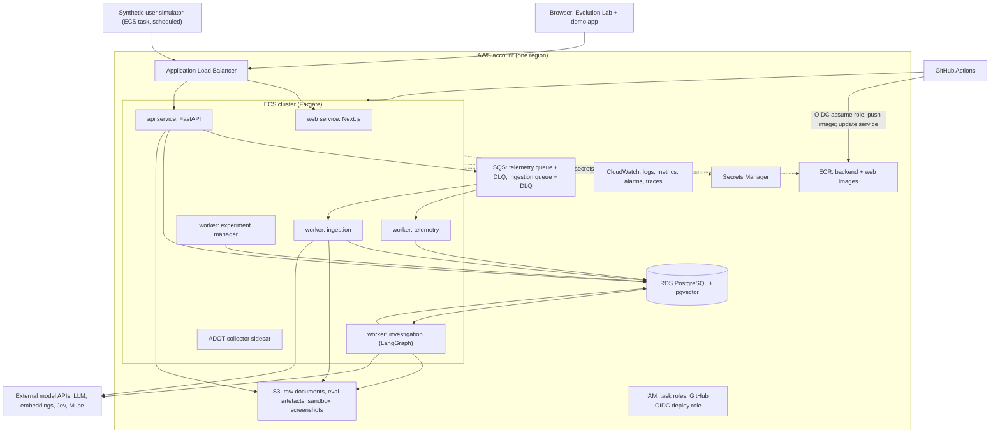
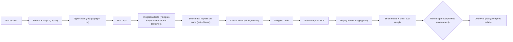

# DarwinUX — AWS Architecture

> **Status:** Design only. Nothing is provisioned. Terraform will define all of this in a later phase (see ROADMAP.md). Local development comes first and must work without AWS.

## Principles

1. **Local first.** Every component runs on a laptop (natively, e.g. Homebrew PostgreSQL 17) before it runs on AWS.
2. **Managed services over self-hosted,** but only services with a clear job.
3. **Small bill.** One developer, one environment, a portfolio project. Design choices that cost a fixed monthly fee without a learning or reliability payoff are avoided.
4. **Same image everywhere in AWS.** The backend image built in CI is the one that runs in dev and (later) in prod. Local development runs the same code natively with `uv run`.

## Conceptual Deployment



All backend services and workers run the **same image** with different commands. That is the modular monolith (ARCHITECTURE.md) expressed in infrastructure.

## Service-by-Service Justification

Every service must earn its place.

| Service | Job in DarwinUX | Why this and not something else |
|---|---|---|
| **ECS on Fargate** | Runs web, api, and each worker as a long-running service | No servers to patch; long-running queue consumers and multi-minute LangGraph runs don't fit Lambda's model well; far less to learn/operate than EKS |
| **ECR** | Stores the two Docker images | Native to ECS; IAM-controlled pulls; image scanning |
| **RDS for PostgreSQL** | System of record: events, signals, lineage, checkpoints, flags, **and** vectors via pgvector | One database engine for relational + vector; RDS for PostgreSQL supports the pgvector extension (confirm version at provisioning time) |
| **S3** | Raw ingested documents, evaluation artefacts, sandbox screenshots, large model request/response payloads, Terraform state | Cheap, durable blobs; keeps large payloads out of Postgres |
| **SQS** | Telemetry buffer and ingestion jobs, each with a dead-letter queue | Decouples ingestion from processing (DATA_PIPELINES.md); simplest managed queue; no brokers to run |
| **Secrets Manager** | LLM/embedding API keys, DB credentials, and — once known — whatever credentials Jev and Muse require | Injected into tasks at start via the task definition; never in images, env files, or Terraform state in plain text |
| **IAM** | One task role per workload (least privilege) + a GitHub OIDC role for deploys | The second wall of mutation safety: the investigation worker physically cannot touch infra, repo, or flags |
| **CloudWatch** | Logs, metrics, alarms, and (via the OTel collector) traces | Native sink for ECS; alarms drive notifications; no extra vendor |

**Also required, not optional:** a VPC with subnets and security groups, and an **Application Load Balancer** for HTTPS ingress to the web and api services. These aren't in the headline list but ECS on Fargate is not reachable without them.

### IAM Sketch (least privilege)

| Role | Can | Cannot |
|---|---|---|
| `api` task | Send to telemetry/ingestion queues; read/write app tables; put raw docs to S3 | Change flags without a recorded approval; read model secrets it doesn't use |
| `worker-telemetry` | Receive/delete from telemetry queue; write events/signals | Call any model API; read Jev/Muse secrets |
| `worker-investigation` | Read memory; write runs/decisions/mutations; read LLM/Jev/Muse secrets; write artefacts to S3 | Change flags; write to repo, ECR, Terraform state, IAM |
| `worker-experiments` | Read approvals; create/update flags; read events | Call model APIs |
| `github-deploy` (OIDC) | Push to ECR; update ECS services | Read application secrets; modify IAM beyond deploy scope |

Changes to IAM, Terraform, and CI/CD are made by a human via pull request. No AI component has a path to them.

## Cost-Conscious Choices

| Choice | Rationale |
|---|---|
| **One environment (`dev`) first** | Staging + prod doubles the fixed cost. A `prod` environment is added only when there is something worth protecting. |
| **Smallest RDS instance class, single-AZ** | Multi-AZ is a production availability feature; for a learning project, snapshots are enough. |
| **Avoid NAT Gateway if possible** | Tasks need outbound internet for model APIs. A NAT Gateway is a fixed hourly cost. Running tasks in public subnets with public IPs and security groups allowing inbound only from the ALB avoids it — a documented trade-off, revisit for prod. |
| **Workers scale to 0–1 tasks** | Investigation and ingestion are bursty and low volume. |
| **Log retention set explicitly** (e.g., 14–30 days) | Default CloudWatch retention is "never expire". |
| **AWS Budgets alert** | A hard reminder before surprises. |

## Deliberately Not Used (yet)

| Service | Why not |
|---|---|
| EKS / Kubernetes | Operationally heavy for one developer; ECS covers the need |
| Lambda | Long-running consumers and multi-minute graph runs; one execution model is simpler to learn and debug |
| MSK / Kafka, Kinesis | SQS handles the volume; no need for replay/stream semantics yet |
| OpenSearch / dedicated vector DB | pgvector is sufficient at this scale |
| ElastiCache | No measured need for a cache |
| Step Functions | LangGraph + the database already provide workflow state |
| API Gateway | ALB is sufficient for a container-based HTTP API |
| Multi-account organization | Valuable at team scale; one account is fine for now |

## Terraform Layout (future)

```
infrastructure/terraform/
├── modules/
│   ├── network/        # VPC, subnets, security groups
│   ├── ecr/
│   ├── rds/
│   ├── sqs/            # queue + DLQ pair, reused twice
│   ├── s3/
│   ├── ecs_service/    # one module, instantiated per service/worker
│   ├── iam/
│   ├── secrets/        # secret *containers* only — values set out of band
│   └── observability/  # log groups, alarms, dashboards, budget
└── environments/
    └── dev/            # add prod/ later by composing the same modules
```

- Remote state in S3 with locking (Terraform's S3 backend supports native lock files in recent versions; confirm at implementation time rather than adding DynamoDB by default).
- Secret **values** are never in Terraform. Terraform creates the secret; a human sets the value.
- `terraform plan` runs in CI on PRs touching `infrastructure/`; `apply` is manual.

## CI/CD Pipeline (GitHub Actions)



- Authentication from GitHub to AWS uses **OIDC** — no long-lived AWS keys stored in GitHub.
- AI evals that call real model APIs run only when relevant paths change (prompts, graph, RAG, mutation validators) and on a nightly schedule, to control cost and flakiness.

### Which AI evaluations block

| Check | Blocks merge/deploy? | Why |
|---|---|---|
| Schema compliance on golden inputs | **Block** | Binary, deterministic |
| Mutation validator golden set (known-bad specs must be rejected, known-good accepted) | **Block** | Safety floor; fully deterministic, runs on every PR |
| Hallucinated citation check (cited chunk IDs ⊆ retrieved IDs) | **Block** | Deterministic |
| Retrieval Precision/Recall@K regression beyond threshold, on RAG changes | **Block** | Statistical, labelled data, low noise |
| Agent golden-trajectory task success regression beyond threshold, on agent changes | **Block** | Statistical with wide threshold |
| LLM-as-judge scores (relevance, faithfulness, design consistency) | **Report only** | Noisy; used for trend review |
| Latency / cost changes | **Report only** | Often external or intentional |
| Jev / Muse vs. baseline comparisons | **Report only** | Research signal, not a correctness gate |

Note the distinction: CI/CD evaluations gate **code changes to DarwinUX**. Evaluation of an individual **candidate mutation** at runtime gates *that mutation* (via Jev and human approval) and has nothing to do with CI.

---

## What You Should Understand Before Implementation

1. **Every AWS service maps to something you already run locally.** Postgres container → RDS, queue emulator → SQS, local folder → S3, processes → ECS services. If you can't name the local equivalent, you don't need the service yet.
2. **One image, many commands.** Workers are the same code as the API, started differently. This keeps deployment simple and consistent.
3. **IAM is part of the safety model, not just ops.** Least-privilege task roles are why a compromised or manipulated AI worker still cannot change infrastructure or flags.
4. **Fixed costs matter more than per-request costs at this scale.** NAT Gateways, Multi-AZ databases, and idle environments dominate a small bill.
5. **CI gates code; runtime gates mutations.** Know which evaluations protect the codebase and which protect users.
6. **OIDC replaces stored cloud credentials in CI.** GitHub proves its identity to AWS per run; nothing long-lived to leak.
