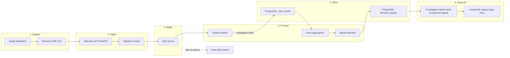

# DarwinUX — Data Pipelines

## Two Pipelines, Two Problems

DarwinUX has two fundamentally different data flows:

1. **Telemetry Pipeline** — High-volume user events → behavioral signals (real-time-ish)
2. **RAG Ingestion Pipeline** — Documents → chunks → embeddings → vector store (batch)

A third, smaller flow — **experiment data** — reuses the telemetry pipeline (see the end of this document).

**Terminology:** in this document "telemetry" always means **behavioral telemetry** (what users do in the target app). System instrumentation (traces, metrics, logs about DarwinUX itself) is **operational telemetry** and is covered in OBSERVABILITY.md. They use different pipelines.

These are separate pipelines because they have different volume characteristics, different latency requirements, different failure modes, and different downstream consumers. Combining them would force one pipeline to compromise for the other's constraints.

---

## Pipeline 1: Telemetry Pipeline

### Purpose

Transform raw user interaction events into behavioral signals that can trigger the evolution loop.

### Current Implementation

The stage-by-stage design further down describes the **target** pipeline (SQS in AWS). What runs today is the same shape on a local PostgreSQL-backed queue:

```
STEP 5 (previous) — synchronous: everything inside the HTTP request

Client ──POST──> FastAPI ──> validate ──> INSERT user_event ──> reconcile signals ──> 202


STEP 6/7 (current) — asynchronous: producer, durable queue, consumer
  Browser (Next.js /demo, telemetry SDK: frontend/src/lib/telemetry/) ──fire-and-forget POST──┐

  PRODUCER (API process)                         CONSUMER (worker process: make worker)
  ─────────────────────                          ──────────────────────────────────────
  Client ──POST /api/v1/telemetry/events──>      loop:
    validate TelemetryEvent (422 if invalid)       receive ── lease one visible message
    build TelemetryMessageV1 (schema_version 1)       │       (UPDATE ... FOR UPDATE SKIP LOCKED)
    INSERT queue_message                               ▼
      ON CONFLICT (message_id = event_id)          validate message (v1 only; else dead-letter)
    COMMIT  ──> 202 {event_id, accepted|duplicate}     ▼
                                                   tx 1: INSERT user_event ON CONFLICT (event_id) DO NOTHING
             queue_message (PostgreSQL)                ▼
        pending ─► leased ─► done                   tx 2: reconcile the session's signals — ALWAYS
                    │   └──► retry (delayed) ─┐        ▼
                    │                  ▲      │    ack  ── status = done
                    └── dead ◄── after max attempts / permanent error
```

- **Producer:** the API. It validates, writes one durable queue row, and returns. It never touches `user_event` or `behavior_signal`.
- **Consumer:** the worker, a separate OS process (`python -m darwin.worker`). It can be stopped while the API keeps accepting events; the queue buffers them.
- **Eventual consistency:** `202` now means *accepted for asynchronous processing*. The event appears in `user_event` — and signals update — shortly afterwards (normally well under a second with the worker running; whenever the worker next runs otherwise).
- **Backpressure:** queue depth is the buffer. If the worker is slow or stopped, `pending` grows (`make queue-status`); nothing is lost and the API stays fast. There is no admission control yet.

Not built yet: batching, the SDK, SQS, and the deferred detectors (below).

### Browser Telemetry SDK (current, Step 7)

The demo app (`frontend/`) is the first real producer of events. Its SDK is deliberately tiny:

- **session_id:** one random UUID per browser tab session, in `sessionStorage` (`darwin.session_id`). It survives reloads within the tab and disappears with it; nothing goes to `localStorage` or cookies, so visits are never linked into a long-lived identity. If storage is blocked, an in-memory id is used.
- **event_id:** a fresh `crypto.randomUUID()` per interaction (the backend's idempotency key). **occurred_at:** the browser clock, ISO 8601 UTC (`…Z`).
- **Typed payloads only:** `page_view {page}`, `button_click {component}`, `form_error {component, field, reason}` — identifiers and small enums, plus `generation`. The SDK has no way to send free text; form values never leave the component that holds them.
- **Failure semantics:** `track()` never throws and never rejects; the UI never awaits it. Network errors, 4xx/5xx and a missing `NEXT_PUBLIC_DARWIN_API_BASE_URL` all just drop the event (a `console.warn` in development only). No retries, no offline buffer.
- **Transport:** `fetch` POST, `content-type: application/json`, `keepalive: true`, `credentials: "omit"`. The API allows exactly the configured origins (`DARWIN_CORS_ORIGINS`, default the local Next.js dev server) — never `*`, never credentials.
- **Backend is the authority.** The SDK mirrors the event-type and component-id rules only to avoid sending obviously invalid events; the API still validates everything.

### Queue and Worker (current)

**Why a PostgreSQL table as the local queue.** It is durable (survives crashes and restarts), works across processes, supports safe multi-worker claiming (`FOR UPDATE SKIP LOCKED`), needs no extra daemon (PostgreSQL 17 is already running), and maps closely onto SQS. An in-memory `asyncio.Queue` loses work on restart and cannot be shared by a separate worker process; a file/SQLite queue adds a second store and has no row-level locking for concurrent workers. `LISTEN/NOTIFY` is not used: notifications are not durable, so the table must be the source of truth anyway, and 1-second polling is plenty.

**Message contract (`TelemetryMessageV1`, `darwin/telemetry/messages.py`).** `schema_version` (=1), `event_id`, `event_type`, `session_id`, `occurred_at`, `payload` — plain JSON. No database id, no `received_at` (set by PostgreSQL when the worker stores the event), no signals, no credentials. Messages are versioned separately from the HTTP schema because they outlive deployments: a message queued by today's API may be read by tomorrow's worker. A missing or unknown `schema_version` is rejected, never assumed to be v1. The worker re-applies every API validation rule — the queue is not a trusted source.

**Idempotent enqueue.** `message_id = event_id`, and `UNIQUE(message_id)` makes `INSERT ... ON CONFLICT` a no-op for a known event — no SELECT-then-INSERT race. `accepted` = newly queued; `duplicate` = already accepted earlier (queued, in flight, or done), nothing new queued. Resubmitting an event whose message was dead-lettered re-queues it with a fresh attempt budget (first body kept).

**Lease / visibility timeout.** A message is receivable when `status = 'pending' AND visible_at <= now()`. `receive` atomically increments `attempts`, sets a fresh `receipt_handle`, and pushes `visible_at` 30 s into the future (`DARWIN_QUEUE_VISIBILITY_TIMEOUT_SECONDS`) — in one short, committed transaction. Processing happens *after* that commit, never inside a long transaction. If the worker dies, nothing needs unlocking: the lease simply expires and the message becomes visible again.

**Ack / retry / dead-letter** all require the delivery's `receipt_handle`, so a worker whose lease already expired cannot settle a newer delivery.

| Outcome | When | Effect |
|---|---|---|
| **ack** | processing succeeded | `status = done` |
| **retry** | any other exception (e.g. database unavailable, a detector bug) | lease released, `visible_at = now() + backoff` (2 s, 4 s, 8 s, 16 s, capped at 5 min), sanitised `last_error` |
| **dead** | malformed message, unknown `schema_version` or message type (permanent: dead immediately), or a failure on attempt 5 (`DARWIN_QUEUE_MAX_ATTEMPTS`), or received more than 5 times (it kept crashing the worker) | `status = dead`, body kept for inspection, sanitised `last_error` |

5 attempts with that backoff give a transient problem ~30 s to clear before a message is parked. It is a local default, not production tuning.

**At-least-once delivery.** A message can be delivered more than once (a crash after processing but before ack; a lease that expires during slow processing). The design does not try to prevent that; it makes it harmless:

- `UNIQUE(event_id)` makes storing the event idempotent.
- Signal reconciliation is deterministic and replay-safe (Step 5).
- So the worker **always reconciles**, even when the insert finds a duplicate: a duplicate usually means an earlier delivery stored the event and then crashed before reconciling.

**Crash recovery, step by step:** worker A receives the message (attempt 1) → stores the `UserEvent` → crashes before reconciling and before ack → 30 s later the lease expires → worker B receives it (attempt 2) → the insert is a no-op → the session is reconciled → ack. Final state: one `UserEvent`, the canonical signals, one `done` message. This exact sequence is an integration test.

**Multiple workers.** `SELECT ... FOR UPDATE SKIP LOCKED` inside the claiming `UPDATE`: a row another worker is claiming at that instant is skipped, not waited for. One visible message is leased by exactly one worker; two messages go to two workers. Tested with threads released simultaneously by a barrier.

**Ordering.** Not guaranteed (oldest-visible-first, but retries and concurrent workers reorder). Nothing relies on it: signal reconciliation converges for any arrival order.

**Graceful shutdown.** SIGINT/SIGTERM set a lock-free stop flag; the worker finishes the current message and exits. (A `threading.Event` set from a signal handler can deadlock the main thread — found and fixed during Step 6.)

**Privacy.** The queue body necessarily carries the untrusted payload (the worker must store it). It is never logged, never copied into `last_error` (exception *types* only, or field names for validation errors), and `make queue-status` shows counts and sanitised dead-letter reasons only.

### Behaviour Signal Detection (current)

**Why deterministic:** "four clicks within two seconds" is a counting-and-timing question. Rules answer it exactly, cheaply, and reproducibly, and can be unit-tested with explicit timestamps. An LLM would be slower, costlier, and could answer differently for the same events — unusable as the *evidence* layer that later AI stages (hypotheses, Jev, Muse) rely on.

**Detectors** (`darwin/signals/detectors.py`, both version `1`):

| Signal | Rule | Threshold / window | Needs |
|---|---|---|---|
| `rage_click` | Same session, same `payload.component`, `event_type` in {`button_click`, `click`} | **4** clicks with first–last ≤ **2 s** | `payload.component`: an identifier-like string (`^[A-Za-z0-9_.:-]{1,128}$`). Missing, wrong type, or free text → the event is skipped |
| `error_burst` | Same session, `event_type` in {`client_error`, `form_error`} | **3** errors with first–last ≤ **10 s** | Nothing from the payload |

Why 4 and not 3 clicks: a double-click followed by one retry is ordinary; four clicks on one control inside two seconds is not.

**Burst rule:** events are sorted by `(occurred_at, event_id)`. The earliest run of *threshold* consecutive events inside the window is the evidence. After a hit, every following event within one window of the previous one belongs to the same burst and produces no further signal — one frustrated burst is one signal, however many clicks it has.

**Windowing uses `occurred_at`** (the user's timeline), never arrival order, so events that arrive out of order are still detected correctly. Trade-off: client clocks can be wrong, but they are consistent within one session, which is what burst timing needs. `received_at` would measure network timing instead of behaviour.

**Invariant:** for every session, the *canonical* signals (`behavior_signal` rows with `superseded_at IS NULL`) equal `detect_all(<the session's complete event history>)` — regardless of arrival order and of how often detection has run.

**Identity:** `signal_id = uuid5(NAMESPACE, "<signal_type>|v<detector_version>|<session_id>|<scope>|<sorted evidence event_ids>")`, where `scope` is the component for rage clicks and empty for error bursts. Same evidence, same id; `UNIQUE(signal_id)` guarantees one row per id. Changing a detector's rules means bumping its version, which yields new, distinguishable ids.

**Why detection must reconcile, not just insert.** A late event can change the canonical result for a session: landing *before* or *inside* a detected run changes which run is earliest (so the evidence and id change), and landing in the *gap* between two bursts can merge them into one burst (so one signal disappears). A late event *after* a run changes nothing. With insert-only persistence the stale signal would stay, as a second, overlapping signal for one episode. So after each accepted event, `reconcile_session_signals`:

1. takes a transaction-scoped advisory lock for the session (reconciliations of one session never interleave; other sessions are unaffected);
2. loads the session's **complete** detector-relevant history (not a time window: a burst chains for as long as every gap is within the window, so any fixed window can see a truncated burst — a 12-minute chain of clicks 1.9 s apart is one burst);
3. runs the detectors → the canonical set;
4. inserts canonical signals that are missing, clears `superseded_at` on canonical ones that had been superseded, and sets `superseded_at = now()` on stored ones that are no longer canonical.

Only that one session's rows are touched. Nothing is deleted: superseded rows are the audit trail. Running it again changes nothing.

**Scope and cost:** one session's events of the detected types (index `ix_user_event_session_id_occurred_at`) and one session's signals (index `ix_behavior_signal_session_id`); never a whole-table scan. There is **no cap** on the history loaded: truncating would not be canonical, and skipping would leave stale rows looking canonical. **Step 5 favours canonical correctness over bounded per-event work. A later queue/session-finalization worker will improve scaling.** Measured locally: a session with ~10,000 relevant events reconciles in ~150 ms (a POST into it: ~200 ms); visit-length sessions are far smaller.

**Evidence** is compact and payload-free: event ids, count, threshold, window, and the component identifier (rage click) or the error event types (error burst). No `severity` is stored — there is no real need yet, and `count / threshold` is derivable.

**Deferred detectors:**
- **Confusion loop** (bouncing between two screens): the event contract has no stable screen/view field yet. Inventing one inside `payload` now would bake an unreviewed schema into the detector. Add it together with a defined screen convention.
- **Abandonment** (started, never finished): detected from the *absence* of a later event, which is only knowable once an observation window has closed. That needs a scheduled job or worker, not a check that runs when an event arrives.
- **Slow completion:** needs a defined task start/end and a baseline distribution.

### Flow



### Stage-by-Stage Design

#### Stage 1: Capture (Frontend — Synchronous)

The target application includes a lightweight JavaScript telemetry SDK that captures user interaction events: clicks, scrolls, navigation, form submissions, errors, timing data.

**Why synchronous:** Event capture must happen in the user's browser at the moment of interaction. This is inherently synchronous with the user's actions. The SDK should be small and non-blocking — it fires events and moves on.

**What the SDK captures:**
- Event ID (client-generated UUID — the idempotency key)
- Event type (click, scroll, navigate, error, etc.)
- Target (stable component ID from the component registry; CSS selector only as fallback)
- UI Spec version / experiment variant the user is seeing
- Timestamp
- Session ID
- Page context (URL, viewport, component tree position)
- Event-specific metadata (click coordinates, scroll depth, error message)

**What the SDK does NOT capture:**
- Personally identifiable information
- Form field values
- Authentication tokens
- Anything that would require consent beyond basic analytics

Free-text fields that can leak personal data (error messages, URLs with query strings) are scrubbed server-side before persistence. For the demo target app all users are synthetic, but the pipeline should be built as if they were not.

#### Stage 2: Ingest (API — Synchronous)

The Telemetry API receives events from the SDK via HTTP POST. (Today: one event per request; batching is a later addition.)

**Why synchronous:** The API must accept or reject the request immediately so the SDK knows whether to retry. This is a thin layer: validate the event schema, add server-owned fields (`received_at`), and hand the event on. No IP address or user agent is stored. Response time target: < 50ms.

**What happens here (target design):**
```
POST /api/v1/telemetry/events
Body: one TelemetryEvent (later possibly a batch)

1. Validate event schema (Pydantic)
2. Reject malformed events with 422
3. Server-owned fields are set by the database/worker (received_at, id)
4. Push to SQS
5. Return 202 Accepted
```

**Why 202, not 200:** The events are accepted for processing, not processed yet. The distinction matters — the client knows the events were received, not that they've been analyzed.

#### Stage 3: Buffer (SQS — Asynchronous)

Events sit in an SQS queue until a worker picks them up.

**Why asynchronous:** This is the critical decoupling point. User-facing telemetry ingestion and computationally expensive signal detection must not be in the same synchronous request path. Reasons:

1. **Back-pressure protection.** If signal detection is slow or failing, the API continues accepting events. Without the queue, API latency would spike and the target application's telemetry would fail.
2. **Rate smoothing.** User events arrive in bursts (page loads, peak hours). The queue absorbs bursts and lets workers process at a sustainable rate.
3. **Retry semantics.** If a worker crashes while processing a batch, SQS re-delivers the messages. Without a queue, those events would be lost.
4. **Independent scaling.** The API and workers can scale independently. More traffic → more API instances. More processing backlog → more workers.

**SQS configuration considerations:**
- Visibility timeout: Long enough for a worker to process a batch (e.g., 5 minutes).
- Dead letter queue: After N failed processing attempts, move messages to a DLQ for inspection.
- Message retention: 4 days (default), enough to survive extended outages.
- Batch size: Process 10 messages at a time for efficiency.

#### Stage 4: Process (Worker — Asynchronous)

Workers poll SQS, process event batches, and detect behavioral signals.

**Why asynchronous:** Processing involves aggregation (grouping events by session, component, time window), statistical computation (click frequency, time-on-task), and pattern matching (rage click detection, abandonment detection). These operations are too expensive for real-time and benefit from batching.

**Processing steps:**
```
1. Poll SQS batch
2. Deserialize events
3. Persist raw events FIRST, idempotently (INSERT ... ON CONFLICT (event_id) DO NOTHING)
4. For each affected (session, component), run detectors over a time window
   of persisted events — not just the events in this batch:
   a. Rage click: 4+ clicks on the same component within 2 seconds   (implemented)
   b. Error burst: 3+ client/form errors within 10 seconds           (implemented)
   c. Abandonment: form started but not submitted                     (deferred: needs a closed window)
   d. Confusion loop: navigating away and back repeatedly             (deferred: needs a screen field)
   e. Slow completion: task far slower than its baseline              (deferred)
5. For each detected pattern:
   a. Insert BehaviorSignal with a deterministic signal_id; ON CONFLICT DO NOTHING
      (see "Behaviour Signal Detection (current)" above)
6. Commit transaction
7. Delete SQS messages (acknowledge processing)
```

**Two properties that make this correct:**

- **Idempotency.** SQS delivers *at least once*. A crashed worker means the same batch is processed twice. Keying events by `event_id` and upserting signals makes a replay harmless.
- **Windowed detection over stored events.** Abandonment or confusion loops span many requests and therefore many SQS messages. A detector that only looks at the current batch would miss them. Detectors query the last N minutes of persisted events for the affected sessions.

**The telemetry worker never calls Jev or an LLM.** It stays cheap, fast, and fully deterministic. Deciding whether to investigate happens in the investigation workflow.

**Signal detection is deterministic.** This is critical. Rage click detection is a counting problem, not a language understanding problem. Deterministic detection means deterministic testing, which means high reliability.

#### Stage 5: Store (PostgreSQL — Synchronous within worker)

Processed events and detected signals are persisted to PostgreSQL.

**Why synchronous (within the worker):** Database writes within the worker are synchronous because the worker needs to confirm persistence before acknowledging the SQS message. If the write fails, the message should be retried.

**Two storage concerns:**
1. **Raw events** — For audit, replay, and future analysis. Append-only, potentially high volume. Consider partitioning by time.
2. **Behavioral signals** — The meaningful output. Lower volume, actively queried by the agent system.

#### Stage 6: Hand-off to Investigation (Asynchronous)

Detected signals that pass a deterministic threshold (severity, evidence count, not already under investigation) are picked up by the **investigation worker**, which starts an AgentRun. The first graph node, `signal_triage`, asks the Jev port whether to proceed.

**Why asynchronous:** Agent runs are expensive (multiple LLM calls, RAG retrieval, evaluation) and may take minutes. They absolutely cannot be in the telemetry processing path.

**Triggering mechanism options:**
- Fire-and-forget async task from the telemetry worker — **rejected**: if the process dies, the investigation is silently lost, and it couples two workloads with very different cost profiles.
- Second SQS queue for investigation requests — resilient, but another queue to operate.
- **The signal row is the trigger** — the investigation worker periodically selects `detected` signals above threshold (`SELECT ... FOR UPDATE SKIP LOCKED`) and marks them `investigating`.

**Recommendation:** Use the database as the hand-off in v1. It is durable, transactional, needs no extra infrastructure, and the extra latency (seconds to a minute) is irrelevant for an investigation that takes minutes. Add a dedicated queue only if polling becomes a measured problem.

---

## Pipeline 2: RAG Ingestion Pipeline

### Purpose

Transform documents and artifacts into searchable, embeddable knowledge chunks in Product Memory.

### Flow


### Stage-by-Stage Design

#### Stage 1: Source Acquisition (Mixed)

Documents enter through three paths:

| Path | Trigger | Example |
|---|---|---|
| Manual upload | Human action (API call or UI) | Engineer uploads new design system docs |
| Automated sync | Scheduled job (cron) | Pull latest component docs from design system repo |
| System-generated | Internal event | DarwinUX creates an experiment report after an experiment concludes |

**Synchronous for manual upload:** The user clicks "upload" and expects immediate feedback (accepted/rejected). Parsing and embedding happen asynchronously after acceptance.

**Asynchronous for automated sync and system-generated:** These run on schedules or internal triggers. No human is waiting for immediate feedback.

#### Stage 2: Parse & Extract (Asynchronous)

**Why asynchronous:** Parsing can be slow (PDF text extraction, HTML rendering, large documents). It should not block the upload response.

**Processing:**
```
1. Detect document format (markdown, PDF, HTML, JSON, etc.)
2. Select appropriate parser
3. Extract text with structure preservation:
   - Heading hierarchy
   - Section boundaries
   - Table structure
   - Code blocks
4. Extract metadata:
   - Title
   - Author (if available)
   - Date
   - Document type classification
5. Store raw document to S3 (for re-processing if parser improves)
6. Create KnowledgeDocument entity in PostgreSQL
```

**LangChain usage:** LangChain's document loaders (PyPDFLoader, UnstructuredMarkdownLoader, etc.) are well-tested for this stage and provide genuine value. This is an area where the library saves meaningful development time.

#### Stage 3: Transform (Asynchronous)

**Why asynchronous:** Transformation is a batch operation that may process many chunks from a single document. It has no real-time requirement.

**Normalization:**
- Unicode normalization (NFC)
- Whitespace standardization
- Encoding verification

**Chunking:**
```
1. Attempt section-based chunking (split on headings)
2. For sections > target size (500 tokens):
   a. Apply recursive character splitting
   b. Maintain 50-token overlap between chunks
3. For sections < minimum size (100 tokens):
   a. Merge with adjacent section
4. Assign chunk metadata:
   - Parent document ID
   - Section heading
   - Chunk index within document
   - Token count
```

**Metadata enrichment:**
- Document type tag
- Component reference (if the document is about a specific UI component)
- Freshness timestamp
- Source credibility tag (official docs > informal notes)

#### Stage 4: Embed (Asynchronous, Batch)

**Why asynchronous and batched:** Embedding API calls have rate limits and per-token costs. Batching chunks (e.g., 100 at a time) is more efficient than embedding one at a time. This stage is the most expensive per-token operation in the pipeline.

**Processing:**
```
1. Collect chunks into batches (batch size = 100 or provider limit)
2. Call embedding provider for each batch
3. Receive vectors
4. Associate each vector with its chunk
5. Record embedding model version (for future re-embedding)
```

**Failure handling:** If an embedding batch fails, retry the batch. If a specific chunk consistently fails (e.g., too long), log it and skip. Never let one bad chunk block the entire pipeline.

#### Stage 5: Index (Asynchronous)

**Why asynchronous:** Index updates can be batched and don't need to be visible immediately.

**Processing:**
```
1. Insert chunk + embedding into pgvector
2. Update KnowledgeDocument status to "indexed"
3. Update document registry (metadata, chunk count, last indexed)
4. If replacing an existing document version:
   a. Soft-delete old chunks
   b. Index new chunks
   c. Update document content hash
```

**Deduplication:** The content hash is checked **before parsing** (see diagram). If a document with the same hash already exists and is already indexed, skip re-processing. This prevents waste when automated sync pulls unchanged documents.

---

## Pipeline Comparison

| Characteristic | Telemetry Pipeline | RAG Ingestion Pipeline |
|---|---|---|
| **Volume** | High (thousands of events/minute at scale) | Low (tens of documents/day) |
| **Latency requirement** | Minutes (signal detection can lag) | Hours (indexing is not time-critical) |
| **Processing cost** | Low (counting, pattern matching) | High (parsing, embedding API calls) |
| **Failure impact** | Missed signals (recoverable) | Missing knowledge (noticeable but not critical) |
| **Trigger** | Continuous (user activity) | Event-driven (uploads, syncs) |
| **Queue** | SQS (essential for decoupling) | SQS in AWS; low volume means a simple job table or the same local queue emulator is fine in development |
| **Downstream consumer** | Agent system (via Jev gate) | RAG retrieval (via vector search) |

### Why Not One Pipeline?

It might seem simpler to have a single "data pipeline" that handles both telemetry and documents. Here's why that's a bad idea:

1. **Different SLAs.** Telemetry must be processed within minutes. Documents can wait hours. Combining them forces the slow path to meet fast-path SLAs or lets the fast path be slowed by the slow path.
2. **Different scaling.** Telemetry scales with user count. Document ingestion scales with content creation rate. These are unrelated.
3. **Different failure handling.** A telemetry processing failure should be retried quickly (events are time-sensitive). A document parsing failure can wait for manual review.
4. **Different testing.** Telemetry pipeline tests are about counting and pattern matching. RAG pipeline tests are about chunking quality and embedding correctness. Separate pipelines have clearer test boundaries.

---

## Experiment Data Flow

Experiments do not need a third pipeline. They reuse the telemetry pipeline:

1. The Experiment Manager (deterministic) assigns each session to control or treatment by hashing `session_id` with the experiment's `flag_key` — stable, stateless assignment.
2. The target app asks the flag service which UI Spec version to render and includes `ui_spec_version_id` on every event.
3. Events flow through the normal telemetry pipeline.
4. A scheduled analysis job (deterministic) computes the pre-registered primary metric and guardrail metrics per variant from `user_events`.
5. On a guardrail breach, the job flips the flag back to control (automatic rollback). Otherwise, when the planned sample size is reached, the Experiment moves to `analyzing` and a human decides on promotion.

**Traffic source.** A portfolio project has no real users. Experiments will initially run on a **synthetic user simulator** (scripted personas driving the demo app in a headless browser, with friction deliberately built into Generation 0). Simulated results are labelled `traffic_source = simulated` everywhere and must never be presented as real UX evidence. See OPEN_QUESTIONS.md.

---

## Local vs. AWS

| Concern | Local development | AWS (later) |
|---|---|---|
| Queue | `queue_message` table in the local PostgreSQL 17 (`darwin.queue.postgres.PostgresQueue`) | SQS + DLQ, behind the same `MessageQueue` port |
| Database | Native Homebrew PostgreSQL 17 + pgvector | RDS for PostgreSQL 17 with pgvector |
| Raw documents | Local directory or S3-compatible emulator | S3 |
| Workers | `python -m darwin.worker` (`make worker`) | ECS/Fargate service from the same image |

The code talks to a queue port and a storage port, so switching is configuration, not a rewrite.

---

## What You Should Understand Before Implementation

1. **The SQS queue in the telemetry pipeline exists for resilience, not performance.** Even if you could process events synchronously in time, the queue protects the user-facing application from pipeline failures and enables independent scaling.
2. **Signal detection is deterministic by design.** An LLM cannot reliably count "3 clicks in 2 seconds." Rules-based detection is faster, cheaper, testable, and more reliable. Jev triages after detection, in the investigation workflow; it never performs detection and the telemetry worker never calls it.
3. **At-least-once delivery means every consumer must be idempotent.** Persist first, key by `event_id`, upsert signals. A replayed batch must change nothing.
4. **The RAG pipeline's most expensive step is embedding, not parsing.** Budget API costs and rate limits when planning batch sizes. Hash documents before parsing and record the embedding model on every chunk so unchanged content is never reprocessed.
5. **These pipelines will be the first things you build.** They are prerequisites for the agent system (which needs behavioral signals) and for RAG retrieval (which needs indexed chunks). Get them right and tested before building the AI layer.
6. **Synchronous vs. asynchronous is a question of "who is waiting?"** If a human or a user-facing system is waiting for the result, it must be fast (synchronous or fast-async). If nothing is waiting, batch it for efficiency.
