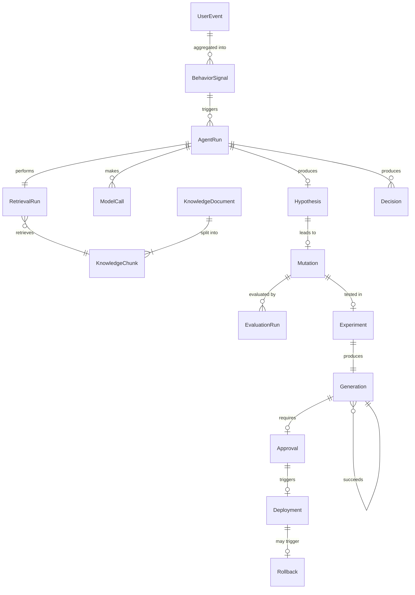

# DarwinUX — Domain Model

## Overview

The domain model captures the core entities of DarwinUX: what they represent, how they relate to each other, and what lifecycle states they pass through. This document defines the conceptual model — not database schemas or ORM classes.

## Entity Relationship Overview



## Core Entities

### UserEvent

A raw interaction event from the target application.

| Field | Type | Description |
|---|---|---|
| id | UUID | Unique identifier |
| session_id | UUID | User session |
| event_type | string | click, scroll, navigation, error, form_submit, etc. |
| target | string | CSS selector or component identifier |
| metadata | JSON | Event-specific data (coordinates, timing, error details) |
| timestamp | datetime | When the event occurred |
| ingested_at | datetime | When DarwinUX received it |

**Why it exists:** UserEvents are the raw input to the system. They are high-volume, append-only, and never modified after ingestion. They are the evidence base from which everything else derives.

**Lifecycle:** `received` → `processed` → `archived`

Events are processed by the telemetry pipeline to extract behavioral signals, then eventually archived to cold storage.

---

### BehaviorSignal

An interpreted pattern derived from one or more UserEvents.

| Field | Type | Description |
|---|---|---|
| id | UUID | Unique identifier |
| signal_type | enum | rage_click, abandonment, repeated_error, slow_completion, confusion_loop, etc. |
| component | string | The UI component or page area involved |
| severity | float | Computed severity score (0.0–1.0) |
| evidence_count | int | Number of supporting UserEvents |
| first_seen | datetime | When the pattern first appeared |
| last_seen | datetime | Most recent occurrence |
| status | enum | Lifecycle state |

**Why it exists:** Raw events are too granular for AI reasoning. BehaviorSignals are the unit of input to the agent system — they represent "something is wrong here" with enough context to investigate.

**Lifecycle:** `detected` → `confirmed` → `investigating` → `resolved` | `dismissed`

**Detection is deterministic.** Signals are detected by threshold-based rules (e.g., "3+ rapid clicks on the same element within 2 seconds = rage_click"), not by LLM inference. This is intentional — signal detection must be fast, predictable, and testable with unit tests.

---

### KnowledgeDocument

A source document ingested into Product Memory.

| Field | Type | Description |
|---|---|---|
| id | UUID | Unique identifier |
| source_type | enum | design_doc, ux_guideline, experiment_report, component_doc, etc. |
| source_uri | string | Original location (URL, file path, S3 key) |
| title | string | Document title |
| content_hash | string | SHA-256 hash of raw content (for deduplication and change detection) |
| ingested_at | datetime | When it was ingested |
| status | enum | Lifecycle state |

**Why it exists:** Product Memory needs to track not just chunks but their source documents — for provenance, deduplication, and re-ingestion when sources change.

**Lifecycle:** `pending` → `processing` → `indexed` → `stale` → `reindexed`

---

### KnowledgeChunk

A segment of a KnowledgeDocument prepared for retrieval.

| Field | Type | Description |
|---|---|---|
| id | UUID | Unique identifier |
| document_id | UUID | FK to KnowledgeDocument |
| content | text | The chunk text |
| chunk_index | int | Position within the document |
| embedding | vector | Dense embedding for similarity search |
| metadata | JSON | Source section, headings, tags |
| token_count | int | For context window budgeting |

**Why it exists:** LLMs have finite context windows. Chunks are the retrieval unit — small enough to fit in context, large enough to carry meaning.

**Lifecycle:** Chunks are immutable once created. When a document is re-ingested, old chunks are soft-deleted and new ones created.

---

### RetrievalRun

A record of a retrieval operation against Product Memory.

| Field | Type | Description |
|---|---|---|
| id | UUID | Unique identifier |
| query | text | The retrieval query |
| agent_run_id | UUID | FK to the requesting AgentRun |
| chunks_retrieved | list[UUID] | Ordered list of chunk IDs returned |
| scores | list[float] | Relevance scores per chunk |
| reranked | bool | Whether reranking was applied |
| latency_ms | int | Total retrieval time |
| timestamp | datetime | When retrieval occurred |

**Why it exists:** Retrieval quality is measurable only if retrieval operations are recorded. RetrievalRuns enable RAG evaluation (precision, recall, MRR) and debugging.

---

### AgentRun

A complete execution of the agent orchestration graph.

| Field | Type | Description |
|---|---|---|
| id | UUID | Unique identifier |
| trigger_signal_id | UUID | FK to the BehaviorSignal that triggered it |
| graph_name | string | Which LangGraph graph was executed |
| nodes_visited | list[string] | Ordered list of graph nodes executed |
| status | enum | Lifecycle state |
| started_at | datetime | Start time |
| completed_at | datetime | End time |
| total_cost_usd | float | Aggregated cost of all model calls |
| error | text | Error details if failed |

**Why it exists:** Agent runs are the unit of AI work. They must be fully traceable for debugging, evaluation, and cost accounting.

**Lifecycle:** `started` → `running` → `completed` | `failed` | `timed_out`

---

### ModelCall

An individual LLM or Jev invocation within an AgentRun.

| Field | Type | Description |
|---|---|---|
| id | UUID | Unique identifier |
| agent_run_id | UUID | FK to AgentRun |
| provider | string | openai, anthropic, jev, etc. |
| model | string | Model identifier |
| input_tokens | int | Token count for input |
| output_tokens | int | Token count for output |
| latency_ms | int | Response time |
| cost_usd | float | Computed cost |
| purpose | string | What this call was for (classify, generate, evaluate, etc.) |
| timestamp | datetime | When the call was made |

**Why it exists:** Cost, latency, and quality tracking require per-call granularity. This also enables model comparison experiments.

---

### Decision

A recorded decision point where Jev or a rule evaluated evidence and chose an action.

| Field | Type | Description |
|---|---|---|
| id | UUID | Unique identifier |
| agent_run_id | UUID | FK to AgentRun (if part of agent flow) |
| decision_type | enum | classify_signal, approve_hypothesis, gate_experiment, etc. |
| input_summary | text | What was being decided |
| outcome | string | The decision made |
| confidence | float | Confidence score (0.0–1.0) |
| reasoning | text | Explanation of why |
| model_call_id | UUID | FK to the ModelCall that produced it (if model-based) |
| escalated | bool | Whether this was escalated to a human |

**Why it exists:** Decisions are the most important thing to audit. When something goes wrong, the question is always "why did the system decide to do that?" Decisions answer that question.

---

### Hypothesis

A proposed explanation for observed UX friction.

| Field | Type | Description |
|---|---|---|
| id | UUID | Unique identifier |
| agent_run_id | UUID | FK to AgentRun that produced it |
| signal_id | UUID | FK to BehaviorSignal being explained |
| description | text | What the hypothesis proposes |
| supporting_evidence | list[UUID] | FKs to RetrievalRun chunks that support it |
| confidence | float | Agent's confidence in this hypothesis |
| status | enum | Lifecycle state |

**Lifecycle:** `proposed` → `accepted` | `rejected` | `needs_more_evidence`

---

### Mutation

A proposed UI change derived from a hypothesis.

| Field | Type | Description |
|---|---|---|
| id | UUID | Unique identifier |
| hypothesis_id | UUID | FK to Hypothesis |
| agent_run_id | UUID | FK to AgentRun that generated it |
| mutation_type | enum | design_token_change, component_config, copy_change, layout_adjustment, etc. |
| specification | JSON | The structured mutation (see MUTATION_SAFETY.md) |
| component | string | The target component |
| status | enum | Lifecycle state |
| generation_id | UUID | FK to Generation (once created) |

**Lifecycle:** `generated` → `validated` → `evaluating` → `approved` | `rejected` → `experimenting` → `promoted` | `rolled_back`

---

### EvaluationRun

An evaluation of a mutation, agent run, or retrieval operation.

| Field | Type | Description |
|---|---|---|
| id | UUID | Unique identifier |
| target_type | enum | mutation, agent_run, retrieval_run |
| target_id | UUID | FK to the entity being evaluated |
| evaluation_type | enum | deterministic, llm_judge, statistical, human |
| metrics | JSON | Computed metric values |
| passed | bool | Whether it passed minimum thresholds |
| evaluator | string | Which evaluator produced this |
| timestamp | datetime | When evaluation ran |

**Why it exists:** Evaluation is a first-class operation with its own records. This enables meta-evaluation (evaluating the evaluators) and trend analysis.

---

### Experiment

A controlled deployment of a mutation to a subset of users.

| Field | Type | Description |
|---|---|---|
| id | UUID | Unique identifier |
| mutation_id | UUID | FK to Mutation |
| experiment_type | enum | a_b_test, phased_rollout, etc. |
| traffic_percentage | float | Percentage of users in treatment group |
| started_at | datetime | When the experiment began |
| ended_at | datetime | When it concluded |
| status | enum | Lifecycle state |
| metrics_before | JSON | Baseline metrics |
| metrics_after | JSON | Treatment metrics |
| statistical_significance | float | p-value or equivalent |
| outcome | enum | positive, negative, inconclusive |

**Lifecycle:** `configured` → `running` → `analyzing` → `concluded`

---

### Generation

An evolutionary step — the record that a mutation was promoted to production.

| Field | Type | Description |
|---|---|---|
| id | UUID | Unique identifier |
| generation_number | int | Sequential generation (0, 1, 2, ...) |
| parent_generation_id | UUID | FK to previous generation (null for gen 0) |
| mutation_id | UUID | FK to the Mutation that was promoted |
| experiment_id | UUID | FK to the Experiment that validated it |
| evidence_summary | text | Why this generation exists |
| created_at | datetime | When this generation was created |

**Why it exists:** Generations are the unit of evolution. They form a chain of lineage that answers "how did the software get from there to here?"

---

### Approval

A human approval or rejection of a proposed change.

| Field | Type | Description |
|---|---|---|
| id | UUID | Unique identifier |
| target_type | enum | mutation, experiment, deployment |
| target_id | UUID | FK to what was approved/rejected |
| approved_by | string | Who made the decision |
| approved | bool | Yes or no |
| reasoning | text | Why |
| timestamp | datetime | When |

---

### Deployment

A record of a mutation being deployed to production.

| Field | Type | Description |
|---|---|---|
| id | UUID | Unique identifier |
| generation_id | UUID | FK to Generation |
| deployed_at | datetime | When deployment occurred |
| deployment_method | string | Feature flag, config update, etc. |
| status | enum | Lifecycle state |

**Lifecycle:** `deploying` → `active` → `rolled_back`

---

### Rollback

A record of reverting a deployment.

| Field | Type | Description |
|---|---|---|
| id | UUID | Unique identifier |
| deployment_id | UUID | FK to Deployment |
| reason | text | Why the rollback occurred |
| automated | bool | Whether this was automatic or manual |
| rolled_back_at | datetime | When |

## Key Relationships

1. **Evidence chain:** `UserEvent` → `BehaviorSignal` → `AgentRun` → `Hypothesis` → `Mutation` → `EvaluationRun` → `Experiment` → `Generation`. This chain is the core traceability requirement. Given any generation, you must be able to walk backwards to the original user events that triggered it.

2. **Knowledge graph:** `KnowledgeDocument` → `KnowledgeChunk` → `RetrievalRun` → `AgentRun`. This links what the system knew to what it decided.

3. **Decision audit trail:** `AgentRun` → `Decision` → `ModelCall`. This links every decision to its reasoning and the model that produced it.

4. **Generational lineage:** `Generation` → `Generation` (parent). This is the evolutionary chain itself.

## Lifecycle State Patterns

Most entities follow one of two patterns:

**Linear progression:** The entity moves forward through states and does not return.
```
pending → processing → completed
```

**Branching progression:** The entity reaches a decision point and takes one of several terminal paths.
```
proposed → accepted → experimenting → promoted
                                    → rolled_back
         → rejected
         → needs_more_evidence → (re-enters flow)
```

---

## What You Should Understand Before Implementation

1. **Entities model the evolution loop, not a CRUD application.** The domain is not "manage mutations" — it is "trace the complete journey from user friction to deployed improvement."
2. **The evidence chain is the most important invariant.** If any link in `UserEvent → BehaviorSignal → ... → Generation` is broken, the system loses its ability to explain why a change was made.
3. **Not every entity needs its own database table on day one.** Some (like ModelCall) could start as JSON fields within AgentRun and be normalized later when querying them independently becomes valuable.
4. **Lifecycle states should be enforced, not just documented.** A Mutation in state `generated` should not be deployable. State machines prevent invalid transitions.
5. **Soft deletion over hard deletion.** Rejected mutations, failed experiments, and rolled-back deployments are valuable negative evidence. Never delete them.
