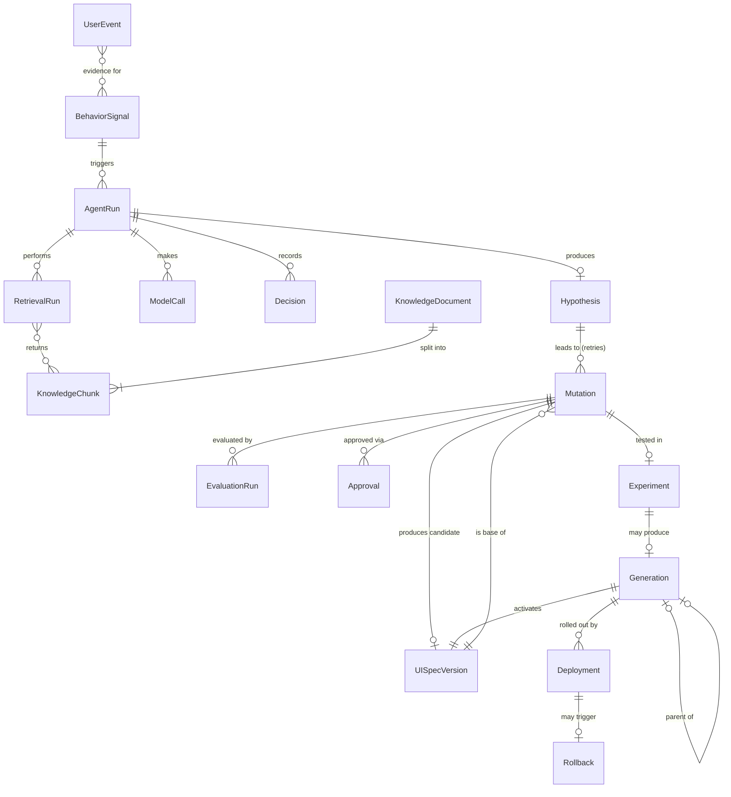

# DarwinUX — Domain Model

## Overview

The domain model captures the core entities of DarwinUX: what they represent, how they relate to each other, and what lifecycle states they pass through. This document defines the conceptual model — not database schemas or ORM classes.

## Entity Relationship Overview



## Core Entities

### UserEvent

A raw interaction event from the target application.

| Field | Type | Description |
|---|---|---|
| id | UUID | Unique identifier |
| session_id | UUID | User session |
| event_type | string | click, scroll, navigation, error, form_submit, etc. |
| event_id | string | Client-generated idempotency key (dedupes SQS at-least-once redelivery) |
| target | string | Stable component ID from the component registry (CSS selector only as fallback) |
| ui_spec_version_id | UUID | Which UI Spec version (i.e., which experiment variant) the user was seeing |
| metadata | JSON | Event-specific data (coordinates, timing, error details) |
| timestamp | datetime | When the event occurred |
| ingested_at | datetime | When DarwinUX received it |

**Why it exists:** UserEvents are the raw input to the system. They are high-volume, append-only, and never modified after ingestion. They are the evidence base from which everything else derives.

**Lifecycle:** `received` → `processed` → `archived`

Events are processed by the telemetry pipeline to extract behavioral signals, then eventually archived to cold storage.

---

### BehaviorSignal

An interpreted pattern derived from one or more UserEvents.

| Field | Type | Description |
|---|---|---|
| id | UUID | Unique identifier |
| signal_type | enum | rage_click, abandonment, repeated_error, slow_completion, confusion_loop, etc. |
| component | string | The UI component or page area involved |
| severity | float | Computed severity score (0.0–1.0) |
| evidence_count | int | Number of supporting UserEvents |
| first_seen | datetime | When the pattern first appeared |
| last_seen | datetime | Most recent occurrence |
| status | enum | Lifecycle state |
| detector_version | string | Which version of the deterministic rule produced it |

**Why it exists:** Raw events are too granular for AI reasoning. BehaviorSignals are the unit of input to the agent system — they represent "something is wrong here" with enough context to investigate.

**Lifecycle:** `detected` → `confirmed` → `investigating` → `resolved` | `dismissed`

**Implemented (Step 5)** as table `behavior_signal` with a leaner shape than sketched above: `id`, `signal_id` (deterministic UUID5, UNIQUE — the replay key), `signal_type`, `detector_version`, `session_id`, `window_start`, `window_end`, `evidence` (event ids + counts), `detected_at`, `superseded_at` (NULL = canonical; set when a late event means the detectors no longer produce the signal — rows are never deleted). One row per detected burst rather than an aggregate per component, so there is no `evidence_count`/`first_seen`/`last_seen`, no `severity` (no real need yet), and no lifecycle `status` (added when the investigation workflow consumes signals).

**Detection is deterministic.** Signals are detected by threshold-based rules (e.g., "3+ rapid clicks on the same element within 2 seconds = rage_click"), not by LLM inference. This is intentional — signal detection must be fast, predictable, and testable with unit tests.

---

### QueueMessage (infrastructure, Step 6)

Not a domain entity — the durable record of one unit of asynchronous work in the local queue (`queue_message`). Documented here because it is persisted.

| Field | Type | Description |
|---|---|---|
| id | UUID | Row identity |
| message_id | UUID, UNIQUE | Producer idempotency key; the `event_id` for telemetry |
| message_type | string | e.g. `telemetry.event`; the worker dispatches on it |
| body | JSON object | The versioned message (`schema_version` 1). Contains untrusted payload data — never logged |
| status | enum | `pending`, `done`, `dead` |
| attempts | int | Deliveries so far (SQS receive count) |
| visible_at | timestamptz | Receivable when `status = pending` and `visible_at <= now()`; pushed forward by a lease or a retry delay |
| receipt_handle | UUID | Identifies the current delivery; required to ack / retry / dead-letter |
| last_error | string (≤ 500) | Sanitised: exception type or field names, never values |
| created_at / finished_at | timestamptz | Enqueued / reached `done` or `dead` |

**Lifecycle:** `pending` → (receive: leased) → `done` | back to `pending` after a retry delay or lease expiry | `dead` (permanent error or out of attempts; re-queued if the same event is submitted again).

---

### Product Memory — implemented (Step 8)

As built in migration 0004 (sections below are the original design sketch):

- **knowledge_document**: `id`, `source_type` (`repo_document` | `ui_spec` | `system_generated`), `source_key` (e.g. `docs/MUTATION_SAFETY.md`), `title`, `content_hash` (sha256 of normalised content), `chunker` (e.g. `markdown-sections:v1:2000`), `embedding_model` (e.g. `hashing-bow:v1:384`), `metadata`, `created_at`, `updated_at`. **UNIQUE(source_type, source_key)** — one row per source; unchanged hash + chunker + model means nothing is re-done.
- **knowledge_chunk**: `id` (UUID5 of source, position, text hash), `document_id` (FK, ON DELETE CASCADE), `chunk_index`, `section` (heading path), `text`, `text_hash`, `char_count` (characters, not tokens), `embedding vector(384)`, `metadata` (source, section, generation for UI Specs), `created_at`. **UNIQUE(document_id, chunk_index)**. Chunks are derived data: replaced in the same transaction when the document changes, so stale chunks are never retrievable.
- **retrieval_run**: `id`, `query`, `top_k` (1–50), `filters`, `results` (`[{rank, chunk_id, source_key, section, score}]` — no chunk text), `embedding_model`, `latency_ms`, `created_at`. No FK to chunks: runs outlive re-ingestion and keep source/section for traceability.

### KnowledgeDocument

A source document ingested into Product Memory.

| Field | Type | Description |
|---|---|---|
| id | UUID | Unique identifier |
| source_type | enum | design_doc, ux_guideline, experiment_report, component_doc, etc. |
| source_uri | string | Original location (URL, file path, S3 key) |
| title | string | Document title |
| content_hash | string | SHA-256 hash of raw content (for deduplication and change detection) |
| ingested_at | datetime | When it was ingested |
| status | enum | Lifecycle state |

**Why it exists:** Product Memory needs to track not just chunks but their source documents — for provenance, deduplication, and re-ingestion when sources change.

**Lifecycle:** `pending` → `processing` → `indexed` → `stale` → `reindexed`

---

### KnowledgeChunk

A segment of a KnowledgeDocument prepared for retrieval.

| Field | Type | Description |
|---|---|---|
| id | UUID | Unique identifier |
| document_id | UUID | FK to KnowledgeDocument |
| content | text | The chunk text |
| chunk_index | int | Position within the document |
| embedding | vector | Dense embedding for similarity search |
| embedding_model | string | Which embedding model/version produced the vector (enables re-embedding) |
| metadata | JSON | Source section, headings, tags |
| token_count | int | For context window budgeting |

**Why it exists:** LLMs have finite context windows. Chunks are the retrieval unit — small enough to fit in context, large enough to carry meaning.

**Lifecycle:** Chunks are immutable once created. When a document is re-ingested, old chunks are soft-deleted and new ones created.

---

### RetrievalRun

A record of a retrieval operation against Product Memory.

| Field | Type | Description |
|---|---|---|
| id | UUID | Unique identifier |
| query | text | The retrieval query |
| agent_run_id | UUID | FK to the requesting AgentRun (nullable — evaluation runs also retrieve) |
| chunks_retrieved | list[UUID] | Ordered list of chunk IDs returned |
| scores | list[float] | Relevance scores per chunk |
| reranked | bool | Whether reranking was applied |
| filters | JSON | Metadata filters applied |
| retriever_version | string | Chunking/embedding/retrieval configuration version |
| latency_ms | int | Total retrieval time |
| timestamp | datetime | When retrieval occurred |

**Why it exists:** Retrieval quality is measurable only if retrieval operations are recorded. RetrievalRuns enable RAG evaluation (precision, recall, MRR) and debugging.

---

### AgentRun

A complete execution of the agent orchestration graph.

| Field | Type | Description |
|---|---|---|
| id | UUID | Unique identifier |
| trigger_signal_id | UUID | FK to the BehaviorSignal that triggered it |
| graph_name | string | Which LangGraph graph was executed |
| nodes_visited | list[string] | Ordered list of graph nodes executed |
| status | enum | Lifecycle state |
| started_at | datetime | Start time |
| completed_at | datetime | End time |
| total_cost_usd | float | Aggregated cost of all model calls |
| error | text | Error details if failed |

**Why it exists:** Agent runs are the unit of AI work. They must be fully traceable for debugging, evaluation, and cost accounting.

**Lifecycle:** `started` → `running` → `awaiting_human` → `running` → `completed` | `failed` | `timed_out`

An AgentRun ends when a candidate is approved for experiment, rejected, or archived. It does **not** stay open for the duration of the experiment — the Experiment Manager owns that.

---

### ModelCall

An individual invocation of an external model: LLM, embedding model, Jev, or Muse.

| Field | Type | Description |
|---|---|---|
| id | UUID | Unique identifier |
| agent_run_id | UUID | FK to AgentRun (nullable — ingestion and evaluation also call models) |
| evaluation_run_id | UUID | FK to EvaluationRun (nullable, for LLM-as-judge calls) |
| provider | string | Adapter name, e.g. an LLM vendor, `jev`, `muse`, `llm_baseline` |
| model | string | Model identifier |
| input_tokens | int | Token count for input |
| output_tokens | int | Token count for output |
| latency_ms | int | Response time |
| cost_usd | float | Computed cost |
| purpose | string | What this call was for (classify, generate, evaluate, etc.) |
| prompt_version | string | Version of the prompt template used (prompts are versioned in git) |
| request_ref / response_ref | string | Pointer to stored full request/response (Postgres or S3), for audit and replay |
| status | enum | ok, error, timeout, schema_invalid |
| timestamp | datetime | When the call was made |

**Why it exists:** Cost, latency, and quality tracking require per-call granularity. This also enables model comparison experiments.

---

### Decision

A recorded decision point where a rule, Jev, an LLM baseline, or a human evaluated evidence and chose an action.

| Field | Type | Description |
|---|---|---|
| id | UUID | Unique identifier |
| agent_run_id | UUID | FK to AgentRun (if part of agent flow) |
| decision_type | enum | signal_triage, evidence_gate, experiment_gate, promotion |
| decider | enum | rule, jev, llm_baseline, human |
| subject_type / subject_id | enum / UUID | What was decided about (signal, hypothesis, mutation, experiment) |
| policy_version | string | Threshold/policy configuration in force |
| input_summary | text | What was being decided |
| outcome | string | The decision made |
| confidence | float | Confidence score (0.0–1.0) |
| reasoning | text | Explanation of why |
| model_call_id | UUID | FK to the ModelCall that produced it (if model-based) |
| escalated | bool | Whether this was escalated to a human |

**Outcomes:** `proceed` | `stop` | `need_more_evidence` | `escalate`. A gate that cannot reach its decider records `escalate` (fail closed).

**Why it exists:** Decisions are the most important thing to audit. When something goes wrong, the question is always "why did the system decide to do that?" Decisions answer that question.

---

### Hypothesis generation — implemented (Step 9)

As built in migration 0005 (the Hypothesis section below is the original design; `agent_run_id` waits for AgentRun):

- **hypothesis_run** — one explicit generation attempt, kept whatever the outcome: `id` (the run id), `signal_id` (FK → `behavior_signal.signal_id`), `signal_type`, `request_version` (`hypothesis.v1`), `provider`, `model`, `embedding_model`, `retrieval_query`, `evidence_chunk_ids` (supplied excerpts, rank order), `evidence_hash` (sha256 of the evidence section — what the model saw, without storing it), `status` (CHECK: `succeeded`, `insufficient_evidence`, `provider_unavailable`, `provider_error`, `invalid_output`, `grounding_failed`), `error_type` (CHECK: NULL **iff** succeeded), `validation_errors` (`[{loc, type}]`, never the offending values), `output` (the schema-valid draft, also kept when grounding failed; SQL NULL otherwise), `input_tokens` / `output_tokens` (NULL when the provider reports none), `latency_ms` (the provider call; NULL when no call was made), `created_at`. Index on `signal_id`. No prompts, chunk text, reasoning or raw invalid output.
- **hypothesis** — the accepted artifact, only from a `succeeded` run: `id`, `run_id` (FK, **UNIQUE**: one per run), `signal_id` (FK), `statement`, `rationale` (both non-empty), `affected_component` (nullable), `confidence` (CHECK `low | medium | high`, uncalibrated), `evidence_references` (non-empty `[{chunk_id, source_key, section}]` — source and section survive re-ingestion, when chunk ids change; no FK to chunks for that reason), `limitations`, `status` (CHECK `proposed`; critique/approval states arrive with those steps), `created_at`. Index on `signal_id`.

### Hypothesis

A proposed explanation for observed UX friction.

| Field | Type | Description |
|---|---|---|
| id | UUID | Unique identifier |
| agent_run_id | UUID | FK to AgentRun that produced it |
| signal_id | UUID | FK to BehaviorSignal being explained |
| description | text | What the hypothesis proposes |
| supporting_evidence | list[UUID] | KnowledgeChunk IDs cited (must be a subset of chunks actually retrieved in this run — a deterministic hallucination check) |
| confidence | float | Agent's confidence in this hypothesis |
| status | enum | Lifecycle state |

**Lifecycle:** `proposed` → `accepted` | `rejected` | `needs_more_evidence`

---

### UISpecVersion

An immutable, versioned structured description of what the target application renders (screens → component instances → props, copy, design tokens). The demo target app renders **from** a UI Spec version through the component registry.

| Field | Type | Description |
|---|---|---|
| id | UUID | Unique identifier |
| parent_id | UUID | The version this was derived from |
| spec | JSON | The full UI Spec document |
| schema_version | string | Version of the UI Spec schema |
| content_hash | string | For integrity and dedupe |
| created_by | enum | seed, mutation |
| created_at | datetime | When |

**Why it exists:** It makes mutations concrete and reversible. A mutation is a patch from version N to candidate N+1; an experiment routes a cohort to N+1; a rollback routes everyone back to N. No source code changes. See MUTATION_SAFETY.md.

**Lifecycle:** Immutable. Never edited, never deleted.

---

### Mutation

A proposed UI change derived from a hypothesis.

| Field | Type | Description |
|---|---|---|
| id | UUID | Unique identifier |
| hypothesis_id | UUID | FK to Hypothesis |
| agent_run_id | UUID | FK to AgentRun that generated it |
| base_spec_version_id | UUID | The UI Spec version the patch applies to |
| candidate_spec_version_id | UUID | The UI Spec version produced by applying the patch (after validation) |
| mutation_type | enum | design_token_change, component_prop_change, copy_change, template_variant_change |
| specification | JSON | The structured MutationSpec (see MUTATION_SAFETY.md) |
| risk_tier | enum | low, medium, high (deterministically computed) |
| component | string | The target component |
| generator | string | Adapter that produced it: `muse`, `llm_baseline`, `fixture` |
| generator_version | string | Model/version reported by the adapter |
| model_call_id | UUID | FK to the ModelCall that generated it |
| attempt | int | Retry number within the AgentRun |
| status | enum | Lifecycle state |

**Lifecycle:** `generated` → `validated` → `sandboxed` → `evaluated` → `awaiting_approval` → `approved` → `experimenting` → `promoted` | `discarded`

`rejected` is a terminal state reachable from any gate before `experimenting` (validation failure, safety failure, Jev `stop`, human rejection). Rejected mutations are kept as negative evidence.

---

### EvaluationRun

An evaluation of a mutation, agent run, or retrieval operation.

| Field | Type | Description |
|---|---|---|
| id | UUID | Unique identifier |
| target_type | enum | mutation, agent_run, retrieval_run, decision, golden_dataset |
| target_id | UUID | FK to the entity being evaluated |
| evaluation_type | enum | deterministic, llm_judge, statistical, human |
| metrics | JSON | Computed metric values |
| passed | bool | Whether it passed minimum thresholds |
| evaluator | string | Which evaluator produced this |
| evaluator_version | string | Version of the evaluator / judge prompt |
| dataset_version | string | Golden dataset version (for offline evals) |
| timestamp | datetime | When evaluation ran |

**Why it exists:** Evaluation is a first-class operation with its own records. This enables meta-evaluation (evaluating the evaluators) and trend analysis.

---

### Experiment

A controlled deployment of a mutation to a subset of users.

| Field | Type | Description |
|---|---|---|
| id | UUID | Unique identifier |
| mutation_id | UUID | FK to Mutation |
| experiment_type | enum | a_b_test (v1 only) |
| control_spec_version_id | UUID | UI Spec version served to control |
| treatment_spec_version_id | UUID | UI Spec version served to treatment |
| flag_key | string | Feature flag that routes cohorts |
| traffic_percentage | float | Percentage of users in treatment group |
| primary_metric | string | Pre-registered metric the decision is based on |
| guardrail_metrics | JSON | Metrics + thresholds that trigger automatic rollback |
| traffic_source | enum | real, simulated (simulated traffic must be labelled everywhere) |
| started_at | datetime | When the experiment began |
| ended_at | datetime | When it concluded |
| status | enum | Lifecycle state |
| metrics_before | JSON | Baseline metrics |
| metrics_after | JSON | Treatment metrics |
| statistical_significance | float | p-value or equivalent |
| outcome | enum | positive, negative, inconclusive |

**Lifecycle:** `configured` → `running` → `analyzing` → `concluded` | `aborted` (guardrail breach)

---

### Generation

An evolutionary step — a UI Spec version that became the default for all users.

| Field | Type | Description |
|---|---|---|
| id | UUID | Unique identifier |
| generation_number | int | Sequential generation (0, 1, 2, ...) |
| parent_generation_id | UUID | FK to previous generation (null for Generation 0) |
| ui_spec_version_id | UUID | The UI Spec version this generation serves |
| mutation_id | UUID | FK to the promoted Mutation (null for Generation 0) |
| experiment_id | UUID | FK to the validating Experiment (null for Generation 0) |
| evidence_summary | text | Why this generation exists |
| status | enum | Lifecycle state |
| created_at | datetime | When this generation was created |

**Why it exists:** Generations are the unit of evolution. They form a chain of lineage that answers "how did the software get from there to here?"

**Generation 0** is the seeded baseline UI Spec. It has no mutation, experiment, or approval.

**Lifecycle:** `active` → `superseded` (a newer generation was promoted) | `rolled_back` (reverted to parent)

An experiment that is negative or inconclusive produces **no** Generation. Its mutation ends as `discarded`, and its results still flow into Product Memory.

---

### Approval

A human approval or rejection of a proposed change.

| Field | Type | Description |
|---|---|---|
| id | UUID | Unique identifier |
| approval_type | enum | start_experiment, promote, escalation_review |
| target_type | enum | mutation, experiment, decision |
| target_id | UUID | FK to what was approved/rejected |
| approved_by | string | Authenticated identity of the human (never an AI component) |
| evidence_snapshot | JSON | What the human was shown (scores, diff, screenshots) |
| approved | bool | Yes or no |
| reasoning | text | Why |
| timestamp | datetime | When |

---

### Deployment

A record of a mutation being deployed to production.

| Field | Type | Description |
|---|---|---|
| id | UUID | Unique identifier |
| generation_id | UUID | FK to Generation |
| deployed_at | datetime | When deployment occurred |
| deployment_method | string | v1: feature-flag change only |
| flag_key | string | Which flag was changed |
| from_spec_version_id / to_spec_version_id | UUID | Exact before/after |
| status | enum | Lifecycle state |

**Lifecycle:** `deploying` → `active` → `rolled_back`

A deployment is a **configuration change** (a flag now points at a different UI Spec version), never a code deploy. Code deploys go through CI/CD and are out of DarwinUX's autonomous reach.

---

### Rollback

A record of reverting a deployment.

| Field | Type | Description |
|---|---|---|
| id | UUID | Unique identifier |
| deployment_id | UUID | FK to Deployment |
| reason | text | Why the rollback occurred |
| automated | bool | Whether this was automatic or manual |
| rolled_back_at | datetime | When |

## Key Relationships

1. **Evidence chain:** `UserEvent` → `BehaviorSignal` → `AgentRun` → `Hypothesis` → `Mutation` → `EvaluationRun` → `Approval` → `Experiment` → `Generation`. This chain is the core traceability requirement. Given any generation, you must be able to walk backwards to the original user events that triggered it.

2. **Knowledge graph:** `KnowledgeDocument` → `KnowledgeChunk` → `RetrievalRun` → `AgentRun`. This links what the system knew to what it decided.

3. **Decision audit trail:** `AgentRun` → `Decision` → `ModelCall`. This links every decision to its reasoning and the model that produced it.

4. **Generational lineage:** `Generation` → `Generation` (parent). This is the evolutionary chain itself.

## Generation Traceability

Every question a Generation must answer maps to a concrete join path:

| Question | Answered by |
|---|---|
| What changed? | `Mutation.specification` + diff of `base_spec_version` → `ui_spec_version` |
| Why did it change? | `Hypothesis.description` + `Generation.evidence_summary` |
| What evidence triggered it? | `AgentRun.trigger_signal_id` → `BehaviorSignal` → `UserEvent`s |
| What RAG context was retrieved? | `AgentRun` → `RetrievalRun.chunks_retrieved` → `KnowledgeChunk` → `KnowledgeDocument` |
| Which agents / nodes participated? | `AgentRun.nodes_visited` + `ModelCall`s |
| What did Jev decide? | `Decision` where `decider = jev` (and baseline decisions for comparison) |
| What did Muse generate? | `Mutation` where `generator = muse`, including rejected attempts |
| How was it evaluated? | `EvaluationRun`s for the mutation |
| Who approved it? | `Approval` (`start_experiment`, `promote`) |
| What happened in the experiment? | `Experiment` metrics, significance, outcome, `traffic_source` |
| Did metrics improve? | `Experiment.outcome` on the pre-registered `primary_metric` |
| Retained or rolled back? | `Generation.status` + `Rollback` |

If any of these queries cannot be answered from stored records, the traceability invariant is broken.

## Lifecycle State Patterns

Most entities follow one of two patterns:

**Linear progression:** The entity moves forward through states and does not return.
```
pending → processing → completed
```

**Branching progression:** The entity reaches a decision point and takes one of several terminal paths.
```
proposed → accepted → experimenting → promoted
                                    → rolled_back
         → rejected
         → needs_more_evidence → (re-enters flow)
```

---

## What You Should Understand Before Implementation

1. **Entities model the evolution loop, not a CRUD application.** The domain is not "manage mutations" — it is "trace the complete journey from user friction to deployed improvement."
2. **The evidence chain is the most important invariant.** If any link in `UserEvent → BehaviorSignal → ... → Generation` is broken, the system loses its ability to explain why a change was made.
3. **Not every entity needs its own database table on day one.** Some (like ModelCall) could start as JSON fields within AgentRun and be normalized later when querying them independently becomes valuable.
4. **Lifecycle states should be enforced, not just documented.** A Mutation in state `generated` should not be deployable. State machines prevent invalid transitions.
5. **Soft deletion over hard deletion.** Rejected mutations, failed experiments, and rolled-back deployments are valuable negative evidence. Never delete them.
6. **Rollback is a pointer move, not an undo.** Because UI Spec versions are immutable, reverting means routing traffic back to a previous version. Nothing needs to be "reconstructed".
7. **Record which adapter decided or generated.** `decider` and `generator` fields keep Jev and Muse outputs distinguishable from rules and LLM baselines — without them, you cannot evaluate Jev or Muse at all.
