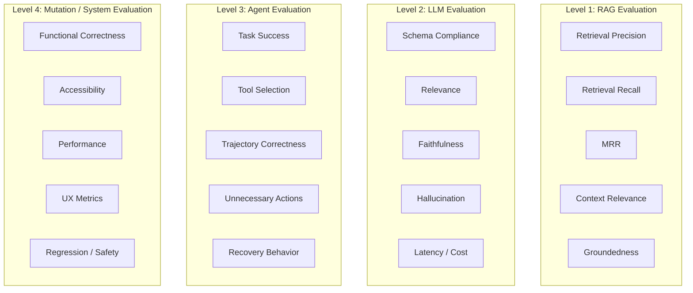

# DarwinUX — Evaluation Strategy

## Evaluation Is Not Testing

Testing asks: "Does this code work as intended?"

Evaluation asks: "Does this AI system produce good results?"

Both are necessary. They are not the same thing.

A test has a binary outcome (pass/fail) determined by the developer at write time. An evaluation measures quality on a spectrum, often requires human judgment or statistical analysis, and must account for the non-deterministic nature of AI outputs.

DarwinUX requires evaluation at four levels, each with different metrics, methods, and integration points.

## Four Levels of Evaluation



### Level 1: RAG Evaluation

**What we're evaluating:** Does Product Memory return the right knowledge for a given query?

| Metric | Type | What It Measures |
|---|---|---|
| **Precision@K** | Deterministic (requires labels) | Of retrieved chunks, how many are relevant? |
| **Recall@K** | Deterministic (requires labels) | Of all relevant chunks, how many were retrieved? |
| **MRR** | Deterministic (requires labels) | How high is the first relevant result? |
| **Context Relevance** | LLM-as-judge | Is the assembled context relevant to the query? |
| **Groundedness** | LLM-as-judge | Is the output supported by retrieved context? |
| **Faithfulness** | LLM-as-judge + human | Does the output accurately represent what context says? |

**Golden dataset required:** RAG evaluation needs manually labeled query-relevance pairs. There is no shortcut. See RAG_ARCHITECTURE.md for golden dataset design.

**When to run:**
- After changes to the chunking strategy, embedding model, or retrieval pipeline.
- On a recurring schedule to detect corpus quality drift.
- Before any major Product Memory re-indexing.

**CI/CD integration:** RAG evaluation should run as part of the AI evaluation regression suite but should **not block deployment** of non-RAG changes. It should block deployment of changes to the RAG pipeline itself.

---

**Implemented (Step 8):** `make memory-eval` runs the golden retrieval set (`backend/tests/evals/golden/retrieval.json`, 26 queries including paraphrases, every corpus source covered) against each chunking config, each in a rolled-back transaction, and writes `artifacts/retrieval-eval.json` (schema `darwinux.retrieval-eval.v1`; gitignored, reproducible). Definitions, per query then averaged — always reported **separately**, never combined into one score:

- a retrieved chunk is **relevant** if its source is one of the case's expected sources (and, when the case lists sections, its section matches one);
- **Precision@K** = relevant chunks in the top K / K;
- **Recall@K** = expected sources found in the top K / expected sources;
- **MRR** = mean of 1 / rank of the first relevant chunk (0 if none in the top K).

The baseline uses the deterministic hashing embedding provider, so results are identical run to run; they measure the harness and chunking, not semantic quality. See RAG_ARCHITECTURE.md, "Current Implementation (Step 8)", for the numbers and their interpretation.

---

### Level 2: LLM Evaluation

**Implemented (Step 9), deterministic part:** `make hypothesis-eval` runs the golden hypothesis set (`backend/tests/evals/golden/hypotheses.json`, 18 cases: grounded rage_click / error_burst, no usage metadata, empty memory, irrelevant memory, a retrieved prompt injection treated as data, a provider that obeys it, an unknown evidence id, an invalid component, four malformed outputs plus prose, provider failure / timeout / unavailable) with the `FakeLLMProvider`, in one rolled-back transaction, and writes `artifacts/hypothesis-eval.json` (`darwinux.hypothesis-eval.v1`, git-ignored). Cases state expected *properties* — status, error type, component, sources that must be cited, text that must not appear — never exact prose. Reported separately:

| Metric | Definition | Step 9 (fake) |
|---|---|---|
| Schema compliance | schema-valid outputs / outputs returned | 7/13 — set by the fixture mix; the point is that each bad output is caught |
| Evidence-reference validity | outputs citing only supplied excerpts / schema-valid outputs | 6/7 |
| Component accuracy | accepted hypotheses naming the expected component / cases expecting one | 5/5 |
| Source-reference success | cases citing every expected source / cases expecting sources | 3/3 |
| Failure handling | failure cases in the expected status + error type with no Hypothesis / failure cases | 13/13 |
| Lexical support (**baseline**) | mean share of a hypothesis's content words present in its cited excerpts + signal facts | 0.54 |
| Latency / tokens | per provider call (fake: char-based estimates) | — |

With a fake provider these numbers measure DarwinUX's **control layer**, not model quality. Lexical support is word overlap — it scores a contradiction built from the evidence's own words highly (tested) — and is deliberately not called faithfulness. **Not yet:** LLM-as-judge relevance, faithfulness and unsupported-claim detection. They need a real provider for the judge, a judge-agreement check against human labels, and must never be the only gate: the deterministic checks above stay primary and blocking.

**What we're evaluating:** Do LLM calls (hypothesis generation, critique, etc.) produce high-quality, well-structured outputs?

| Metric | Type | What It Measures |
|---|---|---|
| **Schema Compliance** | Deterministic | Does the output conform to the expected Pydantic schema? |
| **Relevance** | LLM-as-judge | Is the output relevant to the input? |
| **Faithfulness** | LLM-as-judge | Does the output stay grounded in provided context? |
| **Hallucination Rate** | LLM-as-judge + human | Does the output contain unsupported claims? |
| **Latency** | Deterministic | Response time (p50, p95, p99) |
| **Cost** | Deterministic | Token usage and dollar cost per call |
| **Token Efficiency** | Deterministic | Output-to-input token ratio |

**Schema compliance is the most important and easiest to evaluate.** If the LLM is asked to produce a `HypothesisOutput` Pydantic model and the output fails validation, that is an unambiguous failure — no LLM judge needed.

**Latency and cost are deterministic and cheap to track.** Every ModelCall entity records these. Trend them over time. Alert on anomalies.

**Hallucination detection is the hardest.** For DarwinUX, hallucination means: "The hypothesis cites evidence that was not in the retrieved context" or "The critique references design guidelines that don't exist." This requires an LLM-as-judge evaluator that cross-references output claims against the input context.

**When to run:**
- On every LLM call (schema compliance, latency, cost — these are cheap).
- On a sample of calls (relevance, faithfulness — these cost LLM tokens themselves).
- On demand for hallucination deep-dives.

**CI/CD integration:** Schema compliance tests should **block deployment.** Latency/cost regression tests should **warn but not block** (external provider performance is not in our control).

---

### Level 3: Agent Evaluation

**Implemented (Step 10), deterministic part:** `make research-eval` runs the golden research set (`backend/tests/evals/golden/research.json`, 19 cases) through the real graph with the `FakeLLMProvider`, in one rolled-back transaction, and writes `artifacts/research-eval.json` (`darwinux.research-eval.v1`, git-ignored). Cases cover both signals accepting, empty memory, a refinement that recovers an anchor source (a support-ticket distractor corpus), a refinement that cannot, critique → human review, human approve / reject via resume, low confidence → human, critique reject, malformed critique, provider failure on either call, Step 9 grounding failure, three budget exhaustions (LLM calls, retrieval attempts, graph steps), and prompt injection (treated as evidence; a critic that obeys it). Each case states the terminal status and stop reason, **the path** (an exact node sequence, or required / forbidden nodes), retrieval attempts, LLM calls and the hypothesis's final state — never prose. Reported separately:

| Metric | Definition | Step 10 (fake) |
|---|---|---|
| Workflow success rate | runs ending `succeeded` / cases — descriptive, set by the case mix | 5/19 |
| Terminal-state accuracy | final status (+ stop reason) as expected / cases | 19/19 |
| Avg retrieval attempts / avg LLM calls | per run | 1.11 / 1.42 |
| Unnecessary second-retrieval rate | runs that retrieved twice / cases marked "one retrieval is enough" | 0/4 |
| Human-review routing accuracy | reached `human_review` exactly when expected / cases | 19/19 |
| Budget-exhaustion handling | budget cases ending as expected, within their budget / budget cases | 3/3 |
| Trajectory structural validity | every step an allowed transition (checked per invocation) / cases | 19/19 |
| Trajectory expectations met | exact / required / forbidden nodes as expected / cases | 19/19 |
| All runs within budget | counters ≤ budget and provider requests = counted LLM calls / cases | 19/19 |

With a fake provider these measure the **orchestration** — routing, bounds, persistence — not model judgment. Trajectory evaluation is deterministic here (against the transition table and the golden paths); LLM-as-judge trajectory review remains future work for open-ended agents.

**What we're evaluating:** Does the Research Agent (and the overall LangGraph orchestration) make good decisions and take efficient paths?

| Metric | Type | What It Measures |
|---|---|---|
| **Task Success Rate** | Deterministic + human | Did the agent reach a valid conclusion? |
| **Tool Selection Accuracy** | Deterministic (requires golden) | Did the agent call the right tools? |
| **Trajectory Correctness** | LLM-as-judge + human | Did the agent follow a reasonable path? |
| **Unnecessary Actions** | Deterministic | How many tool calls were wasted? |
| **Recovery Behavior** | Deterministic | Did the agent recover from tool failures? |
| **Iteration Count** | Deterministic | How many loops before completion? |
| **Cost Efficiency** | Deterministic | Total cost relative to outcome quality |

**Agent evaluation is harder than LLM evaluation** because it involves sequences of decisions, not single outputs. A trajectory evaluation must consider:
- Was each step reasonable given what the agent knew at that point?
- Were there steps that could have been skipped?
- Did the agent recover from failed tool calls, or did it spiral?

**Golden trajectories:** Create reference trajectories for known scenarios. "Given a rage_click signal on the checkout button, a good agent trajectory looks like: search for checkout button docs → search for past checkout experiments → summarize findings." Compare actual trajectories against golden ones.

**When to run:**
- After changes to agent prompts, tool definitions, or LangGraph graph structure.
- On a sample of production agent runs (asynchronous, non-blocking).

**CI/CD integration:** Agent trajectory tests against golden scenarios should **block deployment** of agent-related changes. Statistical trajectory analysis should **not block** (it's a monitoring concern).

---

### Level 4: Mutation / System Evaluation

**What we're evaluating:** Is the candidate mutation (produced by Muse) correct, safe, accessible, and an improvement?

| Metric | Type | What It Measures |
|---|---|---|
| **Schema Validity** | Deterministic | Does the mutation conform to MutationSpec? |
| **Allowlist Compliance** | Deterministic | Does it only modify permitted properties? |
| **Value Range Validity** | Deterministic | Are values within acceptable ranges? |
| **Accessibility (WCAG)** | Deterministic + LLM | Contrast ratios, font sizes, focus indicators |
| **Design Consistency** | LLM-as-judge | Does it follow the design system? |
| **Performance Impact** | Deterministic | Does it degrade render performance? |
| **Regression** | Deterministic | Does it reintroduce known problems? |
| **UX Improvement** | Statistical (experiment) | Do user metrics improve? |

**This level has the widest range of evaluation methods:**
- Pure deterministic (schema validation, allowlist checks)
- Deterministic + rules (contrast ratio calculations)
- LLM-as-judge (design consistency)
- Statistical (A/B test results)
- Human (expert review)

**The deterministic checks are the safety floor.** They run fast, they never fail randomly, and they must all pass before any LLM-based evaluation runs. See MUTATION_SAFETY.md.

**UX improvement is measured by experiments, not by evaluation.** Evaluation predicts whether a mutation might be good. Experiments measure whether it actually is. These are different things and should not be conflated.

**When to run:**
- Deterministic validation: on every candidate mutation (always).
- LLM-as-judge evaluation: on every candidate that passes deterministic validation.
- Statistical evaluation: during experiments (after human approval).

**CI/CD integration:** Deterministic mutation validation tests should **block deployment.** The evaluation framework's own tests should block. Individual mutation evaluation results do not affect CI/CD — they affect the Jev decision gate.

---

## Evaluation Methods

### Deterministic Evaluation

**What it is:** Evaluation with fixed, repeatable logic and binary outcomes.

**Examples:**
- Pydantic schema validation
- Mutation allowlist checks
- Contrast ratio calculation
- Response latency measurement
- Token count computation

**Strengths:** Fast, cheap, repeatable — the same input always produces the same result.

**Limitations:** Only as correct as the rule itself (a wrong rule is wrong every time). Can only check things with clear rules. Cannot assess quality, relevance, or coherence.

**When to prefer:** Always prefer deterministic evaluation where possible. It is the foundation.

### Statistical Metrics

**What it is:** Quantitative measurement computed from data, often requiring aggregation.

**Examples:**
- Precision@K, Recall@K, MRR (retrieval metrics)
- A/B test significance calculations
- Latency percentiles (p50, p95, p99)
- Cost trends over time

**Strengths:** Objective, comparable over time, automatable.

**Limitations:** Requires labeled data (for retrieval metrics) or sufficient sample size (for experiments).

**When to prefer:** For measuring trends, comparing models, and making data-driven decisions.

### LLM-as-Judge

**What it is:** Using one LLM to evaluate the output of another LLM (or the same LLM with a different prompt).

**Examples:**
- "Is this hypothesis supported by the provided evidence?" → score 1–5
- "Does this mutation follow the design system guidelines?" → pass/fail with reasoning
- "Is this output faithful to the input context?" → score 1–5

**Strengths:** Can evaluate subjective qualities (relevance, coherence, design consistency). Scales better than human evaluation.

**Limitations:**
- **Not deterministic.** The same input may get different scores on different runs.
- **Position bias.** LLM judges can prefer outputs that appear first.
- **Self-preference bias.** An LLM may rate its own outputs more highly.
- **Cost.** Each evaluation costs LLM tokens.

**Mitigation strategies:**
- Run evaluations multiple times and average scores.
- Use a different model for judging than for generation.
- Calibrate against human judgments regularly.
- Treat LLM-as-judge scores as signals, not ground truth.

**When to prefer:** When deterministic rules cannot express the evaluation criteria, and human evaluation is too expensive for the volume.

### Human Evaluation

**What it is:** Expert humans reviewing AI outputs and providing judgments.

**Examples:**
- Reviewing a sample of hypotheses for reasoning quality.
- Reviewing mutations for design taste and user experience.
- Final approval before experiments.
- Periodic calibration of LLM-as-judge evaluators.

**Strengths:** Highest quality judgments. Can catch subtle issues that automated methods miss.

**Limitations:** Slow, expensive, doesn't scale, subject to individual bias.

**When to prefer:**
- Final approval gates (non-negotiable for DarwinUX).
- Calibrating automated evaluators.
- Evaluating new types of outputs where no automated evaluator exists yet.
- Spot-checking production quality.

## Golden Evaluation Datasets

A golden dataset is a curated set of inputs with known-good expected outputs (or at minimum, known-good evaluation labels). They serve as regression tests for AI quality.

### Structure

```
backend/tests/evals/golden/
├── rag_retrieval/
│   ├── queries.json          # { query, relevant_chunk_ids, irrelevant_chunk_ids }
│   └── README.md
├── hypothesis_generation/
│   ├── scenarios.json        # { signal, evidence, expected_hypothesis_qualities }
│   └── README.md
├── agent_trajectories/
│   ├── trajectories.json     # { signal, expected_tool_calls, expected_outcome }
│   └── README.md
├── gate_decisions/
│   ├── decisions.json        # { decision_type, evidence, human_label }
│   └── README.md
└── mutation_evaluation/
    ├── mutations.json         # { mutation_spec, expected_evaluation_results }
    └── README.md
```

### Building Golden Datasets

1. **Start small.** 20–30 examples per dataset is sufficient to detect regressions. Quality over quantity.
2. **Use real scenarios.** Generate examples from actual agent runs that were manually verified as correct.
3. **Include negative examples.** Bad hypotheses, incorrect tool selections, unsafe mutations.
4. **Version them.** Golden datasets evolve with the system. Track changes in git.
5. **Review quarterly.** As the corpus and system change, golden datasets become stale.

### Using Golden Datasets in CI/CD

```
CI Pipeline:
  ├── Unit tests (fast, always run)
  ├── Integration tests (medium, always run)
  └── AI Evaluation Regression (slow, run on AI-related changes)
      ├── RAG golden set → Precision/Recall must not regress
      ├── Hypothesis golden set → Schema compliance + relevance score must not regress
      ├── Agent trajectory golden set → Task success rate must not regress
      └── Mutation golden set → Safety validation must pass 100%
```

With 20–30 examples per dataset, a single flipped example moves a rate by 3–5%. Thresholds must be wider than that noise, and an LLM-judged metric is never a blocker on its own.

**What should block deployment:**
- Schema compliance regression → **BLOCK** (deterministic, binary)
- Safety validation regression → **BLOCK** (deterministic, binary)
- Retrieval precision drops >10% on a PR that touches RAG code/config → **BLOCK** (statistical, with threshold)
- Agent task success drops >15% on a PR that touches prompts, tools, or the graph → **BLOCK** (statistical, with threshold)
- Muse/baseline generator produces any golden mutation that passes validation but should not → **BLOCK** (safety)
- Relevance score drops 0.2 points → **WARN** (LLM-as-judge, noisy)
- Latency increases → **WARN** (may be external provider issue)
- Cost increases → **WARN** (may be intentional model change)

---

## Evaluating Jev Decisions

Jev is an AI component and is evaluated like one. Because every `Decision` records its `decider`, the same inputs can be compared across the rules, the LLM baseline, and Jev.

| Metric | Type | What It Measures |
|---|---|---|
| **Agreement with human labels** | Statistical (golden `gate_decisions`) | Does the gate reach the decision an expert would? |
| **Calibration (e.g., reliability curve, ECE)** | Statistical | When confidence is 0.8, is it right ~80% of the time? |
| **Escalation rate** | Deterministic | Too high = useless gate; too low = overconfident gate |
| **False-proceed rate at `experiment_gate`** | Statistical | The costly error: proceeding on something a human would stop |
| **Downstream outcome** | Statistical (long-term) | Of experiments Jev let through, how many were positive? |
| **Latency / cost / error rate** | Deterministic | Operational health of the integration |

Jev is kept at a gate only if it beats the simpler adapters on these metrics. That is the honest version of "use AI where it adds value."

**Implemented (Step 11), the harness:** `make decision-eval` writes 27 golden research artifacts as real rows (one rolled-back transaction per decider) and scores each decider **separately** (`backend/tests/evals/golden/decisions.json`, `artifacts/decision-eval.json`, schema `darwinux.decision-eval.v1`): accuracy, per-class precision/recall, a confusion matrix, the **fail-open count** (expected human_review/reject, recorded proceed), fail-closed count, policy overrides, invalid-output and decider-failure handling, human-review rate, confidence by decision, and ineligible artifacts refused with zero decider calls. No calibration metric: no decider has a calibrated numeric confidence (Jev's documented confidence is a distribution statistic, not a probability).

| Decider | Accuracy (20 eligible) | Fail-open | Fail-closed | Overrides | Ineligible refused |
|---|---|---|---|---|---|
| `rules.v1` | 20/20 | 0 | 0 | 0 | 7/7 |
| `fake_decider.v1` (reckless test double) | 7/20 | 2 | 8 | 5 | 7/7 |
| `llm_decision.v1` (FakeLLMProvider, "cautious") | 4/20 | 0 | 4 | 0 | 7/7 |
| Jev | not evaluated — no API key; `--include-jev` when available | | | | |

Read these honestly: the golden labels encode DarwinUX's own decision policy, and `rules.v1` implements that policy, so its 20/20 is **by construction** — the set is a specification test of the gate, not evidence that the rules make good decisions. The test double's two fail-opens (missing evidence, critique issues) show exactly what the hard-precondition policy does *not* contain when a valid decider is reckless; every *failure* case is contained (0 fail-opens among failed_closed runs, enforced by a database CHECK). Comparing Jev meaningfully needs independently labelled real artifacts.

## Evaluating Muse Generations

| Metric | Type | What It Measures |
|---|---|---|
| **Schema-valid rate** | Deterministic | Share of outputs that parse into a `MutationSpec` |
| **Constraint-violation rate** | Deterministic | Share that touch non-allowlisted paths or out-of-range values |
| **Attempts to first valid candidate** | Deterministic | Efficiency of constrained generation |
| **Hypothesis alignment** | LLM-as-judge + human | Does the mutation actually address the hypothesis? |
| **Evaluation pass rate** | Deterministic (aggregated) | Share that pass the full Evaluation Engine |
| **Human approval rate** | Human | Share approved for experiment |
| **Experiment win rate** | Statistical (long-term) | Share of experimented mutations that improve the primary metric |

As with Jev, every metric is computed for Muse **and** for the LLM baseline generator, so Muse's contribution is measured rather than asserted.

**Implemented (Step 12), the control-layer harness:** `make mutation-eval` runs 28 golden cases (`backend/tests/evals/golden/mutations.json`) per generator, each in a rolled-back transaction: import Generation 0, write a research artifact, make a real `rules.v1` proceed decision, optionally make provenance stale, run one generation. Cases state expected status, error type and exact changes. Every candidate is then re-checked **independently** (its diff may only touch mutable properties) and by the frontend's real Zod schema. Reported per generator (`artifacts/mutation-eval.json`, `darwinux.mutation-eval.v1`):

| Metric | `fixture_mutation.v1` | `llm_mutation.v1` (FakeLLMProvider) |
|---|---|---|
| Cases meeting expectations | 28/28 | 28/28 |
| Valid MutationSpec rate (of outputs) | 17/20 | 22/23 |
| Safety-validation pass rate (of valid specs) | 6/17 | 20/22 |
| Correct-target / expected-change rate (of the 6 desired changes) | 6/6 / 6/6 | 2/6 / 2/6 |
| Protected-field violations | 0 | 0 |
| Stale-provenance refusal (no generator call) | 4/4 | 4/4 |
| Generator-failure containment | 4/4 | 1/1 |
| Candidate creation | 6/28 | 20/28 |
| Frontend Zod acceptance of candidates | 6/6 | 20/20 |
| **Unsafe candidate creation count** | **0** | **0** |

These measure containment, not usefulness: the fake LLM's fixed "flip the first enum" behaviour creates 20 *valid* candidates, one of which (`no_applicable_mutation`) re-introduces friction (`feedback: immediate → delayed`). It is safe and schema-valid — and harmful. Usefulness is for sandbox evaluation, humans and experiments (future steps); Muse: not evaluated (no interface).

---

## Evaluating the Evaluators (Meta-Evaluation)

LLM-as-judge evaluators are AI systems themselves and must be evaluated:

1. **Calibrate against human judgments.** Have humans rate a set of outputs. Compare LLM judge scores to human scores. Measure agreement (Cohen's kappa or similar).
2. **Track judge consistency.** Run the same evaluation multiple times. Measure variance. High variance means the judge is unreliable.
3. **Detect judge drift.** If the underlying judge model changes (provider update), re-run calibration.
4. **A/B test judges.** When considering a new evaluation prompt or model, run both old and new judges on the same inputs. Compare.

---

## What You Should Understand Before Implementation

1. **Deterministic evaluation is the foundation.** Start here. It's fast, reliable, and free. Every other evaluation method builds on top of it, not instead of it.
2. **LLM-as-judge is powerful but unreliable.** Never use it as the sole decision-maker. Use it as one signal among several, calibrated against human judgment.
3. **Golden datasets are hand-crafted and expensive.** They are also the only way to detect AI quality regressions in CI/CD. Budget time for creating and maintaining them.
4. **Evaluation and experimentation are different.** Evaluation predicts whether a mutation might be good (before deployment). Experimentation measures whether it actually is (during deployment). Both are needed.
5. **Not all evaluations should block deployment.** Only deterministic checks and statistically significant regressions in golden datasets should block. Noisy signals should warn.
6. **Jev and Muse are evaluated against baselines.** Recording which adapter decided or generated makes it possible to show — not claim — that they add value.
7. **Evaluating AI evaluators is not optional.** If your LLM-as-judge is miscalibrated, every decision downstream is compromised. Build meta-evaluation into the system from the start.
