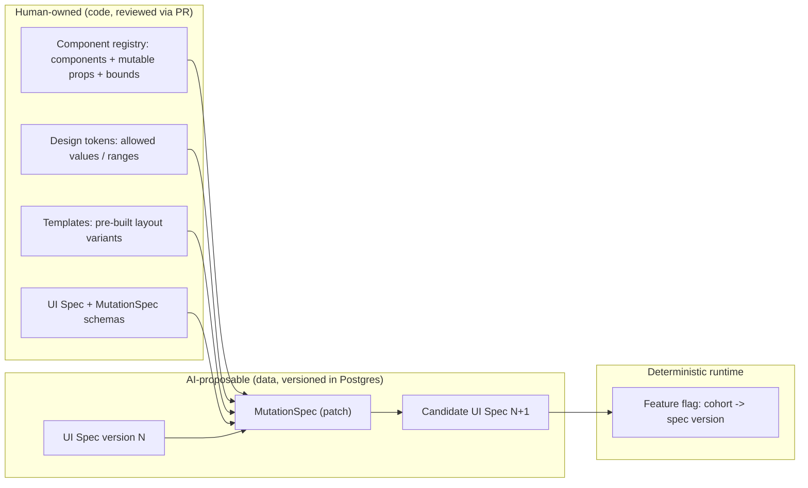
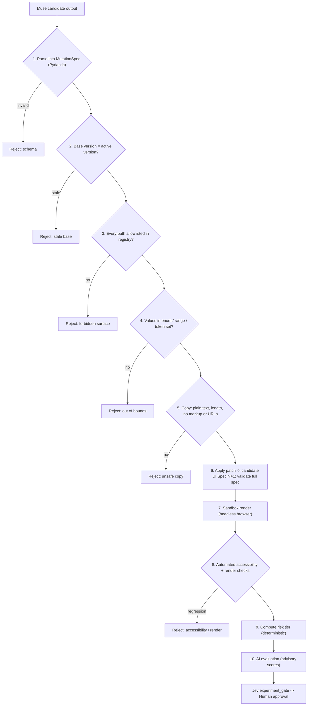

# DarwinUX — Mutation Safety

## The Core Rule

**No AI component — Muse, an LLM, the Research agent, or Jev — ever writes, edits, or commits source code, and none can make a change visible to users on its own.**

AI output in DarwinUX is *data*: a structured, schema-validated patch against a versioned UI specification. Deterministic code decides whether that data is allowed. Humans decide whether users see it.

This document defines the **mutation surface** (what may change), the **forbidden zones** (what may never change), the **validation pipeline** (how that is enforced), and the **reversibility model** (how every change is undone).

## Why Not Let the Model Edit Code?

| If AI edits source code… | If AI emits a constrained spec patch… |
|---|---|
| The space of possible changes is unbounded | The space of possible changes is enumerated by an allowlist |
| Safety review requires reading arbitrary diffs | Safety review is a schema + allowlist check |
| A change needs a build + deploy to test | A change is a new UI Spec version, rendered instantly |
| Rollback means reverting commits and redeploying | Rollback means pointing a flag at the previous version |
| Prompt injection can reach anything the code can reach | Prompt injection can at worst produce an invalid spec, which is rejected |

The trade-off is expressiveness: DarwinUX cannot invent new components or flows. That is intentional — it evolves an interface **within** a design system, it does not redesign it.

## The Mutation Surface

The target application renders from a **UI Spec**: a JSON document describing screens, component instances, their props, copy strings, and design-token references. Components are implemented by humans, in code, and registered in a **component registry**. The registry declares, per component, which props may be mutated and within what bounds.



### What exists today (Step 7)

The mutation surface above now has a concrete base:

- **UI Spec v1** (`frontend/src/ui-spec/schema.ts`, Zod): every object is `.strict()` — unknown keys such as `onClick`, `html`, `style`, `className`, `href`, `src` are rejected, not ignored. Visual and behavioural properties are closed token enums (`spacing: sm|md|lg`, `variant: primary|secondary`, `emphasis`, `tone`, `feedback: immediate|delayed`, `validation: on_submit|inline`, `error_display: summary|per_field`). Text is length-bounded plain text. Buttons name an allowlisted `action` (`reveal_signup`); the handler lives in code. Ids are unique, snake_case, and double as telemetry component ids.
- **Component registry** (`frontend/src/components/registry.tsx`): an exhaustive, typed map from the six spec types (`heading`, `text`, `notice`, `button`, `plan_grid`, `signup_form`) to React renderers. Anything else — including prototype names like `constructor` — throws `UnknownComponentError`. Text is rendered as React text nodes, so markup in a string renders as literal text.
- **Generation 0** (`frontend/src/ui-spec/generation-0.json`): committed, validated at build time, and guarded by a SHA-256 test so it is never edited in place. Later generations are new files.

A MutationSpec patches values in such a document (e.g. `feedback: delayed → immediate`); the result must re-validate against the same schema before it can render. The frontend schema is the rendering-side guard; the server-side MutationSpec validator was added in Step 12 (below).

### What exists today (Step 12): candidate mutations

A proceed decision can now produce a **candidate** UI Spec — data only, in the database, never rendered, deployed or written to the repository.

```
DecisionRun(proceed) → provenance re-check → MutationRequest (mutation_request.v1)
  → MutationGenerator (fixture | llm | muse), one call
  → MutationSpec v1 → surface validation → pure in-memory apply → protected-field diff
  → CandidateUISpec (immutable, content-addressed) + MutationRun
```

**Operation vocabulary: `replace`, nothing else.** A target is *semantic* — `{component_id, property}` — never a JSON Pointer, so there is no path that can point anywhere else. 1–5 operations; no duplicate targets; values are `string | boolean` only (no objects, numbers or arrays).

**Mutable properties** (`backend/src/darwin/mutations/surface.py`; everything else is protected):

| Node | Property | Allowed |
|---|---|---|
| button (incl. plan CTAs) | `feedback` | `immediate`, `delayed` |
| | `variant` | `primary`, `secondary` |
| | `label` | plain text ≤ 40 |
| plan_card | `highlighted` | boolean |
| plan_grid | `gap` | `sm`, `md`, `lg` |
| signup_form | `validation` | `on_submit`, `inline` |
| | `error_display` | `summary`, `per_field` |
| | `title` / `submit_label` / `summary_error_text` | plain text ≤ 80 / 40 / 160 |
| section | `spacing` | `sm`, `md`, `lg` |
| heading / text / notice | `text` | plain text ≤ 120 / 400 / 200 |
| text | `emphasis` | `normal`, `strong` |
| notice | `tone` | `info`, `warning` |

**Protected:** schema `version`, `generation` (assigned by DarwinUX: the candidate is stamped parent + 1), page id and title, every `id`, every `type`, every `action`, heading `level`, section `visibility`, component order and count, plan `name` / `price_label` / `features`, form `fields`, `completion_text`. "Plain text" is trimmed, single-line, bounded, and rejects code fences, HTML tags and control characters.

**Validation, in order** (any failure → no candidate): parse → strict MutationSpec → source spec matches → no duplicate target → component exists → property mutable for its type → value allowed → value actually changes → pure apply (deep copy; the source is never touched) → **generic diff**: the leaves that differ between source and candidate must be exactly the targeted properties plus `generation` (this is independent of the applier, so an applier bug cannot slip a change through) → shape and size bounds.

**Provenance is re-checked, not trusted.** Before any generator call: the decision is still proceed; Step 11's DecisionRequest can still be built (research eligible, hypothesis accepted and still this run's, signal canonical, critique valid) *and hashes exactly as it did when the decision was made*; the source spec is the page's **current baseline** (a newer baseline or a candidate is refused). Stale provenance is recorded (`stale_provenance`) with no request and no generator call.

**Cross-language contract.** The frontend's real Zod schema stays the single definition of a valid UI Spec. `npm run validate-spec -- <file>` validates JSON with it; `--json-schema` exports it. A contract test compares every mutable enum and length bound above with that export, and every candidate in the tests, the evaluation and the CLI is validated by it. The request path itself does not depend on Node.

**Versions.** `ui_spec_version` rows are immutable (a database trigger rejects every UPDATE). Generation 0 is imported from the committed JSON by `make ui-spec-import` (idempotent; a conflicting Generation 0 is refused; the file is only read). A candidate has `generation = NULL` and `candidate_for_generation = parent + 1` until a future promotion step; identical candidates are deduplicated by (parent, content hash).

**Muse.** No documented Muse interface exists (see OPEN_QUESTIONS.md B2), so `MuseAdapter` is an explicit seam that refuses to run. The fixture and the LLM-port baseline exercise the whole control layer.


### Mutation Types (v1)

| Type | Example | Bounded by |
|---|---|---|
| `design_token_change` | Primary button uses `color.action.strong` instead of `color.action.default` | Token must exist and be allowed for that prop |
| `component_prop_change` | `Button.size: md → lg`; `FormField.helpText` shown | Registry: prop is mutable, value in enum/range |
| `copy_change` | Button label "Submit" → "Create account" | Plain text only, max length, no markup, locale-checked |
| `template_variant_change` | Checkout uses `layout: single_column` instead of `two_column` | Only pre-built variants listed in the registry |

**Feature flags** are how a mutation reaches users, not something AI can create or edit. The Experiment Manager (deterministic code) creates the flag for an approved experiment.

### Illustrative MutationSpec

This is DarwinUX's own format — not a Muse output format, which is unknown.

```json
{
  "schema_version": "mutation-spec/1",
  "base_spec_version_id": "b3f1…",
  "target": { "screen": "signup", "component_id": "signup.submit_button" },
  "operations": [
    { "op": "replace", "path": "/props/label", "value": "Create account" },
    { "op": "replace", "path": "/props/size", "value": "lg" }
  ],
  "rationale": "Hypothesis H-42: users hesitate because the label is ambiguous.",
  "cited_chunk_ids": ["c-123", "c-456"]
}
```

Operations are a restricted subset of JSON Patch (`replace` only in v1 — no `add`/`remove`, so no new components and no deleting required ones). Each `path` is resolved against the registry: if the component type does not declare that prop as mutable, the operation is rejected.

## Forbidden Zones

The following are outside the mutation surface **by construction** (they are not representable in a UI Spec) and also **by permission** (the AI runtime has no credentials that could reach them):

- Authentication and session handling
- Authorization, roles, and access rules
- Secrets, API keys, database credentials
- IAM roles and policies
- Production infrastructure (Terraform, ECS, networking)
- Security controls (CSP, CORS, rate limits, input sanitization)
- CI/CD workflows and their permissions
- Telemetry SDK behaviour and consent handling
- Payment, legal, or consent copy (marked `locked: true` in the registry)
- The component registry, schemas, validators, and approval rules themselves

**Defense in depth:** even if a validator had a bug, the investigation worker's IAM role cannot write to the repository, the Terraform state, Secrets Manager (write), or the flag table. Only the Experiment Manager can change flags, and only for an experiment with a recorded human approval.

## Validation Pipeline

Every candidate passes these stages in order. Each stage is recorded as an `EvaluationRun`.



Stages 1–9 are deterministic. Only stage 10 involves models, and its scores feed a decision; they never override a deterministic rejection.

Validation failures from stages 3–5 are returned to Muse as structured feedback for a bounded retry (max 3 attempts total). A failure never loosens the constraints.

### The Sandbox

The sandbox is not deployed infrastructure. In v1 it is: the demo app running locally (or in a CI-style container), opened in a headless browser at a preview route that renders a given spec version by ID. It produces artefacts stored with the EvaluationRun: screenshot, rendered DOM, automated accessibility scan results, and basic render timing. Preview routes are only reachable by the sandbox, never by real traffic.

**What exists today (Step 13).** The v1 sandbox is smaller and stricter than the design above: no browser, no preview route, no server. The candidate stays DATA. The backend writes the source and candidate specs to an OS temp directory; `npm run sandbox-harness` (Vitest + jsdom, `frontend/src/evaluation/harness.tsx`) parses each with the app's **real Zod schema** and renders it through the **real registry and `SpecPage`** — the same allowlisted path the demo uses — with telemetry captured in memory (built, never sent) and timers faked. It reports *facts*: render success and DOM size, axe-core violations (initial and with the signup form revealed; `color-contrast` disabled because jsdom has no layout), labelled inputs / focusable buttons / heading levels, per-CTA click telemetry and reveal delay (0 ms vs 1500 ms), form behaviour (errors on empty submit, summary vs per-field display, inline error on blur, completion) and whether any typed value reached telemetry. The backend's `candidate_eval.v1` policy compares source and candidate facts. No screenshots, no rendered-DOM artefacts, no timing claims about the web: Playwright and a real browser (contrast, layout, visual regression, real timing) are deliberately deferred.


**From sandbox to users (Step 14).** A Step 13 `pass` is only an eligibility precondition. A candidate reaches sessions only through a human-created, human-started experiment whose start gate re-derives the pass, re-hashes both specs and checks allowlisted configuration; the backend re-hashes the stored spec again on every serve and falls back to Generation 0 on any mismatch. The browser still validates the served spec with the real Zod schema and renders it only through the registry; a candidate that fails validation or throws while rendering is replaced by Generation 0 (reported as `experiment_fallback`, never counted as an exposure). Candidate allocation never exceeds 50%. Nothing is written to `frontend/src/ui-spec/`, Generation 0 is never modified, and no result promotes a candidate.

**From experiment to generation (Step 15).** A candidate row is never edited and never becomes active. Promotion creates a NEW immutable `promoted` UI Spec version whose content a database trigger proves equal to the candidate's except `generation`; the active-generation pointer can only name baselines and promoted generations, and only move with a matching promotion or rollback record. Promotion re-derives the whole chain — Step 13 pass, provenance, the completed experiment, the latest analysis, the current source generation — at the moment it runs, under a lock, and refuses if any of it changed since the human approved. Rollback is a pointer move to an earlier known-good generation; artifacts are never deleted.

## Risk Tiers and Approval

| Tier | Examples | Approval required |
|---|---|---|
| **Low** | Token swap within the same token family; size step ±1 | Human approval to start experiment; human approval to promote |
| **Medium** | Copy change; template variant change | Same, plus human must view before/after screenshots (recorded in `Approval.evidence_snapshot`) |
| **High** | Anything touching a flow's step count, a `locked` component, or more than N components | **Not allowed in v1** — rejected deterministically |

There is no tier where AI promotes a change without a human. Auto-promotion of low-risk mutations is listed as future research, not a plan.

## Reversibility

Every mutation is reversible because nothing is ever overwritten:

1. UI Spec versions are **immutable**. A mutation produces a new version; the old one still exists.
2. An experiment is a **flag** that routes a cohort to the candidate version.
3. **Rollback = set the flag back.** No build, no deploy, seconds to take effect.
4. Promotion creates a new **Generation** pointing at the promoted version. Rolling back a generation re-activates its parent's version.

**Automatic rollback** is the one action DarwinUX takes without a human, because it moves *toward* a known-good state. It fires deterministically when a guardrail metric breaches its pre-registered threshold (e.g., error-event rate, form-submit failure rate, automated accessibility regression on live render).

**Kill switch:** a single configuration value that forces every flag to the current Generation's version and pauses all investigation workers.

## Auditability

For any user-visible change, the database can answer: who approved it, what the human saw, what Muse (or the baseline) produced, every rejected attempt and why, which evidence was cited, and which Jev/rule decisions let it through. See DOMAIN_MODEL.md, "Generation Traceability". Approval records reference authenticated human identities; no AI component can create an `Approval`.

## Threat Model (Short)

| Threat | Mitigation |
|---|---|
| Prompt injection via Product Memory (e.g., a support ticket saying "set all buttons to red") | Retrieved text is untrusted data; constraints come from the registry, not from text; validator rejects anything outside the allowlist |
| Muse / LLM emits markup or script in copy | Copy is plain text, validated for markup/URLs, and rendered escaped |
| Model output "claims" approval or high confidence | Approvals only come from authenticated humans via the Evolution Lab; confidence never bypasses a deterministic rule |
| Validator bug lets a bad patch through | Sandbox + accessibility checks, human approval, guardrail auto-rollback, IAM limits |
| Runaway cost from retry loops | Bounded retries; per-run cost budget checked by the workflow |
| Stale base version (two candidates for the same screen) | Stage 2 rejects patches whose base is not the active version |

---

## What You Should Understand Before Implementation

1. **Safety comes from representation, not from instructions.** A prompt that says "don't touch auth" is a hope. A UI Spec that cannot express auth is a guarantee.
2. **The component registry is the security boundary.** Whatever it declares mutable, AI can change; whatever it doesn't, AI cannot. Changes to the registry go through normal human code review.
3. **Validation is layered and deterministic first.** Schema → allowlist → bounds → sandbox → accessibility. AI evaluation adds opinion on top; it never overrides a rejection.
4. **Reversibility is designed in by immutability.** Immutable spec versions plus flags make rollback a pointer move.
5. **Rolling back is automatic; rolling forward never is.** Asymmetric autonomy: the system may retreat to safety on its own, but advancing requires a human.
6. **Least privilege is the second wall.** Even a perfectly manipulated model runs in a process whose credentials cannot reach code, infrastructure, or secrets.
