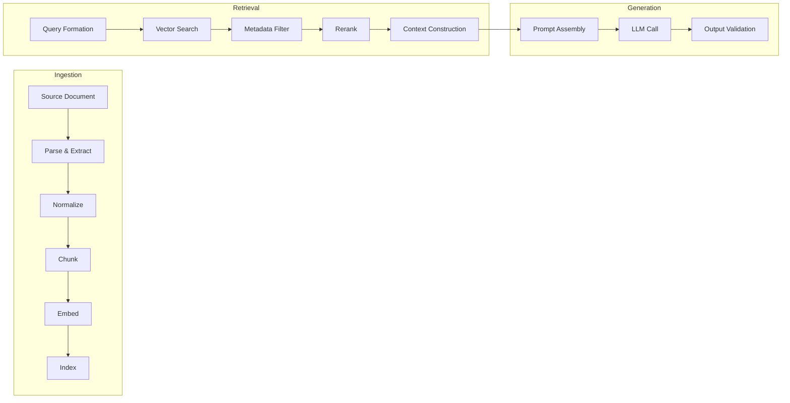

# DarwinUX — RAG Architecture

## What Is Product Memory?

Product Memory is DarwinUX's knowledge base — the accumulated understanding of the product, its design system, its history, and its users. It is not a simple document store. It is a curated, searchable, evaluable collection of knowledge that agents use to make informed decisions.

Without Product Memory, agents would operate on behavioral signals alone — like a doctor diagnosing a patient without access to medical history, guidelines, or research literature. RAG turns "we see friction" into "we see friction, and here's what the design system says about this component, here's what happened last time we changed it, and here's the UX guideline that applies."

## Knowledge Sources

| Source Type | Examples | Update Frequency |
|---|---|---|
| Design system docs | Component API docs, usage guidelines, accessibility requirements | When design system changes |
| UX guidelines | Internal UX principles, heuristics, interaction patterns | Infrequent |
| Product documentation | Feature specs, user guides, release notes | Per release |
| Experiment history | Past A/B test results, what worked, what didn't | Per experiment |
| Generation history | Previous mutations, their evidence, their outcomes | Per generation |
| Evaluation reports | Summarized evaluation results across dimensions | Per evaluation |
| User feedback | Summarized user research, support tickets, survey data | Periodic |
| Agent decision history | Why agents made specific decisions, what evidence they used | Per agent run |
| Technical documentation | API docs, architecture notes, deployment guides | As changed |

## RAG Lifecycle



### Ingestion Pipeline (Detailed)

#### 1. Source Acquisition

Documents enter the system through:
- **Manual upload:** An engineer or product manager uploads a design doc.
- **Automated sync:** A scheduled job pulls updated docs from a known source (e.g., a design system repo, a Notion export, an S3 bucket).
- **System-generated:** DarwinUX itself produces knowledge (experiment reports, evaluation summaries, generation records).

**Design decision:** System-generated knowledge is treated identically to external knowledge in the RAG pipeline. A past experiment report is ingested, chunked, and embedded just like a design guideline. This means the system can retrieve its own history as evidence.

#### 2. Parsing & Extraction

Raw documents are converted to structured text:
- Markdown: Direct text extraction with heading structure preserved.
- PDF: Text extraction with layout analysis (preserving section boundaries).
- HTML: DOM parsing with boilerplate removal.
- JSON/YAML: Structured extraction with key-value preservation.

**Why parsing matters:** Garbage in, garbage out. If a PDF parser loses table structure or a heading hierarchy, chunks will carry less semantic meaning and retrieval quality will suffer.

**LangChain usage:** LangChain's document loaders are genuinely useful here. They provide tested parsers for common formats. This is one area where LangChain adds value without adding unnecessary abstraction.

#### 3. Normalization

Parsed text is normalized:
- Consistent Unicode (NFC normalization).
- Consistent whitespace.
- Metadata extraction (title, source, date, author, document type).
- Section boundary identification.

**This is deterministic Python.** No LLM is needed for normalization.

#### 4. Chunking

Normalized text is split into retrieval units.

**Chunking strategy:**

| Strategy | When to Use | Trade-off |
|---|---|---|
| **Section-based** | Documents with clear heading structure | Preserves semantic boundaries but chunks vary in size |
| **Recursive character** | Unstructured text | Consistent size but may split mid-thought |
| **Semantic** | Dense technical content | Better boundaries but slower and model-dependent |

**Recommended default:** Section-based chunking with recursive character splitting as fallback for sections that exceed the target size.

**Chunk size considerations:**
- **Too small** (< 100 tokens): Loses context. A chunk reading "Use the `primary` variant for main actions" is useless without knowing which component.
- **Too large** (> 1000 tokens): Wastes context window budget. Retrieves irrelevant content alongside relevant content.
- **Target range:** 200–500 tokens per chunk, with overlap of 50 tokens between adjacent chunks.

**Chunk metadata:** Each chunk carries metadata from its source document (type, section heading, document title) to enable filtered retrieval.

**LangChain usage:** LangChain's text splitters (RecursiveCharacterTextSplitter, MarkdownHeaderTextSplitter) are well-tested and appropriate here.

#### 5. Embedding

Each chunk is converted to a dense vector representation.

**Provider abstraction is critical here.** Changing embedding models requires re-embedding the entire corpus. The system must:
- Track which embedding model produced each vector.
- Support batch re-embedding when models change.
- Not assume a fixed vector dimension.

**Embedding model selection considerations:**
- Dimensionality (affects storage and search speed)
- Quality on retrieval benchmarks for the document types in Product Memory
- Cost per token
- Availability and rate limits

**This is an OPEN QUESTION:** Which embedding model to use initially. The architecture should not depend on this choice.

#### 6. Indexing

Embeddings are stored in pgvector with:
- The vector itself (for similarity search)
- The chunk text (for retrieval)
- Metadata (for filtering)
- Foreign key to KnowledgeDocument (for provenance)

**Why pgvector:** Starting with pgvector inside PostgreSQL eliminates a separate vector database dependency. For the scale of an experimental platform (thousands to low tens of thousands of chunks), pgvector with HNSW indexing is sufficient. If retrieval latency becomes a bottleneck at scale, migrating to a dedicated vector database is a well-understood operation.

**Index type:** HNSW (Hierarchical Navigable Small World) for approximate nearest neighbor search. IVFFlat is an alternative with different speed/recall trade-offs, but HNSW is the better default for variable query patterns.

### Retrieval Pipeline (Detailed)

#### 1. Query Formation

The retrieval query is constructed from:
- The behavioral signal description
- The agent's current investigation context
- Optionally, a reformulated query (if the agent decides the original query is too vague)

**Query reformulation** is one of the few places in the retrieval pipeline where an LLM call may be justified. If the behavioral signal is "rage_click on checkout button" and the agent needs design system documentation, reformulating to "checkout button design guidelines interaction states error handling" will retrieve better results.

**Decision:** Query reformulation should be optional and evaluated. Start without it. Add it when retrieval evaluation shows that query quality is the bottleneck.

#### 2. Vector Search

Similarity search against pgvector using the query embedding:
- Retrieve top-K candidates (K = 20–50, more than will be used)
- Use cosine similarity as the distance metric

**Why over-retrieve:** Reranking works better with more candidates. Retrieving 30 and reranking to 5 produces better results than retrieving 5 directly.

#### 3. Metadata Filtering

Filter retrieved chunks by metadata:
- **Document type:** If investigating a design issue, prioritize design_doc and ux_guideline chunks over technical_doc chunks.
- **Recency:** More recent experiment reports may be more relevant than old ones.
- **Component:** If the signal involves a specific component, boost chunks about that component.

**This is deterministic.** Filtering rules are configured, not learned.

#### 4. Reranking

Rerank the filtered candidates to improve precision.

**Options:**
- **Cross-encoder reranking:** A model that scores (query, chunk) pairs more accurately than embedding similarity alone. More expensive but significantly improves relevance.
- **Reciprocal Rank Fusion (RRF):** If using multiple retrieval strategies (e.g., keyword + semantic), fuse the rankings.
- **No reranking:** Acceptable for v1 if retrieval evaluation shows embedding similarity is sufficient.

**Decision:** Start without reranking. Add cross-encoder reranking when RAG evaluation metrics show that retrieval precision is the limiting factor.

#### 5. Context Construction

Assemble the final context from top-ranked chunks:
- Select top-N chunks (N = 3–7) that fit within the context budget.
- Order them by relevance (most relevant first).
- Include source attribution (document title, section) for each chunk.
- Track total token count to stay within model context limits.

**Context budget:** Reserve a fixed portion of the model's context window for retrieved context. If using a model with 128K context, allocating 4K–8K tokens for retrieval context is generous but not wasteful.

## Evaluating RAG

RAG evaluation is essential because retrieval quality directly determines agent decision quality. Bad retrieval → wrong evidence → bad hypothesis → bad mutation.

### Retrieval Metrics

| Metric | What It Measures | How to Compute |
|---|---|---|
| **Precision@K** | Of the top-K retrieved chunks, how many are relevant? | Requires labeled relevance judgments |
| **Recall@K** | Of all relevant chunks in the corpus, how many were in the top K? | Requires complete relevance labels |
| **MRR (Mean Reciprocal Rank)** | How high does the first relevant chunk rank? | 1/rank of first relevant result |
| **nDCG** | Are relevant chunks ranked higher than less relevant ones? | Accounts for graded relevance |
| **Context Relevance** | Is the assembled context relevant to the query? | LLM-as-judge or human annotation |

### End-to-End RAG Metrics

| Metric | What It Measures | How to Compute |
|---|---|---|
| **Groundedness** | Is the generated output supported by the retrieved context? | LLM-as-judge: "Is this claim supported by the provided context?" |
| **Faithfulness** | Does the output accurately represent what the context says? | LLM-as-judge + human spot-check |
| **Answer Relevance** | Does the output actually address the query? | LLM-as-judge: "Does this answer the question?" |

### Golden Dataset

A golden evaluation dataset for RAG should contain:

```
{
  "query": "What are the accessibility requirements for the checkout button?",
  "relevant_chunk_ids": ["chunk-123", "chunk-456"],
  "expected_answer_contains": ["WCAG 2.1 AA", "focus indicator", "minimum contrast"],
  "source_documents": ["design-system-buttons.md", "a11y-guidelines.md"]
}
```

**Building the golden dataset:**
1. Start with 20–30 manually created query-relevance pairs covering the most important knowledge types.
2. Expand as the corpus grows.
3. Include adversarial queries (questions that should return no relevant results).
4. Review and update quarterly as the corpus changes.

**This is manual, expensive, and essential.** There is no shortcut to a good evaluation dataset.

## Product Memory Maintenance

### Staleness Detection

Knowledge documents become stale when their source changes. The system should:
1. Hash document content on ingestion.
2. Periodically re-check source documents.
3. Mark documents as `stale` when hashes change.
4. Trigger re-ingestion for stale documents.

### Deduplication

When multiple sources cover the same topic, retrieval may return near-duplicate chunks. Strategies:
- **Source-level:** Prefer canonical sources (design system docs over blog posts about the design system).
- **Chunk-level:** Detect high-similarity chunks during indexing and flag potential duplicates.

### Growth Management

Product Memory will grow over time. Management strategies:
- Archive very old experiment reports that are unlikely to be relevant.
- Summarize long documents into concise chunks (using LLM summarization during ingestion).
- Monitor retrieval latency as the corpus grows.

---

## What You Should Understand Before Implementation

1. **Chunking quality determines retrieval quality.** A well-chunked corpus with a mediocre embedding model will outperform a poorly-chunked corpus with a great embedding model. Invest time in chunking strategy.
2. **Over-retrieve, then rerank.** Embedding similarity is a rough filter. Reranking is a precision filter. Design the pipeline to support both, even if v1 skips reranking.
3. **RAG evaluation requires labeled data.** You cannot evaluate retrieval quality without human-labeled relevance judgments. Plan to build and maintain a golden dataset.
4. **System-generated knowledge creates a feedback loop.** When DarwinUX indexes its own experiment reports, agents can learn from past decisions. This is powerful but requires careful management to avoid reinforcing bad patterns.
5. **pgvector is sufficient until proven otherwise.** The operational simplicity of one database outweighs the performance advantages of a dedicated vector store at this scale.
6. **Context construction is not just "return the top 5 chunks."** Token budgeting, source attribution, and ordering all affect generation quality. This stage deserves deliberate design.
7. **Query reformulation is an optimization, not a requirement.** Start with direct queries. Add reformulation when evaluation shows it helps.
